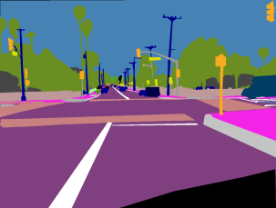

# Open-source free software for image segmentation and labeling

<!-- 
**Under construction...** !-->

[Published on Medium](https://foobar167.medium.com/open-source-free-software-for-image-segmentation-and-labeling-4b0332049878)

You can make your own segmentation and/or labeling tool. [I have my own](https://github.com/foobar167/junkyard/tree/master/manual_image_annotation1) image annotation tool and many of my colleagues have such software on MATLAB and Python. It's a good programming practice to do it by yourself or improve on an existing one. You’ll know a lot during software development! However, it is time-consuming, especially for advanced functional and it is not related with Machine Learning experience.

This is why I have compiled a list of open source segmentation and labeling tools as of **early 2021**. I’ve not tested all of them, but only a few. See a review of my most favorite apps at the end of this article.

Actually, there are [758 public repositories on GitHub](https://github.com/topics/annotation) marked as annotation tool. I've just publish a several links from the top-rated. Also see [awesome data labeling](https://github.com/heartexlabs/awesome-data-labeling) list of tools and [useful links](#useful-links) below.

## Image segmentation tools

### Online

I find that all online web-based tools are more convenient to work with. No installation required.

* [CVAT](https://github.com/openvinotoolkit/cvat) - [Online](https://cvat.org), interactive video and image annotation tool for computer vision.
* [Label Studio](https://github.com/heartexlabs/label-studio) - Label different types of data. Has [online interface](https://app.labelstud.io/welcome).
* [Microsoft VoTT](https://github.com/microsoft/vott) - [Online web app](https://vott.z22.web.core.windows.net). MIT license.
* [VGG Image Annotator](https://www.robots.ox.ac.uk/~vgg/software/via) - Open source. With [online copy](https://www.robots.ox.ac.uk/~vgg/software/via/via.html).
* [Photoshop Online](https://www.photopea.com) - Photoshop-like online tool.
* [Hasty](https://app.hasty.ai) - Online web-based. Still in open beta. Need to practice to work comfortably with it. Export from online is not clear. Has a help of AI processing. The downside is that the processing takes a while (up to 10 or 20 seconds) which is time consuming.

### Local installation

* [LabelMe](https://github.com/wkentaro/labelme) - MIT license. Source code with installation instructions. Another [LabelMe](https://github.com/CSAILVision/LabelMeAnnotationTool) tool.
* [Sefexa](http://www.fexovi.com/sefexa.html) - Semi-automatic image segmentation.
* [Label tool](https://github.com/Slava/label-tool) - MIT license. See online [demo](http://slv.io/label-tool/demo/) without savings.
* [Django Labeller](https://github.com/Britefury/django-labeller) - MIT license. A light-weight image labeling tool for Python designed for creating segmentation data sets.
* [COCO Annotator](https://github.com/jsbroks/coco-annotator) - web-based image annotation tool ([getting-started](https://github.com/jsbroks/coco-annotator/wiki/Getting-Started)) designed for versatility and efficiently label images to create training data for image localization and object detection.
* [GIMP](https://www.gimp.org/) - GNU Image Manipulation Program. Open source alternative to Adobe Photoshop.
* [DeepMask and SharpMask](https://github.com/facebookresearch/deepmask) - BSD license. Object proposal algorithms based on pretrained models. Automatic (*not manual*) segmentation. Has been archived by the owner, seems deprecated. MAC OS X or Linux.
* [MultiPathNet](https://github.com/facebookresearch/multipathnet) - BSD license. Automatic (*not manual*) segmentation. Seems deprecated. Linux.
* [Weka plugin](https://imagej.net/Fiji/Downloads) - The Trainable Weka Segmentation (see [wiki](https://imagej.net/Trainable_Weka_Segmentation) and [video](https://youtu.be/8yfBHiGufFE)) is a Fiji plugin that combines a collection of machine learning algorithms with a set of selected image features to produce pixel-based segmentation. Weka (Waikato Environment for Knowledge Analysis) can itself be called from the plugin.
* [Remo](https://remo.ai) - Community free. Pip or Docker local [installation](https://remo.ai/docs/#installation).

### Video

* [UltimateLabeling](https://github.com/alexandre01/UltimateLabeling) - A multi-purpose Video Labeling GUI in Python with integrated SOTA detector and tracker. MIT license.
* [VATIC](https://github.com/cvondrick/vatic) - Deprecated, see [CVAT](https://github.com/openvinotoolkit/cvat).

## Medicine segmentation tools

Segmentation software designed for 3D medical images and for medical image file formats.

* [MedSeg](https://www.medseg.ai) - [Online web app](http://htmlsegmentation.s3.eu-north-1.amazonaws.com/index.html) for radiology images. Free and simple volume segmentation of organs, tissue and pathologies in radiological images. You can segment the images manually, or let AI models do it for you. Besides there is also a list of external datasets: [general databases](https://www.medseg.ai/external-databases-1/general-databases) and [the cancer imaging archive](https://www.medseg.ai/external-databases-1/tcia) (TCIA).
* [BioImage Suite Web](https://bioimagesuiteweb.github.io/webapp) - Web-based [open-source](https://github.com/bioimagesuiteweb) ([manual](https://bioimagesuiteweb.github.io/bisweb-manual/index.html)) medical image analysis suite primarily geared towards Neuroimaging Analysis.
* [Biomedisa](https://biomedisa.de) - Free and easy-to-use [open-source](https://github.com/biomedisa/biomedisa) platform for segmenting large volumetric images, e.g. CT and MRI scans.
* [RIL-Contour](https://gitlab.com/Philbrick/rilcontour/tree/master) - BSD type license. Python based, multi-platform. The toolkit consists of an imaging viewer with a wide range of capabilities for annotating medical images.
* [3D slicer](https://www.slicer.org) - For radiological images.
* [ITK-SNAP](http://www.itksnap.org/pmwiki/pmwiki.php) - GPL3 license. Multi-platform.
* [MITK](https://www.mitk.org/wiki/The_Medical_Imaging_Interaction_Toolkit_(MITK)) - Free and versatile open-source software project for the development of medical image processing applications. It can be used as a C++ toolkit or application framework for software development.

## Image labeling tools

Free image labeling tools (*not segmentation*) for object detection tasks. There are [many more on GitHub](https://github.com/topics/annotation).

* [LabelImg](https://github.com/tzutalin/labelImg)
* [Make-Sense](https://github.com/SkalskiP/make-sense) - [Online](https://www.makesense.ai) web-based. GPL3 license.

## Paid software

There is huge and intense competition between private companies in this area.

* [Supervisely](https://supervise.ly) - [Free](https://supervise.ly/pricing) for our fellow data scientists and students. Use of AI for automation and faster work. Online web-based.
* [Labelbox](https://labelbox.com) - Use of superpixel labeling. Free community edition limited to 5000 images.
* [Diffgram](https://www.diffgram.com) - Specializes in video labeling. Free for up to 25 tasks per month.
* [SuperAnnotate](https://superannotate.com) (14 days [trial](https://superannotate.com/pricing/)), [eCognition](https://geospatial.trimble.com), [Dragonfly](http://www.theobjects.com/dragonfly) (30-day trial), [RectLabel](https://rectlabel.com) (1 month free trial), [TurtleSeg](https://www.turtleseg.org) (for medical images), [Amazon SageMaker](https://aws.amazon.com/sagemaker), [Simpleware](https://www.synopsys.com/simpleware/software.html) (30-day trial), [Scale.com](https://scale.com), [Playment](https://playment.io), etc.

## Review of my most favorite apps

The best labeling tool for me is, of course, my own software ([one](https://github.com/foobar167/junkyard/tree/master/manual_image_annotation1), [two](https://github.com/foobar167/junkyard/tree/master/manual_image_annotation2), [three](https://github.com/foobar167/junkyard/tree/master/graphics_editor)) :-). However, my own tools are not universal and without automation.

I've used [LabelImg](https://github.com/tzutalin/labelImg) several times and it is OK for manual labeling with rectangles.

[CVAT](https://github.com/openvinotoolkit/cvat) seems to be the leading open-source **video** and image annotation tool.

Besides price, functions and project management there is one new important parameter - **automation** using AI and classical algorithms for faster manual annotation process. **Pay attention to automation** when choosing your working tool.

Maybe in the near future I'll try [Groundwork](https://groundwork.azavea.com), an online [free](https://groundwork.azavea.com/pricing) image labeling tool for creating custom training datasets from **satellite** imagery. However maps are loading quite slowly.

## Useful links

* [758 public repositories on GitHub](https://github.com/topics/annotation)
* [Awesome data labeling](https://github.com/heartexlabs/awesome-data-labeling) list of tools
* [Annotation tools for building datasets](https://www.datasetlist.com/tools/)
* Article [Best Open Source Annotation Tools for Computer Vision](https://www.sicara.ai/blog/2019-09-01-top-five-open-source-annotation-tools-computer-vision)
* Question on ResearchGate: [What is the best (fee) software for image segmentation?](https://www.researchgate.net/post/What-is-the-best-fee-software-for-image-segmentation)
* Question on Reddit: [Image segmentation labelling tool](https://www.reddit.com/r/computervision/comments/5jxhtc/image_segmentation_labelling_tool) 
* Article [The best image labeling tools for computer vision of 2020](https://humansintheloop.org/the-best-image-labeling-tools-of-2020)
* Article [The best image annotation platforms for computer vision of 2019](https://humansintheloop.org/the-best-image-annotation-platforms)
