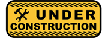

# Open-source free software for image segmentation and labeling

**Under construction...**

[Published on Medium]()

You can make your own segmentation and/or labeling tool. [I have my own](https://github.com/foobar167/junkyard/tree/master/manual_image_annotation1) image annotation tool and many of my colleagues have such software on MATLAB and Python. It's a good programming practice to do it by yourself or improve on an existing one. You’ll know a lot during software development! However, it is time-consuming, especially for advanced functional and it is not related with Machine Learning experience.

This is why I have compiled a list of existing open source segmentation and labeling tools as of **early 2021**. I’ve not tested all of them, but only a few. See a review of my most favorite apps at the end of this article.

Actually, there are [754 public repositories on GitHub](https://github.com/topics/annotation). I've just publish a several links from the top-rated. Also see [awesome data labeling](https://github.com/heartexlabs/awesome-data-labeling) list of tools and [useful links](#useful-links)

## Image segmentation tools

### Online

I find that all online web-based tools are more convenient to work with. No installation required.

* [CVAT](https://github.com/openvinotoolkit/cvat) - Online, interactive video and image annotation tool for computer vision.
* [Label Studio](https://github.com/heartexlabs/label-studio) -  label different types of data. Has [online interface](https://app.labelstud.io/welcome).
* [Microsoft VoTT](https://github.com/microsoft/vott) - MIT license. [Online web app](https://vott.z22.web.core.windows.net).
* [VGG Image Annotator](https://www.robots.ox.ac.uk/~vgg/software/via) - Online web-based. Open source.
* [Photoshop Online](https://www.photopea.com) - Photoshop-like online tool.
* [Hasty](https://app.hasty.ai) - Online web-based. Still in open beta. Need to practice to work comfortably with it. Export from online is not clear. Has a help of AI processing. The downside is that the processing takes a while (up to 10 or 20 seconds) which is time consuming.

### Local installation

* [LabelMe](https://github.com/CSAILVision/LabelMeAnnotationTool) - MIT license. Source code with installation instructions. Another [LabelMe](https://github.com/wkentaro/labelme) tool.
* [Sefexa](http://www.fexovi.com/sefexa.html) - Semi-automatic image segmentation.
* [Label tool](https://github.com/Slava/label-tool) - MIT license
* [Django Labeller](https://github.com/Britefury/django-labeller) - MIT license
* [COCO Annotator](https://github.com/jsbroks/coco-annotator) - web-based image annotation [tool](https://github.com/jsbroks/coco-annotator/wiki/Getting-Started) designed for versatility and efficiently label images to create training data for image localization and object detection.
* [GIMP](https://www.gimp.org/) - GNU Image Manipulation Program. Open source alternative to Adobe Photoshop.
* [DeepMask and SharpMask](https://github.com/facebookresearch/deepmask) - BSD license. Object proposal algorithms based on pretrained models. Automatic (*not manual*) segmentation. Has been archived by the owner, seems deprecated. MAC OS X or Linux.
* [MultiPathNet](https://github.com/facebookresearch/multipathnet) - BSD license. Automatic (*not manual*) segmentation. Seems deprecated. Linux.
* [Weka plugin](https://imagej.net/Fiji/Downloads) - The Trainable Weka Segmentation (see [wiki](https://imagej.net/Trainable_Weka_Segmentation) and [video](https://youtu.be/8yfBHiGufFE)) is a Fiji plugin that combines a collection of machine learning algorithms with a set of selected image features to produce pixel-based segmentations. Weka (Waikato Environment for Knowledge Analysis) can itself be called from the plugin.
* [Remo](https://remo.ai) - Community free. Pip or Docker local [installation](https://remo.ai/docs/#installation).

### Video

* [UltimateLabeling]() - A multi-purpose Video Labeling GUI in Python with integrated SOTA detector and tracker. MIT license.
* [VATIC](https://github.com/cvondrick/vatic) - Deprecated, see [CVAT](https://github.com/openvinotoolkit/cvat).

## Medicine segmentation tools

Segmentation software designed for 3D medical images and for medical image file formats.

* [MedSeg](https://www.medseg.ai) - For radiological images.
* [BioImage Suite Web](https://bioimagesuiteweb.github.io/webapp) - Online. [Open-source](https://github.com/bioimagesuiteweb) with [manual](https://bioimagesuiteweb.github.io/bisweb-manual/index.html).
* [Biomedisa](https://biomedisa.de) - Free and easy-to-use [open-source](https://github.com/biomedisa/biomedisa) platform for segmenting large volumetric images, e.g. CT and MRI scans.
* [RIL-Contour](https://gitlab.com/Philbrick/rilcontour/tree/master) - BSD type license. Python based.
* [3D slicer](https://www.slicer.org) - For radiological images.
* [ITK-SNAP](http://www.itksnap.org/pmwiki/pmwiki.php) - Multi-platform.
* [MITK](https://docs.mitk.org/nightly) - Free and versatile open-source software project for the development of medical image processing applications. It can be used as a C++ toolkit or application framework for software development. [Wiki](https://www.mitk.org/wiki/The_Medical_Imaging_Interaction_Toolkit_(MITK)).

## Image labeling tools

Free image labeling tools (*not segmentation*) for object detection tasks. There are [many more on GitHub](https://github.com/topics/annotation).

* [LabelImg](https://github.com/tzutalin/labelImg)
* [Make-Sense](https://github.com/SkalskiP/make-sense) - [Online](https://www.makesense.ai) web-based. GPL3 license.

## Paid software

There is huge and intense competition between private companies.

* [Supervisely](https://supervise.ly) - [Free](https://supervise.ly/pricing) for our fellow data scientists and students. Use of AI for automation and faster work. Online web-based.
* [Labelbox](https://labelbox.com) - Use of superpixel labeling. Free community edition limited to 5000 images.
* [SuperAnnotate](https://superannotate.com) - 14 days [trial](https://superannotate.com/pricing/)
* [Diffgram](https://www.diffgram.com) - Specializes in video labeling
* [eCognition](https://geospatial.trimble.com)
* [Dragonfly](http://www.theobjects.com/dragonfly) - 30-day trial
* [RectLabel](https://rectlabel.com) - 1 month free trial
* [TurtleSeg](https://www.turtleseg.org) - For medical images
* [Amazon SageMaker](https://aws.amazon.com/sagemaker)
* [Simpleware](https://www.synopsys.com/simpleware/software.html) - 30-day trial
* [Scale.com](https://scale.com)
* [Playment](https://playment.io)
* etc.

## Review of my most favorite apps

The best labeling tool for me is, of course, my own software ([one](https://github.com/foobar167/junkyard/tree/master/manual_image_annotation1), [two](https://github.com/foobar167/junkyard/tree/master/manual_image_annotation2), [three](https://github.com/foobar167/junkyard/tree/master/graphics_editor)) :-). However, my own tools are not universal.

I've used [LabelImg](https://github.com/tzutalin/labelImg) several times and it is OK for manual labeling with rectangles.

[CVAT](https://github.com/openvinotoolkit/cvat) seems to be the leading open-source **video** and image annotation tool.

Besides price, functions and project management there is one new important parameter - **automation** for faster manual annotation process. Pay attention to automation when choosing your working tool.

Maybe in the near future I'll try [Groundwork](https://groundwork.azavea.com), a [free](https://groundwork.azavea.com/pricing) image labeling tool for creating custom training datasets from **satellite** imagery. It requires WebGL 2.0.

## Useful links

* [754 public repositories on GitHub](https://github.com/topics/annotation)
* [Awesome data labeling](https://github.com/heartexlabs/awesome-data-labeling) list of tools.
* [Annotation tools for building datasets](https://www.datasetlist.com/tools/)
* [Best Open Source Annotation Tools for Computer Vision](https://www.sicara.ai/blog/2019-09-01-top-five-open-source-annotation-tools-computer-vision)
* Question on ResearchGate: [What is the best (fee) software for image segmentation?](https://www.researchgate.net/post/What-is-the-best-fee-software-for-image-segmentation)
* Question on Reddit: [Image segmentation labelling tool](https://www.reddit.com/r/computervision/comments/5jxhtc/image_segmentation_labelling_tool) 
* Article [The best image labeling tools for computer vision of 2020](https://humansintheloop.org/the-best-image-labeling-tools-of-2020)
* Article [The best image annotation platforms for computer vision of 2019](https://humansintheloop.org/the-best-image-annotation-platforms)
