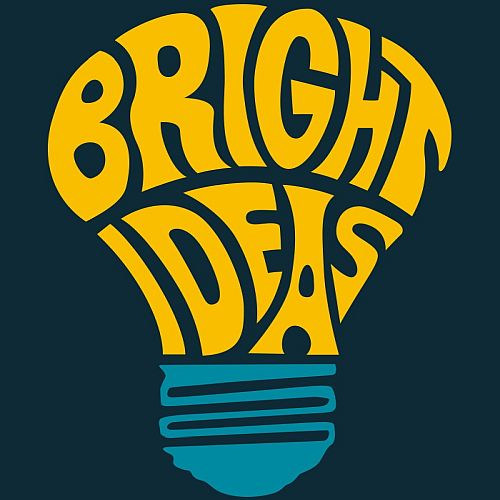
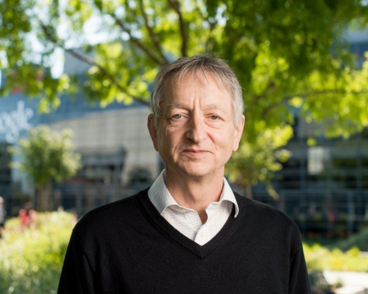
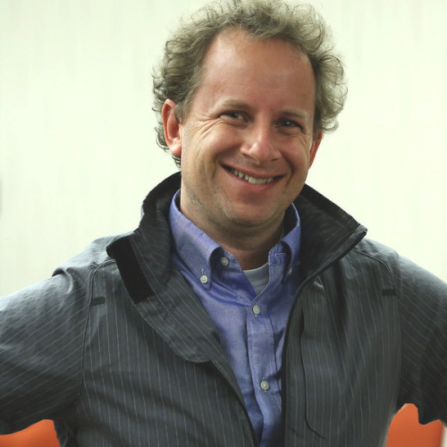
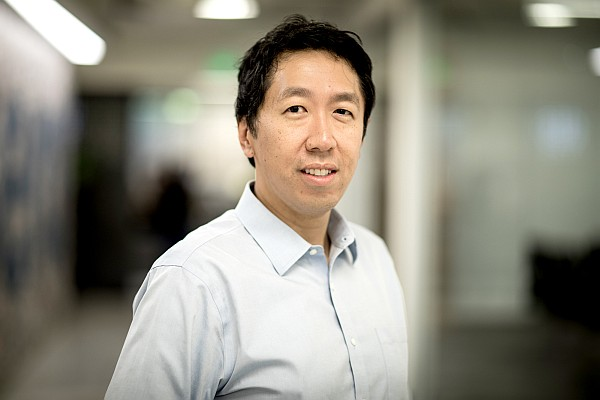

# Ideas of the leading Machine Learning researches

<!--  -->

[Published on Medium](https://foobar167.medium.com/ideas-of-the-leading-machine-learning-researches-2e19bcdb3245)

_<b>Disclaimer</b>_: ideas that were expressed in these videos may be wrong or misunderstood and incorrectly conveyed by me.

Article provides three fresh interviews (2019-2020) with the world's leading researchers in the field of Machine Learning. I've tried to find the most interesting ideas for thinking and developing new ML algorithms.

Interview with [Geoffrey Hinton: The Foundations of Deep Learning](https://youtu.be/zl99IZvW7rE)

* Brain learns without a "teacher", so the future of ML is unsupervised learning ([7:57](https://youtu.be/N0ER1MC9cqM?t=477), [27:18](https://youtu.be/N0ER1MC9cqM?t=1638), [36:44](https://youtu.be/N0ER1MC9cqM?t=2204), [42:50](https://youtu.be/N0ER1MC9cqM?t=2570), [47:09](https://youtu.be/N0ER1MC9cqM?t=2829)). For now BERT, GPT-3, capsule networks and other transformer models use unsupervised pretraining ([25:25](https://youtu.be/N0ER1MC9cqM?t=1525)). Most of the learning in the brain is unsupervised ([48:07](https://youtu.be/N0ER1MC9cqM?t=2887)).
* The main idea of the [capsule network](https://youtu.be/_-RU9Yoca84) is that features are better represented as a directional vector, rather than an undirected array of numbers. According to Hinton capsule neural networks are "finally something that works well".
* Brain does not use back-propagation, at least not like in convolutional neural networks ([18:04](https://youtu.be/N0ER1MC9cqM?t=1084), [19:42](https://youtu.be/N0ER1MC9cqM?t=1182)). So idea of [distillation networks](https://arxiv.org/abs/1503.02531) appeared ([20:52](https://youtu.be/N0ER1MC9cqM?t=1252)). There is no need to back-propagate through all the layers, but reach an agreement between neighboring layers in the layer stack. However *for now it is not better than simple greedy bottom-up learning algorithm*. That is, [knowledge distillation](https://www.microsoft.com/en-us/research/blog/three-mysteries-in-deep-learning-ensemble-knowledge-distillation-and-self-distillation/?utm_source=Deep+Learning+Weekly&utm_campaign=96f0f962c5-EMAIL_CAMPAIGN_2019_04_24_03_18_COPY_01&utm_medium=email&utm_term=0_384567b42d-96f0f962c5-156883485) simply trains another individual model to match the output of the ensemble. Also self-distillation (or ["Be Your Own Teacher"](https://arxiv.org/abs/1905.08094)) performs knowledge distillation against an individual model of the same architecture.
* Neural networks are very good at recognizing textures ([31:55](https://youtu.be/N0ER1MC9cqM?t=1915)). That's why there are [adversarial examples](https://openai.com/blog/adversarial-example-research) where two things looks totally different to us, but very similar to neural net and vice versa.
* **Big model trained directly on the data can teach smaller and faster models**, that would be as good as the big model ([37:01](https://youtu.be/N0ER1MC9cqM?t=2221), [38:53](https://youtu.be/N0ER1MC9cqM?t=2333)). Models that are good at sucking structure out of the data are not necessarily the same as the models that are going to be small, agile and easy to use on the cell phones.

Interview with [Jeremy Howard: fast.ai Deep Learning Courses and Research | Lex Fridman Podcast](https://youtu.be/J6XcP4JOHmk)

* Python is not the future programming language for ML ([12:59](https://youtu.be/J6XcP4JOHmk?t=779)). Python is a lot less elegant language in nearly every way, but it has data science libraries. There are better array-oriented programming languages ([8:16](https://youtu.be/J6XcP4JOHmk?t=496)) such as [Swift](https://youtu.be/comQ1-x2a1Q) ([CoLab](https://colab.research.google.com/drive/1rjVQPZwny2gnk9Ypm3_G4vM80WRzCKyy?usp=sharing) with Swift support, [Swift for TensorFlow](https://www.tensorflow.org/swift), [Swift AI](https://github.com/Swift-AI/Swift-AI)), J and Julia.
* There is about 10x shortage of the number of doctors in the world ([24:05](https://youtu.be/J6XcP4JOHmk?t=1445)). It would like to take about 300 years to train enough doctors to meet that gap. Maybe if we used deep learning for some of the analytics, maybe we don't need so many highly trained doctors for diagnosis and treatment planning. In South Africa there is only 5 pediatric radiologists for the entire continent ([25:28](https://youtu.be/J6XcP4JOHmk?t=1528)). The person that looks at medical imaging for kids will be a nurse at best. In India and China almost no X-rays are read by any trained professional. We need algorithms for preliminary diagnosis. They have money: developing world is not a poor world. There is an expensive diagnostic equipment, but no expertise. AI in medicine started from zero at 2014 ([28:28](https://youtu.be/J6XcP4JOHmk?t=1708)).
* One of the research areas now is **doing more with less data** ([33:00](https://youtu.be/J6XcP4JOHmk?t=1980)): [transfer learning](https://jovian.ai/aakashns/transfer-learning-pytorch), [active learning](https://youtu.be/ANIw1Mz1SRI) ([41:49](https://youtu.be/J6XcP4JOHmk?t=2509)), cooperative learning, one-shot learning, future learning, data augmentation, data generation, self-supervised learning, etc. The rise of small data or low data.
* Most of the research in deep learning world is a total waste of time :-) ([40:55](https://youtu.be/J6XcP4JOHmk?t=2455)).
* Computational photography ([57:01](https://youtu.be/J6XcP4JOHmk?t=3421)): three cheap lenses plus a little bit intentional movement (take several frames) gives enough information to get excellent pixel resolution. The same thing with audio which is not done yet.
* Leslie Smith discovered [super-convergence](https://arxiv.org/abs/1708.07120) ([58:57](https://youtu.be/J6XcP4JOHmk?t=3537), [1:01:00](https://youtu.be/J6XcP4JOHmk?t=3660)). There are certain networks that with certain settings of hyper-parameters could be trained ten times faster by using ten times higher learning rate. No one published that paper, because it's not an area of academic research and this phenomenon has not yet been explained.
* **The key differentiator between people that succeed and people that fail is tenacity** ([1:20:55](https://youtu.be/J6XcP4JOHmk?t=4855), [1:27:02](https://youtu.be/J6XcP4JOHmk?t=5222)).
* We don't need more experts like create slightly evolutionary research in areas that everybody is studying ([1:24:37](https://youtu.be/J6XcP4JOHmk?t=5077)). We need experts at using deep learning to diagnose malaria, to analyze fisheries to identify problem areas in ocean, to [predict mutations](https://science.sciencemag.org/content/371/6526/284?utm_campaign=The%20Batch&utm_medium=email&_hsmi=108410154&_hsenc=p2ANqtz-_mdkn1cWzG-HdEOBMszd16A0NhGuKNi8XIilSfOSn-1WgBIggGH-KaMSSxPTFbutLNf4eDcwwfF4JcXiKYuE6xaVs06MRGHrL_y2IV5CoqchSiFv8&utm_content=108407238&utm_source=hs_email) in viruses, etc.

Interview with [Andrew Ng: Deep Learning, Education, and Real-World AI](https://youtu.be/0jspaMLxBig)

* The thing we really got wrong was the early importance of unsupervised learning ([23:33](https://youtu.be/0jspaMLxBig?t=1413)). The modern ML is based on supervised learning. However unsupervised learning is a beautiful idea ([46:10](https://youtu.be/0jspaMLxBig?t=2770)).
* **Make learning a habit** ([50:54](https://youtu.be/0jspaMLxBig?t=3054)). Just like brushing your teeth. **Start small** ([57:52](https://youtu.be/0jspaMLxBig?t=3472), [1:14:33](https://youtu.be/0jspaMLxBig?t=4473), [1:18:22](https://youtu.be/0jspaMLxBig?t=4702), article [AI Transformation Playbook](https://landing.ai/wp-content/uploads/2020/05/LandingAI_Transformation_Playbook_11-19.pdf)), but remember that the ML model is about less than 5% of the entire system.
* [Career advice](https://youtu.be/733m6qBH-jI?t=1757): try to find a good team for daily communication. Who are these 5–10 people you'll interact with every day? ([1:00:32](https://youtu.be/0jspaMLxBig?t=3632), [1:03:10](https://youtu.be/0jspaMLxBig?t=3790)).

## Several useful courses

If you want to do ML for yourself there are several useful courses worth to study. I'm a practice fan of "[eating my own dog food](https://en.wikipedia.org/wiki/Eating_your_own_dog_food)", so I have studied these courses myself in the last six months or finishing them right now.

* Start with [Machine Learning](https://www.coursera.org/learn/machine-learning) course by [Andrew Ng](https://en.wikipedia.org/wiki/Andrew_Ng), which gives math knowledge behind the stuff. 11 weeks.
* Continue with [Deep Learning with PyTorch: Zero to GANs](https://jovian.ai/learn/deep-learning-with-pytorch-zero-to-gans). 6 lessons. If you're familiar with [PyTorch](https://madewithml.com/courses/ml-foundations/pytorch/), then review only the last lesson about [GANs and transfer learning](https://jovian.ai/learn/deep-learning-with-pytorch-zero-to-gans/lesson/lesson-6-image-generation-using-gans).
* Deepen knowledge with [Practical Deep Learning for Coders](https://course.fast.ai/videos/?lesson=1) course by [Jeremy Howard](https://en.wikipedia.org/wiki/Jeremy_Howard_(entrepreneur) ). 8 lessons.
* Understand model architectures with [CNN Architectures implementations](https://www.youtube.com/playlist?list=PLaPdEEY26UXyE3UchW0C742xh542yh0yI) on Keras with the [source code](https://github.com/Machine-Learning-Tokyo/CNN-Architectures/tree/master/Implementations) and [my review](https://colab.research.google.com/drive/10oWdIVyPTeF0C50OVZeTFwXJdNWMgCSw) on CoLab.
* Stay in touch with newsletters: [deep learning weekly](https://www.deeplearningweekly.com) and [deep learning batch](https://www.deeplearning.ai/thebatch).

## Quick summary

Do more with less data. Use Machine Learning in your expert domain area to solve everyday life practical problems with this tool. Make learning a habit. Keep learning even if you don't understand something, because the key difference between people that succeed and people that fail is tenacity.
