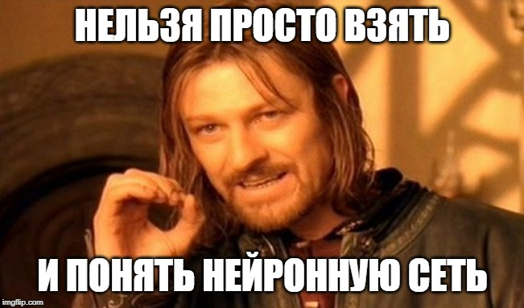
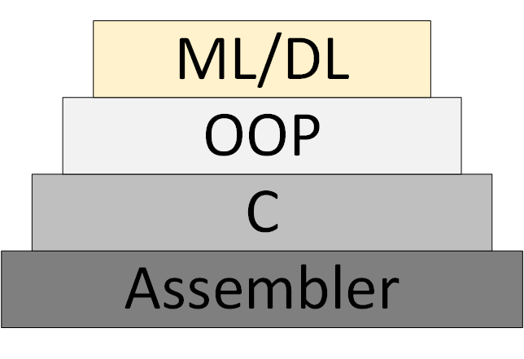

# Нейросети. Куда это все движется
Дата публикации: 31.12.2019

[Статья опубликована на Хабре](https://habr.com/ru/post/482794)

Статья состоит из двух частей:
  1. Краткое описание некоторых архитектур сетей по обнаружению объектов на изображении и сегментации изображений с самыми понятными для меня ссылками на ресурсы. Старался выбирать видео пояснения и желательно на русском языке.
  2. Вторая часть состоит в попытке осознать направление развития архитектур нейронных сетей. И технологий на их основе.

Рисунок 1 – Понимать архитектуры нейросетей непросто

Все началось с того, что сделал два демонстрационных приложения по классификации и обнаружению объектов на телефоне Android:
  * [Back-end demo](https://github.com/foobar167/junkyard/tree/master/object_classifier), когда данные обрабатываются на сервере и передаются на телефон. Классификация изображений (image classification) трех типов медведей: бурого, черного и плюшевого.
  * [Front-end demo](https://github.com/foobar167/android/tree/master/object_detection_demo), когда данные обрабатываются на самом телефоне. Обнаружение объектов (object detection) трех типов: фундук, инжир и финик.

Есть разница между задачами по классификации изображений, обнаружению объектов на изображении и [сегментацией изображений](https://medium.com/analytics-vidhya/image-classification-vs-object-detection-vs-image-segmentation-f36db85fe81). Поэтому появилась необходимость узнать, какие архитектуры нейросетей обнаруживают объекты на изображениях и какие могут сегментировать. Нашел следующие примеры архитектур с самыми понятными для меня ссылками на ресурсы:
  * Серия архитектур на основе R-CNN (**R**egions with **C**onvolution **N**eural **N**etworks features): R-CNN, Fast R-CNN, [Faster R-CNN](https://medium.com/@smallfishbigsea/faster-r-cnn-explained-864d4fb7e3f8), [Mask R-CNN](https://youtu.be/0vt05rQqk_I). Для обнаружения объекта на изображении с помощью механизма Region Proposal Network (RPN) выделяются ограниченные регионы (bounding boxes). Первоначально вместо RPN применялся более медленный механизм Selective Search. Затем выделенные ограниченные регионы подаются на вход обычной нейросети для классификации. В архитектуре R-CNN есть явные циклы «for» перебора по ограниченным регионам, всего до 2000 прогонов через внутреннюю сеть AlexNet. Из-за явных циклов «for» замедляется скорость обработки изображений. Количество явных циклов, прогонов через внутреннюю нейросеть, уменьшается с каждой новой версией архитектуры, а также проводятся десятки других изменений для увеличения скорости и для замены задачи обнаружения объектов на сегментацию объектов в Mask R-CNN.
  * [YOLO](https://youtu.be/L0tzmv--CGY) (**Y**ou **O**nly **L**ook **O**nce) – первая нейронная сеть, которая распознавала объекты в реальном времени на мобильных устройствах. Отличительная особенность: различение объектов за один прогон (достаточно один раз посмотреть). То есть в архитектуре YOLO нет явных циклов «for», из-за чего сеть работает быстро. Например, такая аналогия: в NumPy при операциях с матрицами тоже нет явных циклов «for», которые в NumPy реализуются на более низких уровнях архитектуры через язык программирования С. YOLO использует сетку из заранее заданных окон. Чтобы один и тот же объект не определялся многократно, используется коэффициент перекрытия окон (IoU, **I**ntersection **o**ver **U**nion). Данная архитектура работает в широком диапазоне и обладает высокой [робастностью](https://ru.wikipedia.org/wiki/%D0%A0%D0%BE%D0%B1%D0%B0%D1%81%D1%82%D0%BD%D0%BE%D1%81%D1%82%D1%8C): модель может быть обучена на фотографиях, но при этом хорошо работать на рисованных картинах.
  * [SSD](https://youtu.be/P8e-G-Mhx4k) (**S**ingle **S**hot MultiBox **D**etector) – используются наиболее удачные «хаки» архитектуры YOLO (например, non-maximum suppression) и добавляются новые, чтобы нейросеть быстрее и точнее работала. Отличительная особенность: различение объектов за один прогон с помощью заданной сетки окон (default box) на пирамиде изображений. Пирамида изображений закодирована в сверточных тензорах при последовательных операциях свертки и пулинга (при операции max-pooling пространственная размерность убывает). Таким образом определяются как большие, так и маленькие объекты за один прогон сети.
  * MobileSSD (**Mobile**NetV2 + **SSD**) – комбинация из двух архитектур нейросетей. Первая сеть [MobileNetV2](https://habr.com/ru/post/352804/) работает быстро и увеличивает точность распознавания. MobileNetV2 применяется вместо VGG-16, которая первоначально использовалась в [оригинальной статье](https://arxiv.org/abs/1512.02325). Вторая сеть SSD определяет местоположение объектов на изображении.
  * [SqueezeNet](https://youtu.be/ge_RT5wvHvY) – очень маленькая, но точная нейросеть. Сама по себе не решает задачу обнаружения объектов. Однако может применяться при комбинации различных архитектур. И использоваться в мобильных устройствах. Отличительной особенностью является то, что сначала данные сжимаются до четырех 1×1 сверточных фильтров, а затем расширяются до четырех 1×1 и четырех 3×3 сверточных фильтров. Одна такая итерация сжатия-расширения данных называется «Fire Module».
  * [DeepLab](https://youtu.be/b6jhopSMit8) (Semantic Image Segmentation with Deep Convolutional Nets) – сегментация объектов на изображении. Отличительной особенностью архитектуры является разряженная (dilated convolution) свертка, которая сохраняет пространственное разрешение. Затем следует стадия постобработки результатов с использованием графической вероятностной модели (conditional random field), что позволяет убрать небольшие шумы в сегментации и улучшить качество отсегментированного изображения. За грозным названием «графическая вероятностная модель» скрывается обычный фильтр Гаусса, который аппроксимирован по пяти точкам.
  * Пытался разобраться в устройстве [RefineDet](https://arxiv.org/abs/1711.06897) (Single-Shot **Refine**ment Neural Network for Object **Det**ection), но мало чего понял.
  * Также посмотрел, как работает технология «внимание» (attention): [видео1](https://youtu.be/W2rWgXJBZhU), [видео2](https://youtu.be/iDulhoQ2pro), [видео3](https://youtu.be/H6Qiegq_36c). Отличительной особенностью архитектуры «внимание» является автоматическое выделение регионов повышенного внимания на изображении (RoI, **R**egions **o**f **I**nterest) с помощью нейросети под названием Attention Unit. Регионы повышенного внимания похожи на ограниченные регионы (bounding boxes), но в отличие от них не зафиксированы на изображении и могут иметь размытые границы. Затем из регионов повышенного внимания выделяются признаки (фичи), которые «скармливаются» рекуррентным нейросетям с архитектурами [LSDM, GRU или Vanilla RNN](https://youtu.be/5lUUrREboSk). Рекуррентные нейросети умеют анализировать взаимоотношение признаков в последовательности. Рекуррентные нейросети изначально применялись для переводов текста на другие языки, а теперь и для перевода [изображения в текст](https://youtu.be/e-WB4lfg30M) и [текста в изображение](https://youtu.be/rAbhypxs1qQ).

По мере изучения этих архитектур **я понял, что ничего не понимаю**. И дело не в том, что у моей нейросети есть проблемы с механизмом внимания. Создание всех этих архитектур похоже на какой-то огромный хакатон, где авторы соревнуются в хаках. Хак (hack) – быстрое решение трудной программной задачи. То есть между всеми этими архитектурами нет видимой и понятной логической связи. Все, что их объединяет – это набор наиболее удачных хаков, которые они заимствуют друг у друга, плюс общая для всех [операция свертки с обратной связью](https://youtu.be/Ilg3gGewQ5U) (обратное распространение ошибки, backpropagation). Нет [системного мышления](https://habr.com/ru/post/272473/)! Не понятно, что менять и как оптимизировать имеющиеся достижения.

Как результат отсутствия логической связи между хаками, их чрезвычайно трудно запомнить и применить на практике. Это фрагментированные знания. В лучшем случае запоминаются несколько интересных и неожиданных моментов, но большинство из понятого и непонятного исчезает из памяти уже через несколько дней. Будет хорошо, если через неделю вспомнится хотя бы название архитектуры. А ведь на чтение статей и просмотр обзорных видео было потрачено несколько часов и даже дней рабочего времени!

Рисунок 2 – [Зоопарк нейронных сетей](https://www.asimovinstitute.org/neural-network-zoo/)

Большинство авторов научных статей, по моему личному мнению, делают все возможное, чтобы даже эти фрагментированные знания были не поняты читателем. Но деепричастные обороты в десяти строковых предложениях с формулами, которые взяты «с потолка» – это тема для отдельной статьи (проблема [publish or perish](https://en.wikipedia.org/wiki/Publish_or_perish)).

По этой причине появилась необходимость систематизировать информацию по нейросетям и, таким образом, увеличить качество понимания и запоминания. Поэтому основной темой разбора отдельных технологий и архитектур искусственных нейронных сетей стала следующая задача: **узнать, куда это все движется**, а не устройство какой-то конкретной нейросети в отдельности.

Куда все это движется. Основные результаты:
  * Число стартапов в области машинного обучения в последние два года [резко упало](https://habr.com/ru/company/recognitor/blog/455676/). Возможная причина: «нейронные сети перестали быть чем-то новым».
  * Каждый сможет создать работающую нейросеть для решения простой задачи. Для этого возьмет готовую модель из «зоопарка моделей» (model zoo) и натренирует последний слой нейросети ([transfer learning](https://youtu.be/yofjFQddwHE)) на готовых данных из [Google Dataset Search](https://toolbox.google.com/datasetsearch) или из [25-ти тысяч датасетов Kaggle](https://www.kaggle.com/datasets) в бесплатном [облаке Jupyter Notebook](https://www.dataschool.io/cloud-services-for-jupyter-notebook/).
  * Крупные производители нейросетей начали создавать **«зоопарки моделей»** (model zoo). С помощью них можно быстро сделать коммерческое приложение: [TF Hub](https://tfhub.dev/) для TensorFlow, [MMDetection](https://github.com/open-mmlab/mmdetection) для PyTorch, [Detectron](https://github.com/facebookresearch/Detectron) для Caffe2, [chainer-modelzoo](https://github.com/wkentaro/chainer-modelzoo) для Chainer и [другие](https://modelzoo.co/).
  * Нейросети, работающие в **реальном времени** (real-time) на мобильных устройствах. От 10 до 50 кадров в секунду.
  * Применение нейросетей в телефонах (TF Lite), в браузерах (TF.js) и в [бытовых предметах](https://youtu.be/19ZNz2N79u4) (IoT, **I**nternet **o**f **T**hings). Особенно в телефонах, которые уже поддерживают нейросети на уровне «железа» (нейроакселераторы).
  * «Каждое устройство, предметы одежды и, возможно, даже пища будут иметь **IP-v6 адрес** и сообщаться между собой» – [Себастьян Трун](https://youtu.be/GG7H8Xa4m8I?t=85).
  * Рост количества публикаций по машинному обучению начал [превышать закон Мура](http://data-mining.philippe-fournier-viger.com/too-many-machine-learning-papers) (удвоение каждые два года) с 2015 года. Очевидно, нужны нейросети по анализу статей.
  * Набирают популярность следующие технологии:
      * **PyTorch** – популярность растет стремительно и, похоже, обгоняет TensorFlow.
      * Автоматический подбор гиперпараметров **AutoML** – популярность растет плавно.
      * Постепенное уменьшение точности и увеличение скорости вычислений: [нечеткая логика](https://youtu.be/rln_kZbYaWc), алгоритмы [бустинга](https://youtu.be/MIPkK5ZAsms), неточные (приближенные) вычисления, квантизация (когда веса нейросети переводятся в целые числа и квантуются), нейроакселераторы.
      * Перевод [изображения в текст](https://youtu.be/e-WB4lfg30M) и [текста в изображение](https://youtu.be/rAbhypxs1qQ).
      * Создание [трехмерных объектов по видео](https://youtu.be/OrHLacCDZVQ), теперь уже в реальном времени.
      * Основное в DL – это много данных, но собрать и разметить их непросто. Поэтому развивается автоматизация разметки ([automated annotation](https://youtu.be/NcKTn4C91Yc)) для нейросетей с помощью нейросетей.
  * С нейросетями Computer Science внезапно стала **экспериментальной наукой** и возник [кризис воспроизводимости](https://habr.com/ru/post/480348).
  * ИТ-деньги и популярность нейросетей возникли одновременно, когда вычисления стали рыночной ценностью. Экономика из золотовалютной становится **золото-валютно-вычислительной**. Смотрите [мою статью](../../Various/ekonomika_budushchego_dlya_fizikov/ekonomika_budushchego_dlya_fizikov.md) по [эконофизике](https://ru.wikipedia.org/wiki/%D0%AD%D0%BA%D0%BE%D0%BD%D0%BE%D1%84%D0%B8%D0%B7%D0%B8%D0%BA%D0%B0) и причине появления IT-денег.

Постепенно появляется новая [методология программирования ML/DL](https://habr.com/ru/post/481844) (Machine Learning & Deep Learning), которая основана на представлении программы, как совокупности обученных нейросетевых моделей.

Рисунок 3 – ML/DL как новая методология программирования

Однако так и не появилось **«теории нейросетей»**, в рамках которой можно думать и работать системно. Что сейчас называется «теорией» на самом деле экспериментальные, эвристические алгоритмы.

Ссылки на мои и не только ресурсы:
  * Рассылка новостей по Data Science. В основном, по обработке изображений. Кто хочет получать, пусть присылает e-mail (foobar167<гаф-гаф>gmail<точка>com). Ссылки на статьи и видео рассылаю по мере накопления материала.
  * Общий [список курсов и статей](https://github.com/foobar167/articles/blob/master/Machine_Learning/courses_on_machine_learning.md), которые прошел и которые хотел бы пройти.
  * [Курсы и видео для начинающих](https://github.com/foobar167/articles/blob/master/Ubuntu/13_Keras_and_TensorFlow_how-tos.md#exercises), с которых стоит начинать изучать нейросети. Плюс брошюра [«Введение в машинное обучение и искусственные нейронные сети»](https://foobar167.github.io/page/vvedeniye-v-mashinnoye-obucheniye-i-iskusstvennyye-neyronnyye-seti.html).
  * [Полезные инструменты](https://github.com/foobar167/articles/blob/master/Ubuntu/13_Keras_and_TensorFlow_how-tos.md#tools), где каждый найдет что-то интересное для себя.
  * Крайне полезными оказались **видеоканалы по разбору научных статей** по Data Science. Находите, подписывайтесь на них и передавайте ссылки своим коллегам и мне тоже. Примеры:
    * [Two Minute Papers](https://www.youtube.com/user/keeroyz)
    * [Henry AI Labs](https://www.youtube.com/channel/UCHB9VepY6kYvZjj0Bgxnpbw)
    * [Yannic Kilcher](https://www.youtube.com/channel/UCZHmQk67mSJgfCCTn7xBfew)
    * [CodeEmporium](https://www.youtube.com/channel/UC5_6ZD6s8klmMu9TXEB_1IA)
    * [Блог Chengwei Zhang](https://www.dlology.com) ака [Tony607](https://github.com/Tony607) с пошаговыми инструкциями и открытым исходным кодом.

Спасибо за внимание!

**Теги:** нейросети, искусственные нейронные сети, машинное обучение, распознавание изображений, machine learning, deep learning, глубокое обучение, сумма технологии, 
