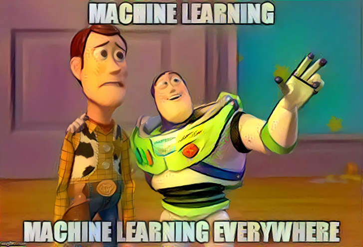
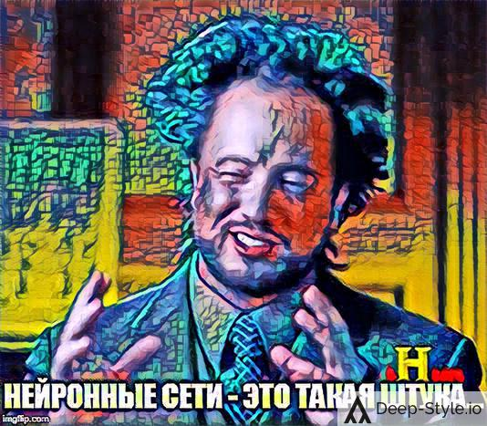
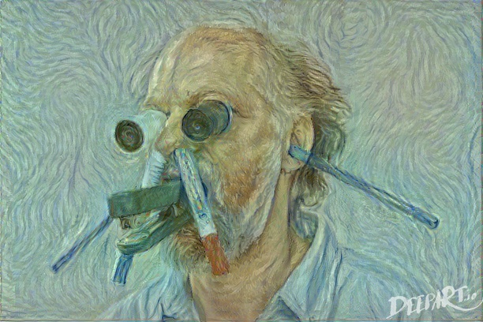

# Новости машинного обучения. Самое интересное из пяти рассылок

[Опубликовано на Хабре](https://habr.com/ru/news/t/483098/)

Наиболее интересные новости из пяти почтовых рассылок. Новые технологии, идеи по применению и гипотезы.

  * Пограничники и охрана территорий, сидят за огромным монитором, на котором изображения от IP-камер. Результативно следить за всеми картинками в течение 6-8 часов физически невозможно. Большой помощью в такой работе будет [система распознавания и детектирования](https://youtu.be/YqCIqNeYmOA): людей, машин, предметов. Сюда же относятся [домашние системы безопасности](https://youtu.be/E6mkaFc59p0) и [обнаружение объектов в реальном времени](https://youtu.be/xhp47v5OBXQ) с камер наблюдения.
  * [Управление шлагбаумом](https://youtu.be/wGVipPfr4UE) с помощью [Arduino](https://www.arduino.cc) (аналог [Raspberry Pi](https://www.raspberrypi.org)). Интересно, что будет, если подойти к шлагбауму с [нарисованным на картоне](https://youtu.be/Bswsbh-KTLQ) номером?
  * Вместо шлагбаума [эмоции посетилелей](https://youtu.be/BEkZ8nl4Nd8), сотрудников, прохожих. Распознавание [изображений лиц](https://youtu.be/BqQT4sIOYA0) через мобильные приложения. [Обнаружение и отслеживание предметов](https://youtu.be/M6FsOHbq2ro). Современные системы отслеживания объектов (object tracking) также используют нейросети ([Regression Networks](https://youtu.be/kMhwXnLgT_I) и т.д.).
  * [Робот-танк](https://habr.com/ru/post/459126) на Raspberry Pi с Intel Neural Computer Stick 2. [Аналогичная разработка](https://youtu.be/z9gSZwVMybc) выглядит впечатляюще для 2016 года.
  * [Детектор дыма](https://youtu.be/g4cxpcj2UFA) для пожарной сигнализации.
  * [Распознавание товаров на полках](https://habr.com/ru/company/true_engineering/blog/416123/) с помощью нейронных сетей на технологиях Keras и Tensorflow Object Detection API. [Система автоматических рассчетов](https://youtu.be/yeS8TJwBAFs) в магазине.
  * [Решение математических уравнений](https://youtu.be/iss52uQS6jo).
  * Оценка местности: площадь домов, [количество бассейнов](https://towardsdatascience.com/object-detection-on-aerial-imagery-using-retinanet-626130ba2203), наличие автомобилей и т.д.
  * Наблюдение за животными в [доме](https://youtu.be/gGqVNuYol6o) и в [дикой природе](https://youtu.be/_54dNgKqHY8). [Определение заболеваний растений](https://youtu.be/MD61bddZtbg) для фермеров.
  * Управление устройствами и процессами [движением рук](https://habr.com/ru/post/466781/).
  * Мод для автомобиля Tesla под названием [Surveillance Detection Scout](https://youtu.be/zk7DIiStgr4), с помощью которого автомобиль Tesla превращается в платформу видеонаблюдения на колесах. Он распознает номера машин на дороге и лица людей в реальном времени. [Презентация](https://youtu.be/qR7gm1RsdGg) технологии. В ней хакер объясняет, что систему можно использовать в различных целях: как для разведки, так и для контрразведки. Например, если система часто замечает один и тот же автомобильный номер или одного и того же человека, то хозяину отправляется сообщение о подозрительной активности.
  * В московской компании [Deep Systems](https://deepsystems.ai/ru) сделали [робо-мобиль](https://youtu.be/VuweCfAGZjU) еще в 2017 году. Последняя их разработка: автоматическая сегментация с помощью нейросетей хорошо [обрабатывает волосы](https://youtu.be/8R7oxGXhJkY), помощь фотошоперу и разметчику баз данных.
  * [Автоматическая сегментация с помощью нейросетей](https://youtu.be/rpp7ZhGb1IQ) По моему субъективному мнению, примерно в 8-10 раз быстрее ручной разметки. Для ускорения работы все следует сегментировать только нейросетями.
  * Перевод [изображения в текст](https://youtu.be/e-WB4lfg30M) и [текст в изображение](https://youtu.be/rAbhypxs1qQ) (с помощюь GAN-сетей, **G**enerative **A**dversarial **N**etwork).
  * Бесплатные веб-приложения для передачи стиля ([neural style transfer](https://colab.research.google.com/github/tensorflow/docs/blob/master/site/en/tutorials/generative/style_transfer.ipynb)): [algorithmia.com](https://demos.algorithmia.com/deep-style), [deepart.io](https://deepart.io), [deepdreamgenerator.com](https://deepdreamgenerator.com). С помощью них сгенерировал картинки к статье.

  * Теперь [каждый может танцевать](https://youtu.be/4J0cpdR7qec).
  * Что такое [Neuralink](https://youtu.be/9uRK8Delzvk)? Давно хотел узнать, над чем работает Илон Макс, но как-то руки не добегали.
  * [Реконструкция 3D объекта](https://youtu.be/OrHLacCDZVQ) по видеокардам. Давняя задача, над которой работают много людей. Кстати, разметка у этих исследователей полуавтоматическая с помощью [суперпикселей](https://youtu.be/OrHLacCDZVQ?t=107).
  * [Визуализация и симуляция атомарных структур](https://youtu.be/DWWXaUNVZM4) с помощью CUDA. Красиво и полезно.
  * Визуализация датасетов через [Google FACETS](https://youtu.be/y7cem6PsDjg?t=182), [статья](https://towardsdatascience.com/visualising-machine-learning-datasets-with-googles-facets-462d923251b3). Приложение работает **только в браузере Chrome**. Поэтому [эту ссылку](https://colab.research.google.com/drive/15XYYCo2D4sMYl0ZC3Tm8wVrp0UlzHljR) на Google Colab открывайте только в Chrome. Другие приложения для визуализации данных [тут](https://github.com/parulnith/Data-Visualisation-libraries).
  * В статье [Satellite Imagery Analysis with Python](https://medium.com/analytics-vidhya/satellite-imagery-analysis-with-python-3f8ccf8a7c32) приводится интересная идея: в бочках с нефтью (нефтехранилищах) верхняя крышка двигается вверх-вниз. Значит по положению крышки можно определить запасы нефти на нефтехранилище. На спутниковых снимках берутся бочки с нефтью и по теням от кромок бочек обучается нейронная сеть, которая затем делает оценку запасов нефти на нефтехранилище. Компания [OrbitalInsight](https://orbitalinsight.com/products/go-energy/) уже реализовала этот функционал.
  * Десять хаков для более эффективной работы в Jupyter Notebook: [10 Simple hacks to speed up your Data Analysis in Python](https://github.com/parulnith/10-Simple-hacks-to-speed-up-your-Data-Analysis-in-Python).
  * Не совсем по теме нейросетей... но ответ на «[Главный вопрос жизни, вселенной и всего такого](https://ru.wikipedia.org/wiki/%D0%9E%D1%82%D0%B2%D0%B5%D1%82_%D0%BD%D0%B0_%D0%B3%D0%BB%D0%B0%D0%B2%D0%BD%D1%8B%D0%B9_%D0%B2%D0%BE%D0%BF%D1%80%D0%BE%D1%81_%D0%B6%D0%B8%D0%B7%D0%BD%D0%B8,_%D0%B2%D1%81%D0%B5%D0%BB%D0%B5%D0%BD%D0%BD%D0%BE%D0%B9_%D0%B8_%D0%B2%D1%81%D0%B5%D0%B3%D0%BE_%D1%82%D0%B0%D0%BA%D0%BE%D0%B3%D0%BE)» не 42 (в двоичной системе 101010), а 44 (101100 в двоичной системе). «Доказательство» находится в видео «[Why do prime numbers make these spirals?](https://youtu.be/EK32jo7i5LQ)». Ошибку +2 можно считать погрешностью глубокой нейронной сети [Deep Thought](https://youtu.be/5ZLtcTZP2js) из научно-фантастического рассказа Дугласа Адамса 1979 года.

Спасибо за внимание!

**Теги:** машинное обучение, machine learning, нейросеть, искусственная нейронная сеть, artificial neural network, глубокое обучение, deep learning, Data Science, новости науки и техники, идеи для бизнеса, бизнес идеи, обработка изображений, научно-популярное, будущее здесь, визуализация данных, искусственный интеллект, 

**Хабы:** машинное обучение, обработка изображений, научно-популярное, будущее здесь, визуализация данных, искусственный интеллект,
