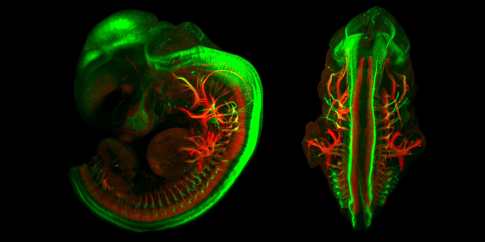
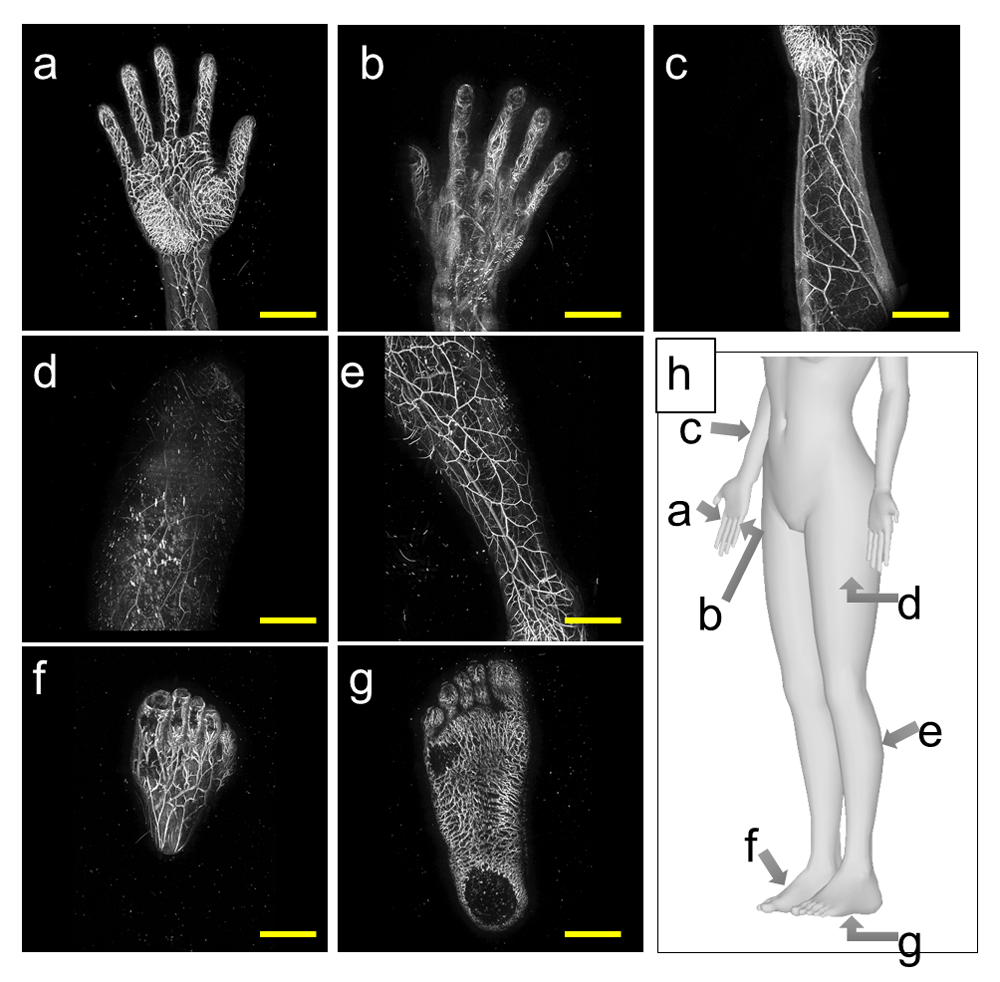
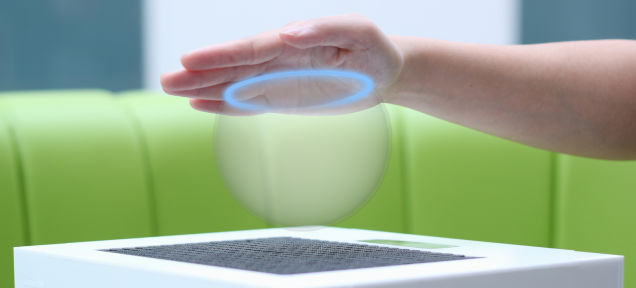

# Новости машинного обучения. Выпуск 6

[Опубликовано на Хабре](https://habr.com/ru/news/t/483100/)

[Предыдущий выпуск](2020.01.07-novosti-mashinnogo-obucheniya-samoye-interesnoye-iz-pyati-rassylok.md)

Новости ML, новые технологии, идеи по применению и гипотезы.

  * [Lattice Light-Sheet Microscopy](https://youtu.be/9euW5iCjKDo) (решетчатая светолистовая микроскопия). Наступает новая эра в микробиологии клетки. Данная технология позволяет увидеть отдельную клетку, не разрушая ее. Технология основана на эффекте интерференции света от лазеров. Для уменьшения шума применяется технология позаимствованная из астрофизики – адаптивная оптика (adaptive optics). Микроскоп называется MOSAIC и расположен в лаборатории города Беркли. Скоро изготовят второй, более точный микроскоп.
  * [3D визуализация с помощью ультразвука](https://youtu.be/C9aPsURza1I). Шарик из пенопласта радиусом 1 мм летает в ультразвуковых волнах и подсвечивается лазерами. Получается 3D изображение, которое можно услышать и потрогать. Еще лет десять назад видел проект Билла Гейтса по созданию 3D изображений из тумана. Эта технология называется [Fog Screen Projection](https://youtu.be/sV4C_I0yCX8) (проекция на экран из тумана). Устройство на ультразвуке еще не продается. Устройство на тумане продается под названием [Gatebox](https://youtu.be/nK4y5jBJfu8), вполне возможно, в честь Билла Гейтса (Bill **Gates**). Не знаю его ли это технология, но знаю, что Билл вложил в этот стартап деньги еще 10 лет назад.
  * [3D изображения тела с помощью лазерных звуковых волн](https://youtu.be/i_OUzqpsVP4) или фотоакустическая визуализация (photoacoustic imaging). Готовится ряд технологических новшеств на основе звуковых и лазерных волн. Идея гениально простая: **звук можно не только слышать, но видеть и трогать. И наоборот.** Тактильные ощущения можно видеть, а [магнитные поля – ощущать](https://youtu.be/dg3pza4y2ws). Более сотни лет назад Александр Грэхем Белл первым наблюдал, как электромагнитные волны создают звуковые волны, если направить их на материалы. К этой же категории относятся устройства, которые позволяют увидеть тактильные ощущения при помощи языка: технология [Brain Port](https://youtu.be/48evjcN73rw) и ее более [современная версия](https://youtu.be/6NNmpbU7GMA). К сожалению, цена устройства как была [10&nbsp;000 долларов](https://youtu.be/RHRxiuxP3QU), такой и осталась. **Расширяет область восприятия** [специальная одежда](https://youtu.be/4c1lqFXHvqI). «Умную» одежду пытаются использовать для [торгов на фондовой бирже](https://youtu.be/4c1lqFXHvqI?t=870), то есть обучить натуральную нейронную сеть мозга подавая котировки акций в виде сигналов на «умную» одежду с обратным подкреплением: правильно или неправильно нажал на кнопку, то есть правильно или не правильно продал-купил в реальном времени. Можно ли увидеть запахи, как их различает собака? [Увидеть звук](https://youtu.be/eUzB0L0mSCI) через звуконепроницаемое стекло. Или расширить спектр видимых глазу волн, увидеть тепловое, инфракрасное излучение, ультрафиолет. Видеть (слышать, тактильно ощущать при помощи перчаток) излучение от колебаний тока в проводах полезно для электриков. Или ультразвуковой локатор на голове, который позволяет «видеть» на 360 градусов вокруг не поворачивая головы. Видеть сквозь стены и небольшие преграды, через которые проходит ультразвук. Такие и похожие приспособления есть у спецвойск, но их можно также применять в быту и *для развлечений*. [Бионические люди не фантастика](https://youtu.be/kI9vfzsciqs).
  * Для чего нужен мозг? Головой мы едим, но для чего в ней мозг? Правильный ответ: **мозг нужен для того, чтобы делать сложные движения**. Видео «[Для чего на самом деле нужен мозг](https://youtu.be/lIbEolNCbrI)». Физические упражнения со сложными движениями у йогов и шаолиньских монахов приобретают особый смысл: развитие мозга при помощи физических упражнений. «Если вы можете попасть маленьким белым шариком в лунку на расстоянии в несколько сотен метров, используя для этого длинную металлическую палку, то общество будет готово вознаградить вас за это умение несколькими сотнями [миллионов долларов](https://youtu.be/lIbEolNCbrI?t=372)». Также становится понятно, почему древние греки изучали математику в спортзале, то есть в гимназиях (гимназия, английский gym, от древнегреческого gymnasium, переводится, как «место для упражнений»). Отсюда вывод: **чтобы иметь здоровый мозг, необходимо совершать сложные движения**. Видео «[Electrical experiments with plants that count and communicate](https://youtu.be/pvBlSFVmoaw)». Изучение работы мозга будет неполным, если не изучать тех, у кого формально мозга (сети нейронов) нет: растения, грибы, кораллы, губки, бактерии.

  * [Видим ли мы реальность такой, какая она есть?](https://youtu.be/DqzILgXWwqM) Мы реконструируем реальность. В этом смысле работа мозга по реконструкции реальности *похожа* на автокодировщик ([autoencoder](https://youtu.be/Rdpbnd0pCiI)). Только хардкор, [только приспособленность](https://youtu.be/DqzILgXWwqM?t=646), никакой реальности. Эволюция препятствует подлинному или точному восприятию реальности организмом. Эволюция дала нам *интерфейс*, который скрывает реальность и помогает приспосабливаться. Наша реальность похожа на 3D рабочий стол, чтобы прятать всю сложность реального мира. Вполне возможно, что детекторы эмоций создаются IT компаниями на неправильных предположениях, ведь [физические движения сами по себе не имеют никакого эмоционального посыла](https://youtu.be/PEyqa4ljXCE?t=465). Надеюсь, что эта инфа поможет вам создавать более эффективные программы.
  * [Молекулярное программирование](https://youtu.be/V2d1U4AyDPw) ([Molecular Programming](https://youtu.be/IAWAPKMKFFo)). Технология по [программированию молекулярных систем](http://molecular-programming.org/). Молекула, как робот. В общем, это и есть нанотехнология. Больших прорывов в этой области пока нет (либо их знают единицы), но прогресс идет. Сюда же можно отнести и всю генную инженерию, это тоже, в каком-то смысле, молекулярное программирование. В отличие от генной инженерии идея молекулярного программирования: создать молекулы, которые будут более предсказуемыми, более программируемыми и гораздо меньших размеров, чем ДНК и РНК. Сюда же, к молекулярному программированию, можно отнести изучение [прионов](https://youtu.be/J0TyPWdDniU) и [болезни Альцгеймера](https://youtu.be/c54blnCms14).
  * Появился датасет из *натуральных* изображений, которые [трудно распознаются нейросетями](https://youtu.be/cpxtd-FKY1Y). Датасет называется [ImageNet-A](https://arxiv.org/abs/1907.07174) и находится в [бесплатном доступе](https://github.com/hendrycks/natural-adv-examples) всем желающим. Точность распознавания этого датасета примерно 2&nbsp;%. Современные техники увеличения робастности улучшают качество классификации на этом датасете лишь на 1&nbsp;%.
  * [Streamlit](https://docs.streamlit.io) бесплатная библиотека Python, которая позволяет делать красивые приложения для машинного обучения, облегчает разработку и подбор гиперпараметров. Исходный код [на GitHub](https://github.com/streamlit/streamlit). Видео презентация Streamlit [здесь](https://youtu.be/0It8phQ1gkQ). В данный момент библиотека *не работает* с Jupyter и CoLab, запускайте из консоли.

Спасибо за внимание!

**Теги:** машинное обучение, machine learning, нейросеть, искусственная нейронная сеть, artificial neural network, глубокое обучение, deep learning, Data Science, новости науки и техники, идеи для бизнеса, бизнес идеи, обработка изображений, научно-популярное, будущее здесь, визуализация данных, искусственный интеллект, 

**Хабы:** машинное обучение, обработка изображений, научно-популярное, будущее здесь, визуализация данных, искусственный интеллект, 
