# Новые архитектуры нейросетей

<!--

**Under construction...**
-->

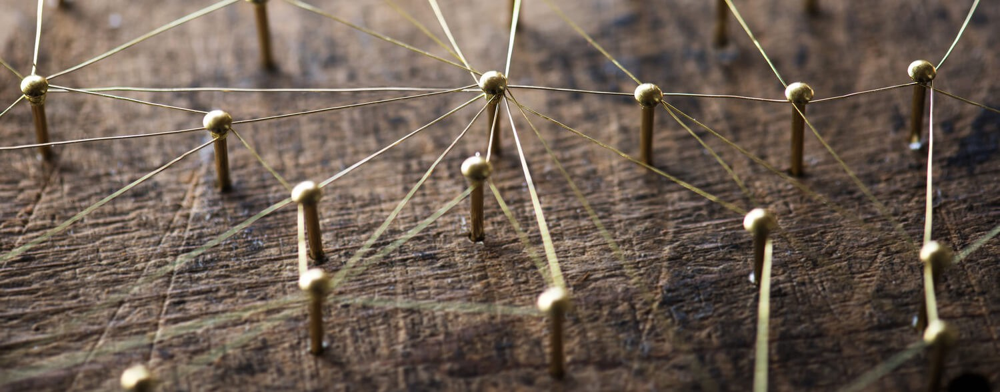

[Эта статья на Хабре](https://habr.com/ru/post/498168/)

Предыдущая статья «[Нейросети. Куда это все движется](https://habr.com/ru/post/482794/)»

В этой статье кратко рассматриваются некоторые архитектуры нейросетей, в основном по задаче *обнаружения объектов*, чтобы найти (или хотя бы попытаться найти) будущие направления в этой быстро развивающейся области.

Статья не претендует на полноту охвата и хорошее понимание прочитанных «по диагонали» статей. Автор уверен, что пока писал эту статью, появилось еще много новых архитектур. Например, смотрите здесь: https://paperswithcode.com/area/computer-vision.

<cut />

  - [EfficientNet](#EfficientNet)
  - [EfficientDet](#EfficientDet)
  - [SpineNet](#SpineNet)
  - [CenterNet](#CenterNet)
  - [ThunderNet](#ThunderNet)
  - [CSPNet](#CSPNet)
  - [DenseNet](#DenseNet)
  - [SAUNet](#SAUNet)
  - [DetNASNet](#DetNASNet)
  - [SM-NAS](#SM-NAS)
  - [AmoebaNet](#AmoebaNet)
  - [Graph Neural Network](#GNN)
  - [Growing Neural Cellular Automata](#cellular_automata)
  - [Импульсная нейронная сеть](#spiking-nn)
  - [DPM](#DPM)
  - [Выводы](#conclusions)

[Object Detection in 20 Years](https://arxiv.org/pdf/1905.05055v2.pdf) - большой обзор на 400+ статей для обнаружения объектов за 20 лет.

[The Neural Network Zoo](https://www.asimovinstitute.org/neural-network-zoo/) - зоопарк нейросетей, содержимое которого постоянно меняется.

Интересное видео с рекомендациями, как спроектировать нейронную сеть: «[How to Design a Neural Network](https://youtu.be/g2vlqhefADk)».

-------
## <a name="EfficientNet">EfficientNet</a>
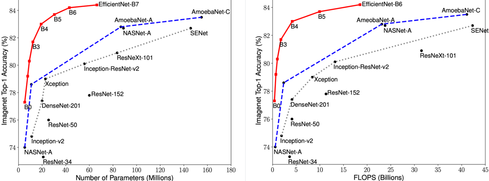

**EfficientNet** — класс новых моделей, который получился из изучения масштабирования (скейлинг, scaling) моделей и балансирования между собой глубины и ширины (количества каналов) сети, а также разрешения изображений в сети. Авторы [статьи](https://arxiv.org/abs/1905.11946) предлагают новый метод составного масштабирования (compound scaling method), который равномерно масштабирует глубину/ширину/разрешение с фиксированными пропорциями между ними. Из существующего метода под названием «Neural Architecture Search» ([NAS](https://en.wikipedia.org/wiki/Neural_architecture_search), [статья1](https://arxiv.org/abs/1611.01578), [статья2](https://arxiv.org/abs/1807.11626), [видео](https://youtu.be/gZZKjiAKc5s)) для автоматического создания новых сетей и своего собственного метода масштабирования авторы получают новый класс моделей под названием EfficientNets.

  * [статья](https://arxiv.org/abs/1905.11946) «EfficientNet: Rethinking Model Scaling for Convolutional Neural Networks»
  * обзор оригинальной статьи [на русском](https://habr.com/ru/company/ods/blog/472672/#4-efficientnet-rethinking-model-scaling-for-convolutional-neural-networks)
  * [исходный код](https://github.com/tensorflow/tpu/tree/master/models/official/efficientnet) для TensorFlow
  * [видео1](https://youtu.be/3svIm5UC94I), [видео2.1](https://youtu.be/4U2WO8ObGGU), [видео2.2](https://youtu.be/LRpzb17B1BM), [видео3](https://youtu.be/K4XXS4Tn1Ow)

-------
## <a name="EfficientDet">EfficientDet</a>

**EfficientDet** применяется для обнаружения объектов. Архитектура показана на рисунке ниже. Состоит из [EfficientNet](#EfficientNet) в качестве основы, к которой приделан слой по работе с пирамидой признаков под названием BiFPN, за которым идет «стандартная» сеть вычисления класс/рамка объекта.

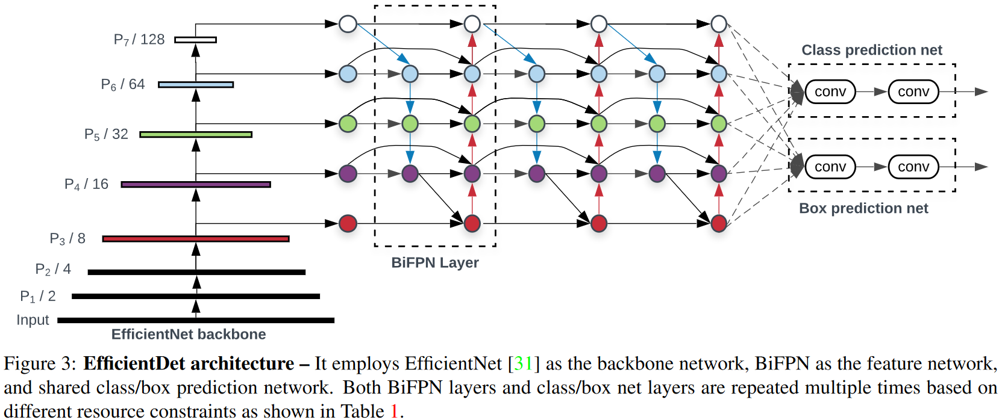

Рисунок — Архитектура EfficientDet == EfficientNet + BiFPN + сеть вычисления класс/рамка

  * [статья](https://arxiv.org/abs/1911.09070) «EfficientDet: Scalable and Efficient Object Detection»
  * [исходный код](https://github.com/xuannianz/EfficientDet) для TensorFlow
  * [исходный код](https://github.com/toandaominh1997/EfficientDet.Pytorch) для PyTorch
  * [видео1](https://youtu.be/UCPxzFPdAf8)

-------
## <a name="SpineNet">SpineNet</a>

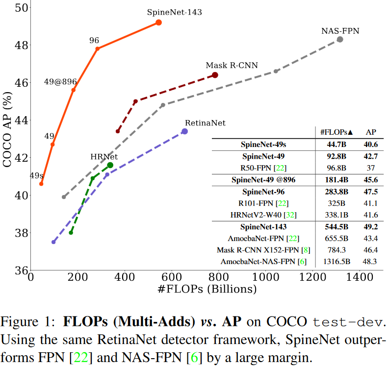

**SpineNet** применяется для обнаружения объектов на изображении. Исследователи из Google Research достигли хороших результатов, которые превышают имеющиеся state-of-the-art (SOTA) подходы. 

Сверточные нейросети обычно кодируют входное изображение в последовательность промежуточных признаков меньшей размерности. Такой подход хорошо работает для задачи классификации изображений, но плохо работает для задачи распознавания объектов (распознавание и локализация). Для обхода ограничения сверточных сетей по локализации (сегментации) объектов применяются сверточные кодировщик-декодировщик с архитектурой типа «[песочные часы](https://medium.com/@sunnerli/simple-introduction-about-hourglass-like-model-11ee7c30138)» (Convolutional Encoder-Decoder Neural Network). В архитектурах типа «песочные часы» декодировщик располагается поверх кодировщика. Таким образом кодировщик применяется для задач классификации, а декодировщик – для задач локализации (сегментации). При этом кодировщик является основной моделью (backbone model), как правило, содержит больше параметров и потребляет больше вычислительных мощностей, чем декодировщик. Исследователи заявляют, что архитектура типа «песочные часы» неэффективна для генерации признаков *разных масштабов*, потому что в такой модели масштаб изображения постоянно уменьшается при помощи основной модели (кодировщика).

Предложенная модель SpineNet позволяет выучивать разномасштабные признаки из-за сверточных слоев смешанных размеров (смотрите рисунок ниже). Размеры слоев подбирались с помощью нейронного поиска архитектур (Neural Architecture Search, NAS). Использование SpineNet в качестве базовой модели дает прирост в точности (Average Precision, AP). При этом на обучение модели требуется меньше вычислительных ресурсов.

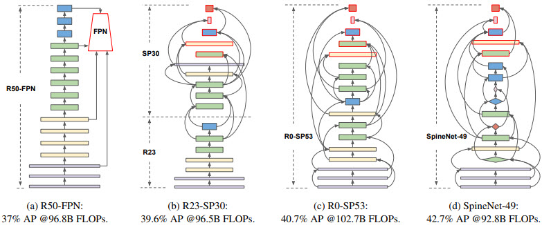

Рисунок – Построение моделей со смешанным масштабом с помощью перестановок слоев архитектуры ResNet (ResNet-50-FPN крайняя слева)

  * [статья](https://arxiv.org/abs/1912.05027) «SpineNet: Learning Scale-Permuted Backbone for Recognition and Localization»
  * [обзор на русском](https://neurohive.io/ru/papers/spinenet-arhitektura-dlya-raspoznavaniya-i-lokalizacii-obekta-na-izobrazhenii/) «SpineNet: архитектура для распознавания и локализации объекта на изображении»
  * [SpineNet online demo](http://zeus.robots.ox.ac.uk/spinenet/demo.html)

-------
## <a name="CenterNet">CenterNet</a>
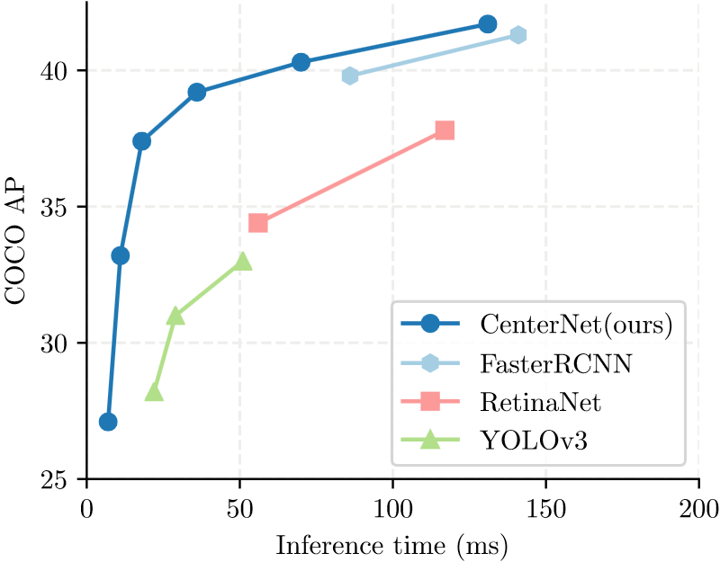

**CenterNet** и **CornerNet-Lite** считались на 2019 год мейнстримовыми *легковесными* системами обнаружения объектов  в реальном времени (cтатья «[Объекты как точки](https://arxiv.org/abs/1904.07850)»).

CenterNet моделирует объект, как одну точку, которая находится в центре ограничительной рамки. Размер объекта, его ориентация, 3D-форма, направление, поза и т.д. извлекаются в последствии через характеристики изображения (image features) около полученной точки. Авторы подают входное изображение в полносвязную сверточную сеть, которая генерирует тепловую карту (heatmap). Пики на этой тепловой карте соответствуют центрам объектов. Характеристики изображения в каждом пике тепловой карты предсказывают размеры ограничительной рамки вокруг объекта. С помощью CenterNet авторы статьи экспериментируют с определением 3D размеров объектов и оценкой позы человека по двумерному изображению.

В другой [статье](https://arxiv.org/abs/1904.08189v3) исследователи используют 3 точки: левый верхний угол, правый нижний угол и центр объекта для более точного определения положения объекта.

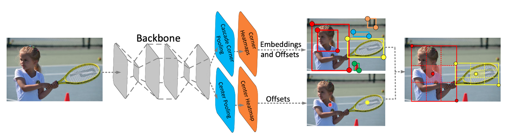

Рисунок – Диаграмма CenterNet

CornerNet является предшественником CenterNet. CornerNet обнаруживает объект, как пару точек: верхний левый и правый нижний углы ограничительной рамки (bounding box). Таким образом распознавание по набору фиксированных рамкок (anchor box), как у нейросетей SSD и YOLO, заменяется на определение пары точек верхнего левого и правого нижнего углов ограничительной рамки вокруг объекта. Также авторы предлагают архитектуру на основе последовательности нескольких нейросетей типа «песочные часы», которые до этого не использовались для определения объектов.

В CornerNet применяется механизм «corner pooling» для определения углов ограничительной рамки вокруг объектов. В CenterNet добавляется механизм «center pooling» для определения центра рамки.

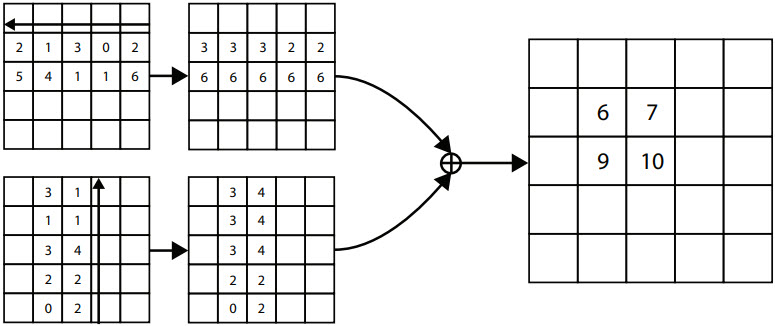

Рисунок – Механизм «corner pooling» для верхнего левого угла. Сканирование проходит справа налево для горизонтального «max-pooling» и снизу вверх для вертикального «max-pooling». Затем две карты характеристик (feature maps) слаживаются.

  * [статья](https://arxiv.org/abs/1904.08189v3) по CenterNet «CenterNet: Keypoint Triplets for Object Detection» + [исходный код 1](https://github.com/xingyizhou/CenterNet) + [исходный код 2](https://paperswithcode.com/paper/centernet-object-detection-with-keypoint)
  * [статья](https://arxiv.org/abs/1904.08900) по CornerNet-Lite «CornerNet-Lite: Efficient Keypoint Based Object Detection» + [исходный код](https://paperswithcode.com/paper/190408900)
  * [статья](https://arxiv.org/abs/1808.01244) по CornerNet: «CornerNet: Detecting Objects as Paired Keypoints» + [исходный код](https://paperswithcode.com/paper/cornernet-detecting-objects-as-paired) + [видео презентация](https://youtu.be/aJnvTT1-spc)

-------
## <a name="ThunderNet">ThunderNet</a>
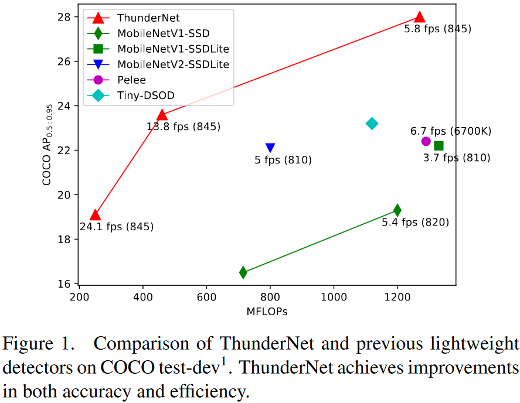

**ThunderNet** применяется для обнаружения объектов на изображении. Является легковесным двуступенчатым детектором. Как утверждают авторы, является первым детектором объектов в реальном времени, который был запущен на платформах [ARM](https://ru.wikipedia.org/wiki/ARM_(%D0%B0%D1%80%D1%85%D0%B8%D1%82%D0%B5%D0%BA%D1%82%D1%83%D1%80%D0%B0)) (мобильные телефоны и одноплатные компьютеры) со скоростью 24.1 fps (frames per second, кадров в секунду) и точностью сравнимой с MobileNet-SSD.

  * [статья](https://arxiv.org/abs/1903.11752) «ThunderNet: Towards Real-time Generic Object Detection»
  * [результаты](https://github.com/search?q=ThunderNet) поиска примеров в GitHub

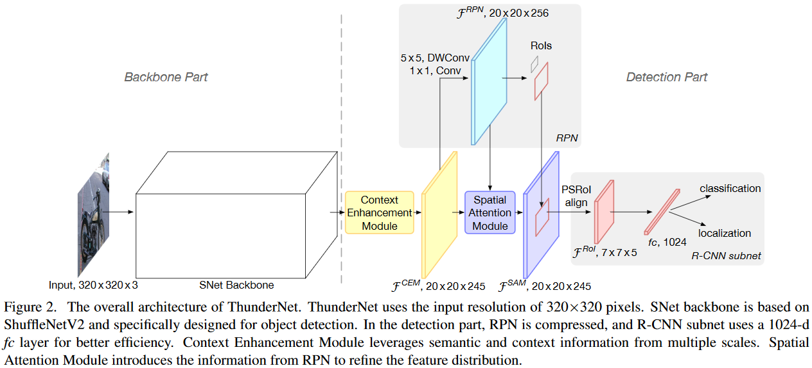

Рисунок — Архитектура ThunderNet

-------
## <a name="CSPNet">CSPNet</a>

**CSPNet** (**C**ross **S**tage **P**artial **Net**work) работает на фреймворке [Darknet](https://github.com/AlexeyAB/darknet), [сайт](https://pjreddie.com/darknet/). Метод применяется не сам по себе, а как *улучшение* уже существующих остаточных нейросетей (residual neural networks, ResNet). Основная концепция в том, чтобы поток градиента распространялся по разным сетевым путям через разделения потока градиента. Таким образом распространяемая информация о градиенте может иметь большую корреляцию, если переключать этапы конкатенации и перехода. CSPNet может значительно сократить объем вычислений, повысить скорость вывода и точность. Как видно из картинки выше, суть CSPNet заключается в более сложной обработке [пирамид признаков](https://youtu.be/4SxOkIN0CmA?t=495) (feature pyramid network, [FPN](https://arxiv.org/abs/1612.03144)).

  * [статья](https://arxiv.org/abs/1911.11929v1) «CSPNet: A New Backbone that can Enhance Learning Capability of CNN»
  * [исходный код 1](https://github.com/WongKinYiu/CrossStagePartialNetworks), [исходный код 2](https://paperswithcode.com/paper/cspnet-a-new-backbone-that-can-enhance)

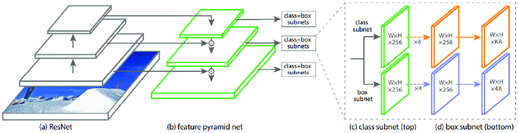

Рисунок — Пример пирамиды признаков

-------
## <a name="DenseNet">DenseNet</a>
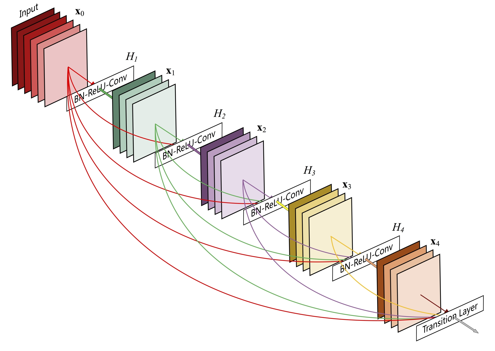

Рисунок — Один плотный блок DenseNet c 5 слоями и скоростью роста k = 4. Каждый слой принимает все предыдущие карты признаков в качестве входных данных.

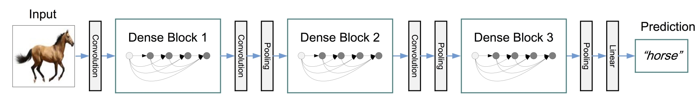

Рисунок — DenseNet с тремя плотными блоками

DenseNet (Densely Connected Convolutional Network) была предложена в 2017 году. Успех ResNet (Deep Residual Network) позволил предположить, что укороченное соединение в CNN позволяет обучать более глубокие и точные модели. Авторы проанализировали это наблюдение и представили компактно соединенный (dense) блок, который соединяет каждый слой с каждым другим слоем. Важно отметить, что, в отличие от ResNet, признаки («фичи») прежде чем они будут переданы в следующий слой не суммируются, а конкатенируются (объединяются, channel-wise concatenation) в единый тензор. При этом количество параметров сети DenseNet намного меньше, чем у сетей с такой же точностью работы. Авторы [утверждают](https://youtu.be/-W6y8xnd--U?t=366), что DenseNet работает особенно хорошо на малых наборах данных.

  * [статья](https://arxiv.org/abs/1608.06993) «Densely Connected Convolutional Networks»
  * [видео презентация](https://youtu.be/-W6y8xnd--U)
  * [видео реализация](https://youtu.be/QKtoh9FJIWQ) на Keras + [исходный код](https://github.com/Machine-Learning-Tokyo/DL-workshop-series/blob/master/Part%20I%20-%20Convolution%20Operations/ConvNets.ipynb) этой и _**многих других моделей**_ в CoLab
  * [реализация](https://github.com/liuzhuang13/DenseNet) на Torch от автора, обученные модели и [реализации](https://github.com/liuzhuang13/DenseNet#other-implementations) на других фреймворках

-------
## <a name="SAUNet">SAUNet</a>
**SAUNet** (**S**hape **A**ttentive **U-Net**) показывает наилучшие на начало 2020 года результаты по сегментации изображений МРТ сердца и предлагается авторами, как сеть по сегментации медицинских изображений.

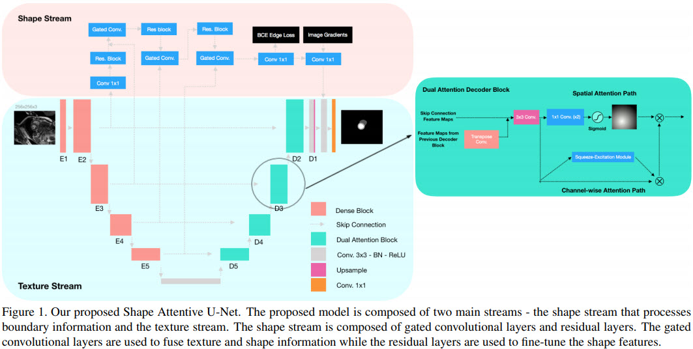

Рисунок — SAUNet состоит из двух частей: одна часть обрабатывает текстуры (texture stream); вторая часть обрабатывает формы (gated shape stream). В кодировщике текстур сети U-Net используются блоки DenseNet-121 (смотрите выше [DenseNet](#DenseNet)), а в декодере в качестве слоев сети U-Net применяются «блоки внимания» (dual attention decoder block).

Архитектура SAUNet является *модульной* и состоит из многих различных блоков: [U-Net](https://colab.research.google.com/drive/1oGDqlVuBFqzcYu12_L53bjkutBkz9_ne), [DenseNet](https://arxiv.org/abs/1608.06993), [Gated-SCNN](https://arxiv.org/abs/1907.05740) и механизма внимания на основе [Squeeze-and-Excitation Networks](https://arxiv.org/abs/1709.01507).

  * [статья](https://arxiv.org/abs/2001.07645v3) «SAUNet: Shape Attentive U-Net for Interpretable Medical Image Segmentation»
  * [исходный код](https://github.com/sunjesse/shape-attentive-unet) на PyTorch

-------
## <a name="DetNASNet">DetNASNet</a>
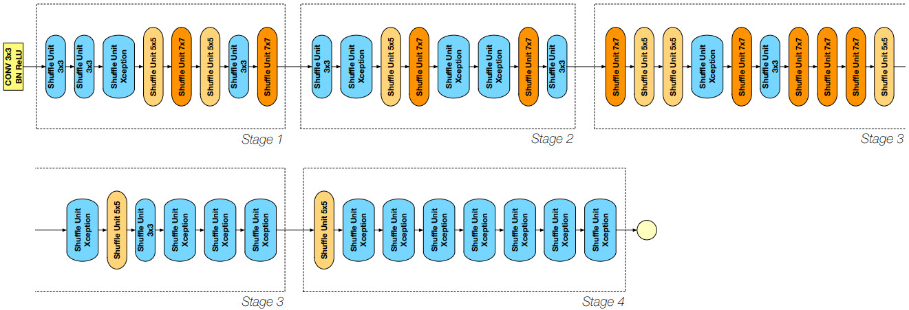

Рисунок — Архитектура DetNASNet

Многие детекторы объектов работают на сетях, которые спроектированы для классификации изображений, что не оптимально, потому что определение объектов (object detection) и классификация изображений (image classification) являются различными задачами. **DetNASNet** использует подход под названием Neural Architecture Search ([NAS](https://en.wikipedia.org/wiki/Neural_architecture_search)) для разработки архитектур, которые определяют объекты. Авторы утверждают, что они впервые применили процесс NAS, т.е. автоматический поиск оптимальных гиперпараметров нейросети, для оптимизации задачи определения объектов. Количесто вычислений составило 44 GPU-дня на наборе данных COCO. Достигнутая точность лучше, чем у ResNet-101, с гораздо меньшим количеством FLOP-пов.

  * [статья](https://arxiv.org/abs/1903.10979) «DetNAS: Backbone Search for Object Detection»
  * [исходный код](https://github.com/megvii-model/DetNAS) на PyTorch

-------
## <a name="SM-NAS">SM-NAS</a>
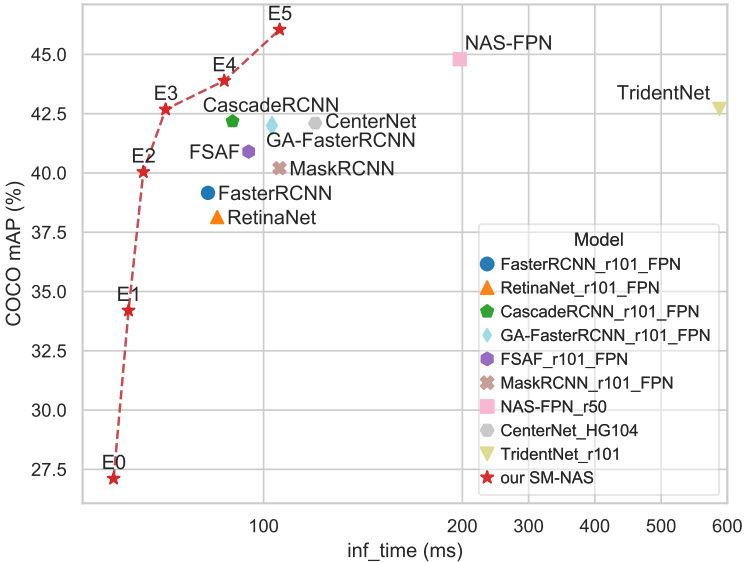

Рисунок — Сравнение времени вывода (мс) и точности обнаружения (mAP) на наборе данных COCO.

В **SM-NAS** предлагается двухэтапная стратегия грубого поиска под названием Structural-to-Modular NAS (SM-NAS): первый этап поиска на структурном уровне направлен на поиск эффективной комбинации различных модулей; второй этап поиска на модульном уровне развивает каждый конкретный модуль и продвигает [фронт Парето](https://ru.wikipedia.org/wiki/%D0%AD%D1%84%D1%84%D0%B5%D0%BA%D1%82%D0%B8%D0%B2%D0%BD%D0%BE%D1%81%D1%82%D1%8C_%D0%BF%D0%BE_%D0%9F%D0%B0%D1%80%D0%B5%D1%82%D0%BE) вперед к более быстрой сети для конкретных задач.

  * Исходный код *не найден*.
  * [статья](https://arxiv.org/abs/1911.09929) «SM-NAS: Structural-to-Modular Neural Architecture Search for Object Detection»

-------
## <a name="AmoebaNet">AmoebaNet</a>
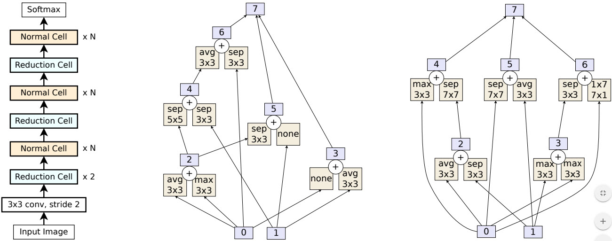

Рисунок — Архитектура сети AmoebaNet-A. Слева общая модель. В центре блок «Normal Cell». Справа блок «Reduction Cell».

**AmoebaNet** также относится к алгоритмам по автоматическому созданию нейросетей. AmoebaNet использует [эволюционные алгоритмы](https://ru.wikipedia.org/wiki/%D0%AD%D0%B2%D0%BE%D0%BB%D1%8E%D1%86%D0%B8%D0%BE%D0%BD%D0%BD%D1%8B%D0%B5_%D0%B0%D0%BB%D0%B3%D0%BE%D1%80%D0%B8%D1%82%D0%BC%D1%8B) вместо алгоритмов обучения с подкреплением для автоматического поиска оптимальных архитектур нейросетей. AmoebaNet использует то же простарство поиска (search space), что и [NASNet](https://arxiv.org/abs/1707.07012). Является очень затратной по вычислениям и использует *сотни* TPU (Tensor Processing Units) для вычислений.

  * [статья](https://arxiv.org/abs/1802.01548) «Regularized Evolution for Image Classifier Architecture Search»
  * [исходный код](https://github.com/tensorflow/tpu/tree/master/models/official/amoeba_net)

-------
## <a name="GNN">Graph Neural Network</a>
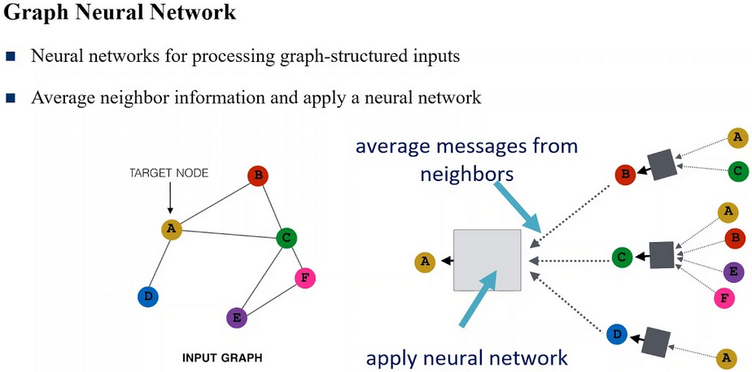

**Graph Neural Network** или **нейронная сеть на графе**, где искусственные нейроны — это узлы графа, а соединения между нейронами — это ребра графа. Полезны для решения задач машинного обучения на графах, т.е. если задачу можно представить в виде какого-нибудь графа. А на графах можно сделать очень многое и даже прововодить обработку изображений. Наиболее популярные библиотеки для машинного обучения на графах: [PyTorch Geometric](https://github.com/rusty1s/pytorch_geometric) для PyTorch, [Graph Nets](https://github.com/deepmind/graph_nets) для TensorFlow, [Deep Graph](https://www.dgl.ai) самая удобная для начала ознакомления.

  * [простой пример](https://colab.research.google.com/drive/1-lGZyrCaNwq1ub8qdH4_g19erjFz3tU-) в CoLab
  * [видео](https://youtu.be/bA261BF0bdk) by Siraj Raval
  * [документация](https://docs.dgl.ai/tutorials/basics/1_first.html) библиотеки DGL (**D**eep **G**raph **L**ibrary)

-------
## <a name="cellular_automata">Growing Neural Cellular Automata</a>
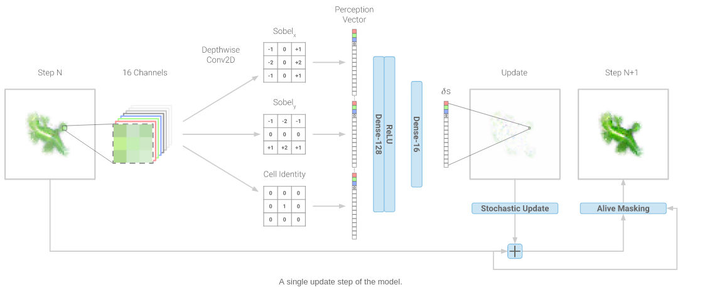

Рисунок — Один шаг обновления модели

**Growing Neural Cellular Automata** являются скрещением идей клеточных автоматов и искусственных нейронных сетей, результатом которого являются «живые» самовоспроизводящиеся и взаимодействующие друг с другом изображения. Ничто не мешает вместо изображений взять любые другие объекты (текст, музыку и т.д.). Растущие нейронные клеточные автоматы выглядят привлекательно и эффектно. Изображения «выращиваются» из вектора в 16 чисел с плавающей запятой. Таким образом данные могут быть «упаковываны» в компактную цепочку чисел, как код ДНК, что в будущем может составить конкуренцию форматам сжатия данных типа JPEG (изображения), MP3 (звук),  MPEG (видео) и ZIP (текст).

В [интерактивной статье](https://distill.pub/2020/growing-ca/) исследователи объясняют принцип устройства растущих нейронных клеточных автоматов, а также пути достижения устойчивости картинки с течением времени, способность восстанавливаться (регенерировать) при повреждениях и устойчивость к вращению. 

  * [интерактивная статья](https://distill.pub/2020/growing-ca/) на сайте Distill
  * [исходный код](https://colab.research.google.com/github/google-research/self-organising-systems/blob/master/notebooks/growing_ca.ipynb) в Colab notebook
  * [видео презентация](https://youtu.be/9Kec_7WFyp0) by Yannic Kilcher
  * игра [«Жизнь»](https://ru.wikipedia.org/wiki/%D0%98%D0%B3%D1%80%D0%B0_%C2%AB%D0%96%D0%B8%D0%B7%D0%BD%D1%8C%C2%BB)

-------
## <a name="spiking-nn">Импульсная нейронная сеть</a>

**Импульсная нейронная сеть** или **Spiking neural network** является самой реалистичной с точки зрения физиологии. В ней нейроны обмениваются короткими импульсами одинаковой амплитуды. Первая научная модель импульсной нейросети была предложена еще в 1952 году Аланом Ходжкином и Эндрю Хаксли, однако данный вид искусственных нейронных сетей известен немногим специалистам в этой области. Основная идея состоит в том, чтобы скопировать поведение биологическкого нейрона. Такие модели могут быть полезны при изучении функций мозга. Для того, чтобы быстро летать, необязательно махать крыльями, однако при решении прикладных задач некоторые свойства можно позаимствовать у биологических организмов.

  * Википедия ([ru](https://ru.wikipedia.org/wiki/%D0%98%D0%BC%D0%BF%D1%83%D0%BB%D1%8C%D1%81%D0%BD%D0%B0%D1%8F_%D0%BD%D0%B5%D0%B9%D1%80%D0%BE%D0%BD%D0%BD%D0%B0%D1%8F_%D1%81%D0%B5%D1%82%D1%8C), [en](https://en.wikipedia.org/wiki/Spiking_neural_network))
  * [результаты поиска](https://paperswithcode.com/search?q_meta=&q=Spiking+Neural+Network) на сайте PapersWithCode.com

-------
## <a name="DPM">DPM</a>

**DPM**, **D**eformable **P**art **M**odel detector, **не** нейросеть. Использует [марковское случайное поле](https://ru.wikipedia.org/wiki/%D0%9C%D0%B0%D1%80%D0%BA%D0%BE%D0%B2%D1%81%D0%BA%D0%B0%D1%8F_%D1%81%D0%B5%D1%82%D1%8C) (смотрите [реализацию в CoLab](https://colab.research.google.com/drive/1mCBaNHKniYmtx0AxFpZfc_HmOm7wbfDg)) и гистограммы направленных градиентов ([HOG](https://ru.wikipedia.org/wiki/%D0%93%D0%B8%D1%81%D1%82%D0%BE%D0%B3%D1%80%D0%B0%D0%BC%D0%BC%D0%B0_%D0%BD%D0%B0%D0%BF%D1%80%D0%B0%D0%B2%D0%BB%D0%B5%D0%BD%D0%BD%D1%8B%D1%85_%D0%B3%D1%80%D0%B0%D0%B4%D0%B8%D0%B5%D0%BD%D1%82%D0%BE%D0%B2)). Была популярна при *обнаружении пешеходов* где-то в 2009 году, а затем, как пишут в [статье](https://arxiv.org/pdf/1905.05055v2.pdf) «Object Detection in 20 Years: A Survey», уступила первенство алгоритму Integral Channel Features ([ICF](https://pages.ucsd.edu/~ztu/publication/dollarBMVC09ChnFtrs_0.pdf)), который затем уступил первенство нейросетям.

Сотни готовых «классических» алгоритмов могут использоваться для предварительной обработки и постобработки данных, как дополнение к нейросетям, которое обеспечивает новый синтез идей, и даже вместо нейросетей. Например, в [статье](https://arxiv.org/abs/1409.5403v2) «Deformable Part Models are Convolutional Neural Networks» алгоритм DPM заменяется на эквивалентную ему сверточную нейронную сеть.

  * [статья](https://arxiv.org/abs/1409.5403v2) «Deformable Part Models are Convolutional Neural Networks» + довольно устаревшая [реализация](https://github.com/rbgirshick/DeepPyramid) на MatLab и Caffe

-------
## <a name="conclusions">Выводы</a>
01. Усилия исследователей направлены на:

   * автоматический поиск оптимальных параметров нейросети, развитие идей AutoML, «нейросеть генерирует нейросеть», Neural Architecture Search ([NAS](https://arxiv.org/abs/1611.01578) и [NASNet](https://arxiv.org/abs/1707.07012));
   * механизм внимания (attention mechanism), карты внимания;
   * развитие сверточных сетей типа «песочные часы» для задач обнаружения объектов, которые часто используются как основные (backbone) модели в модульных архитектурах;
   * модульность, многие современные state-of-the-art (SOTA) архитектуры сотоят из многих частей.

02. Чтение статей без последующей работы с исходным кодом дает *мало пользы*. Даже если понятна задумка исследователей, но без понятного исходного кода и **умения использовать исходный код на практике** такое знание не имеет смысла. Кроме осведомленности, что такой метод уже есть, чтобы не изобретать велосипед заново. После чтения «по диагонали» нескольких десятков статей в очередной раз убедился, что ИТ — это практическая дисциплина, нацеленная на **результат**.

P.S. Рекомендую видео блог [ML Tokyo](https://www.youtube.com/playlist?list=PLaPdEEY26UXywkvfCy0tmRoQorSSTfYq3), в котором автор объясняет и _**делает**_ нейросети на Keras. Его [CNN семинар](https://www.youtube.com/playlist?list=PLaPdEEY26UXywkvfCy0tmRoQorSSTfYq3) — это как раз то, что нужно начинающему «нейрокодеру» вроде меня.

Спасибо за внимание!

**Теги:** машинное обучение, machine learning, нейросеть, искусственная нейронная сеть, artificial neural network, глубокое обучение, deep learning, Data Science, обработка изображений, искусственный интеллект, обнаружение объектов, 

**Хабы:** машинное обучение, обработка изображений, искусственный интеллект, научно-популярное,
