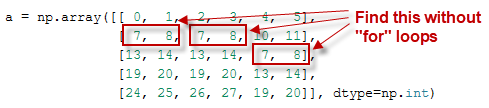
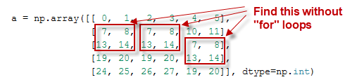
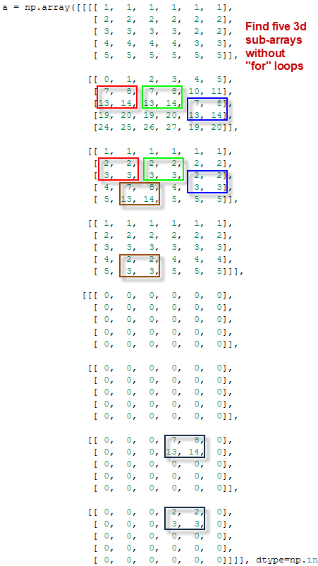

# Сканирующее окно по массивам NumPy
[Опубликовано на Хабре](https://habr.com/ru/post/489734/)

[CoLab блокнот](https://colab.research.google.com/drive/1Zru_-zzbtylgitbwxbi0eDBNhwr8qYl6) с примерами.

Возможно сделать [скользящее окно](https://wiki.loginom.ru/articles/windowing-method.html) (rolling window, [sliding window](https://stackoverflow.com/questions/8269916/what-is-sliding-window-algorithm-examples), moving window) по массивам NumPy на языке программирования Python **без явных циклов**. В данной статье рассматривается создание одно-, двух-, трех- и N-мерных скользящих окон по массивам NumPy. В результате скорость обработки данных увеличивается в несколько тысяч раз и сравнима по скорости с языком программирования **С**.

Cкользящее окно применяется в: обработке изображений, искусственных нейронных сетях, интернет протоколе TCP, обработке геномных данных, прогнозировании временных рядов и т.д.

**Отказ от ответственности**: *в исходном коде могут быть ошибки!* Если вы видите ошибку, пожалуйста, напишите мне.

  * [Введение](#introduction)
  * [Скользящее 1D окно по ND массиву в Numpy](#1d)
  * [Скользящее 2D окно по ND массиву в Numpy](#2d)
  * [Скользящее 3D окно по ND массиву в Numpy](#3d)
  * [Скользящее MD окно по ND массиву, где M ≤ N](#md)
  * [Скользящее MD окно по ND массиву для любых M и N](#md-extended)

<cut/>

---
## <a name="introduction">Введение</a>
Эта статья является продолжением [моего ответа](https://stackoverflow.com/a/46237736/7550928) на сайте StackOverflow. Мои первые эксперименты со скользящим окном [здесь](https://github.com/foobar167/junkyard/blob/master/rolling_window.py) и [здесь](https://github.com/foobar167/junkyard/blob/master/rolling_window_advanced.py).

**Практическая реализация** скользящего двумерного окна по двумерному массиву изображения находится в функции `roll` файла [`logic_tools.py`](https://github.com/foobar167/junkyard/blob/master/manual_image_annotation1/polygon/logic_tools.py) проекта [Ручная разметка изображений с помощью многоугольников](https://github.com/foobar167/junkyard/tree/master/manual_image_annotation1).

Алгоритмы для одномерного скользящего окна уже реализованы [здесь](https://stackoverflow.com/a/7100681/7550928), [здесь](https://rigtorp.se/2011/01/01/rolling-statistics-numpy.html) и [здесь](https://stackoverflow.com/questions/6811183/rolling-window-for-1d-arrays-in-numpy).

Для понимания темы, вам необходимо знать, что такое [страйды (strides, шаги)](https://stackoverflow.com/a/53099870/7550928).

Какое-то скользящее окно реализовано [в библиотеке Pandas](https://pandas.pydata.org/pandas-docs/stable/reference/api/pandas.DataFrame.rolling.html), однако автор плохо знаком с библиотекой Pandas, чтобы сказать, насколько универсальная и быстрая приведенная там реализация. К тому же всегда интереснее сделать функционал самому, если есть такая возможность. Как альтернативу, можно задействовать библиотеку [Cython](https://cython.org/), однако скорость обработки все-равно будет ниже, чем в NumPy.

---
## <a name="1d">1. Скользящее 1D окно по ND массиву в Numpy</a>


Простейшее одномерное скользящее окно по многомерному массиву выглядит так:

```python
# Rolling 1D window for ND array
def roll(a,      # ND array
         b,      # rolling 1D window array
         dx=1):  # step size (horizontal)
    shape = a.shape[:-1] + (int((a.shape[-1] - b.shape[-1]) / dx) + 1,) + b.shape
    strides = a.strides[:-1] + (a.strides[-1] * dx,) + a.strides[-1:]
    return np.lib.stride_tricks.as_strided(a, shape=shape, strides=strides)
```

Функция [`numpy.lib.stride_tricks.as_strided`](https://docs.scipy.org/doc/numpy-1.13.0/reference/generated/numpy.lib.stride_tricks.as_strided.html) создает новый вид (view) массива с заданной формой (shape) и шагами (strides).

Форма (shape) нового массива создается из формы входного многомерного массива, по которому осуществляется движение сканирующего окна, и формы одномерного сканирующего окна. Тогда как шаги (strides) создаются только из шагов входного многомерного массива без участия одномерного сканирующего окна.

Форма (shape) состоит из трех слагаемых:
  * `a.shape[:-1]` — это остаток от формы ND-массива, где `N > 1`. Если `N == 1`, то этот остаток будет равен пустому [кортежу](https://pythonworld.ru/tipy-dannyx-v-python/kortezhi-tuple.html) `t == ()`, таким образом это слагаемое не важно для `N == 1`.
  * `(int((a.shape[-1] - b.shape[-1]) / dx) + 1,)` — это количество шагов скользящего окна по последней размерности `[-1]` массива. Шаг сканирующего окна `dx` может быть равным: 1, 2, 3 и т.д.
  * `b.shape` — это форма скользящего окна.

Шаги (strides) также состоят из трех сладаемых:
  * `a.strides[:-1]` — это остаток от шагов ND-массива, где `N > 1`. Если `N == 1`, то этот остаток будет равен пустому кортежу `t == ()`, таким образом это слагаемое не важно для `N == 1`.
  * `(a.strides[-1] * dx,)` — это количество байт между шагами скользящего окна. Например, целочисленный `int` массив имеет 4 байта в одном шаге между соседними элементами, таким образом для шага `dx == 2` шаг в байтах составит `4 * 2 = 8` байт.
  * `a.strides[-1:]` — это шаг в байтах между соседними элементами. Например, целочисленный `int` массив имеет шаг 4 байта между соседними элементами, тогда данный кортеж равен `(4,)`.

---
## <a name="2d">2. Скользящее 2D окно по ND массиву в Numpy</a>


Примеры скользящего 2D окна по 2D массиву:
  * найти меньшее изображение в большем;
  * сделать операцию свертки в искусственной нейронной сети;
  * применить цифровой фильтр к изображению (фильтры Собеля, Гауссиан, размытия и т.д.).

В общем, скользящее 2D окно позволяет проводить *периодические операции* на матрице с каким-либо шагом. Операции сравнения, свертки, вычитания, умножения, применения цифрового фильтра и т.д. Здесь так же, как в [разделе один](#1d), создается вид нового массива с помощью формы и шагов.

```python
# Rolling 2D window for ND array
def roll(a,      # ND array
         b,      # rolling 2D window array
         dx=1,   # horizontal step, abscissa, number of columns
         dy=1):  # vertical step, ordinate, number of rows
    shape = a.shape[:-2] + \
            ((a.shape[-2] - b.shape[-2]) // dy + 1,) + \
            ((a.shape[-1] - b.shape[-1]) // dx + 1,) + \
            b.shape  # sausage-like shape with 2D cross-section
    strides = a.strides[:-2] + \
              (a.strides[-2] * dy,) + \
              (a.strides[-1] * dx,) + \
              a.strides[-2:]
    return np.lib.stride_tricks.as_strided(a, shape=shape, strides=strides)
```

*Форма* состоит из четырех слагаемых: три слагаемых такие же, как в [разделе один](#1d), а четвертое слагаемое — это количество вертикальных шагов скользящего окна `((a.shape[-2] - b.shape[-2]) // dy + 1,)`. Выражение:
```python
    (int((a.shape[-1] - b.shape[-1]) / dx) + 1,)
```
было заменено на
```python
    ((a.shape[-1] - b.shape[-1]) // dx + 1,)
```
потому что эти два выражения эквивалентны.

*Шаги* (страйды) также похожи на [раздел один](#1d), но с дополнительным страйдом `(a.strides[-2] * dy,)` для вертикального шага скользящего 2D окна.

Функция для проверки результатов выводит в консоль количество найденных совпадений `counts`, их координаты `coords` и выглядит следующим образом:

```python
def show_results(a, b, dx=1, dy=1):
    n = a.ndim  # number of dimensions
    # np.all over 2 dimensions of the rolling 2D window for 4D array
    bool_array = np.all(roll(a, b, dx, dy) == b, axis=(n, n+1))
    counts = np.count_nonzero(bool_array)
    coords = np.transpose(np.nonzero(bool_array)) * [dy, dx]
    print("Found {counts} elements with coordinates:\n{coords}".format(
        counts=counts, coords=coords))
```

Здесь `np.all` применяется к двум размерностям 2D скользящего окна по четырехмерному 4D массиву. Для получения правильных координат совпадения `coords` результат домножается на вертикальный и горизонтальный шаги `[dy, dx]` скользящего окна.

---
## <a name="3d">3. Скользящее 3D окно по ND массиву в Numpy</a>


Можно увидеть шаблон (паттерн) для одно- и двумерных скользящих окон. Сложно понимать работу алгоритма в более высоких размерностях, однако можно воспользоваться замеченным шаблоном для реализации скользящего 3D окна по ND-мерному массиву.

Пример скользящего 3D окна по 3D массиву — это различные операции с вокселами (трехмерными пикселами) в трехмерных изображениях. В [тестовом CoLab примере](https://colab.research.google.com/drive/1Zru_-zzbtylgitbwxbi0eDBNhwr8qYl6#3d) ищутся обычные совпадения малого 3D под-массива в большем, однако можно придумать и более сложные операции (свертка, цифровые фильтры, сравнения и т.д.).

```python
# Rolling 3D window for ND array
def roll(a,      # ND array
         b,      # rolling 2D window array
         dx=1,   # horizontal step, abscissa, number of columns
         dy=1,   # vertical step, ordinate, number of rows
         dz=1):  # transverse step, applicate, number of layers
    shape = a.shape[:-3] + \
            ((a.shape[-3] - b.shape[-3]) // dz + 1,) + \
            ((a.shape[-2] - b.shape[-2]) // dy + 1,) + \
            ((a.shape[-1] - b.shape[-1]) // dx + 1,) + \
            b.shape  # multidimensional "sausage" with 3D cross-section
    strides = a.strides[:-3] + \
              (a.strides[-3] * dz,) + \
              (a.strides[-2] * dy,) + \
              (a.strides[-1] * dx,) + \
              a.strides[-3:]
    #print('shape =', shape, " strides =", strides)  # for debugging
    return np.lib.stride_tricks.as_strided(a, shape=shape, strides=strides)
```

Для нахождения количества совпадений `counts` и координат этих совпадений `coords` применяется следующая функция:

```python
def show_results(a, b, dx=1, dy=1, dz=1):
    n = a.ndim  # number of dimensions == 3
    # np.all over 3 dimensions of the rolling 3D window for 6D array
    bool_array = np.all(roll(a, b, dx, dy, dz) == b, axis=(n, n+1, n+2))
    counts = np.count_nonzero(bool_array)
    coords = np.transpose(np.nonzero(bool_array)) * [dz, dy, dx]
    print("Found {counts} elements with coordinates:\n{coords}".format(
        counts=counts, coords=coords))
```

---
## <a name="md">4. Скользящее MD окно по ND массиву, где M ≤ N</a>


Обобщим функции `roll` и `show_results` на многомерное скользящее MD окно по ND массиву, где размерность M скользящего окна меньше либо равна размерности N исходного массива: M ≤ N.

```python
# Rolling MD window for ND array
def roll(a,        # ND array
         b,        # rolling MD window array
         d=None):  # steps array

    # Make several verifications
    n = a.ndim  # array dimensions
    m = b.ndim  # rolling window dimensions
    if m > n:  # check if M ≤ N
        print("Error: rolling window dimensions is larger than the array dims")
        return None
    if d is None:  # steps are equal to 1 by default
        d = np.ones(m, dtype=np.uint32)
    elif d.ndim != 1 and d.size != m:
        print("Error: steps number must be equal to rolling window dimensions")
        return None
    elif not np.issubdtype(d.dtype, np.integer) or \
         not (d > 0).all():
        print("Error: steps must be integer and > 0")
        return None

    s = np.flip(d)  # flip the 1D array of step sizes
    sub = np.subtract(a.shape[-m:], b.shape[-m:])
    steps = tuple(np.divide(sub, s).astype(np.uint32) + 1)
    shape = a.shape[:-m] + steps + b.shape

    section = tuple(np.multiply(a.strides[-m:], s))
    strides = a.strides[:-m] + section + a.strides[-m:]

    #print('shape =', shape, " strides =", strides)  # for debugging
    return np.lib.stride_tricks.as_strided(a, shape=shape, strides=strides)
```

Вначале функции `roll` находится тривиальная проверочная часть для массива шагов скользящего окна. Нетривиальные части следующие:
  * `steps = tuple(np.divide(sub, s).astype(np.uint32) + 1)` — вычисление количества шагов скользящего окна по многомерному массиву.
  * `section = tuple(np.multiply(a.strides[-m:], s))` — рассчет секции (вставки) для страйдов «многомерной сосиски».
  * Создание «многомерной сосиски» путем вставки `section` в ND-массив: `strides = a.strides[:-m] + section + a.strides[-m:]`.

Функция нахождения количества совпадений `counts` и координат этих совпадений `coords` выглядит следующим образом:

```python
def show_results(a, b, d=None):
    n = a.ndim  # array number of dimensions == N
    m = b.ndim  # rolling window dimensions == M
    if d is None:  # step sizes are equal to 1 by default
        d = np.ones(m, dtype=np.uint32)
    bool_array = roll(a, b, d) == b
    # np.all over M dimensions of the rolling MD window for (N+M)D array
    bool_array = np.all(bool_array, axis=tuple(range(n, n + m)))
    counts = np.count_nonzero(bool_array)
    # flip 1D array of step sizes and concatenate it with remaining dimensions
    s = np.concatenate((np.ones(n-m, dtype=int), np.flip(d)))
    coords = np.transpose(np.nonzero(bool_array)) * s
    print("Found {counts} elements with coordinates:\n{coords}".format(
        counts=counts, coords=coords))
```

Нетривиальные части функции `show_results` следующие:
  * Создание логического (двоичного) массива `bool_array` или **маски** для найденных совпадений. Затем применение [`numpy.all`](https://docs.scipy.org/doc/numpy/reference/generated/numpy.all.html) ко всем `m` размерностям для проверки, все ли элементы массива в данном измерении имеют значение `True`. Обратите внимание, что `bool_array` — это (N+M)D массив, а `np.all` применяется `m` раз по всем размерностям скользящего MD окна:

```python
    bool_array = roll(a, b, d) == b  # get (N+M)D boolean array
    # np.all over M dimensions of the rolling MD window for (N+M)D array
    bool_array = np.all(bool_array, axis=tuple(range(n, n + m)))
```

  * Еще одна нетривиальная часть для `M < N`. Если `M < N` мы должны не только перевернуть одномерный 1D массив шагов скользящего окна, но и объединить его с одномерным массивом из единиц для оставшихся размерностей `N-M` (шаг по высшим размерностям равен 1). Если `M == N`, то оставшиеся размерности равны нулю, и в этом случае конкатенация не требуется:
```python
    # flip 1D array of step sizes and concatenate it with remaining dimensions
    s = np.concatenate((np.ones(n-m, dtype=int), np.flip(d)))
```

---
## <a name="md-extended">5. Скользящее MD окно по ND массиву для любых M и N</a>


Возможно ли сделать скользящее MD окно по ND массиву, где M > N? В общем, да! Однако только часть скользящего окна будет **пересекаться** с ND массивом, потому что у скользящего MD окна будет больше размерностей M > N.

Давайте найдем **совпадения между пересечениями** MD и ND массивов. И реализуем скользящее MD окно по ND массиву для любых M и N. Для этого используем предыдущие функции `roll` и `show_results`.

```python
def get_results(a, b, d=None):  # the same as `show_results` function
    n = a.ndim  # array number of dimensions == N
    m = b.ndim  # rolling window dimensions == M
    if d is None:  # step sizes are equal to 1 by default
        d = np.ones(m, dtype=np.uint32)
    bool_array = roll(a, b, d) == b  # get (N+M)D boolean array
    # np.all over M dimensions of the rolling MD window for (N+M)D array
    bool_array = np.all(bool_array, axis=tuple(range(n, n + m)))
    counts = np.count_nonzero(bool_array)
    # flip 1D array of step sizes and concatenate it with remaining dimensions
    s = np.concatenate((np.ones(n-m, dtype=int), np.flip(d)))
    coords = np.transpose(np.nonzero(bool_array)) * s
    return (counts, coords)

def show_intersections(a, b, d=None):
    d_tmp = d
    n = a.ndim  # array number of dimensions == N
    m = b.ndim  # rolling window dimensions == M
    #
    if d_tmp is None:  # step sizes are equal to 1 by default
        d_tmp = np.ones(m, dtype=np.uint32)
    elif m > n and d_tmp.size == n:  # for m > n case
        # Concatenate d_tmp with remaining dimensions
        d_tmp = np.concatenate((np.ones(m-n, dtype=int), d_tmp))
    #
    counts = 0
    coords = None
    if m <= n:
        results = get_results(a, b, d_tmp)  # return previous example
        counts = results[0]
        coords = results[1]
    else:  # if m > n
        t = m - n  # excessive dimensions
        layers = np.prod(b.shape[:t])  # find number of layers
        # Reshape MD array into (N+1)D array.
        temp = b.reshape((layers,) + b.shape[t:])
        # Get results for every layer in the intersection
        for i in range(layers):
            results = get_results(a, temp[i], d_tmp[t:])
            counts += results[0]
            if coords is None:
                coords = results[1]
            else:
                coords = np.concatenate((coords, results[1]))
    print("Found {counts} elements with coordinates:\n{coords}".format(
        counts=counts, coords=coords))
```

Функция `get_results` та же самая, что и `show_results` с небольшими изменениями в выводе результата.

Функция `show_intersections` получает пересечения между многомерными массивами. Если `M <= N`, то функция `show_intersections` просто возвращает функцию `get_results`, как в [предыдущем разделе](#md). Если `M > N`, то мы должны найти пересечение между массивами `b` и `a`.

Для этого найдем количество излишних размерностей `t = m - n` между MD массивом `b` и ND массивом `a`. И найдем количество слоев в пересечении между `b` и `a`: `layers = np.prod(b.shape[:t])`. Затем переформируем (придадим иную форму, reshape) массив `b` из MD массива в (N+1)D массив:

```python
    # Reshape MD array into (N+1)D array.
    temp = b.reshape((layers,) + b.shape[t:])
```

Наконец найдем результат: совпадения между двумя массивами `(N+1)D` и `ND`, где размерность `(N+1)` имеет количество слоев равное `layers`:

```python
    # Get results for every layer in the intersection
    for i in range(layers):
        results = get_results(a, temp[i], d_tmp[t:])
```

Объединим количество совпадений `counts` и найдынных координат этих совпадений `coords` для каждого слоя:

```python
    # Get results for every layer in the intersection
    for i in range(layers):
        results = get_results(a, temp[i], d_tmp[t:])
        counts += results[0]
        if coords is None:
            coords = results[1]
        else:
            coords = np.concatenate((coords, results[1]))
```

Все примеры находятся в [CoLab блокноте](https://colab.research.google.com/drive/1Zru_-zzbtylgitbwxbi0eDBNhwr8qYl6).

Спасибо за внимание!

**Теги:** Python, алгоритмы, программирование, NumPy, метод скользящего окна, rolling window, sliding window, moving window, массивы, оптимизация кода, совершенный код,

**Хабы:** Python, Алгоритмы, Программирование, Совершенный код,
