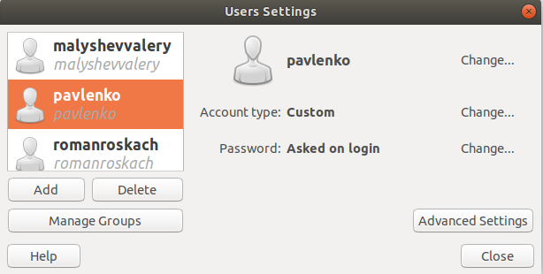
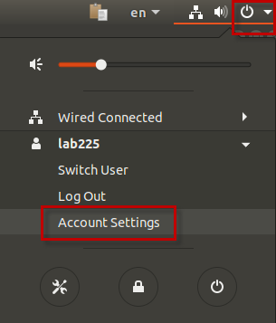
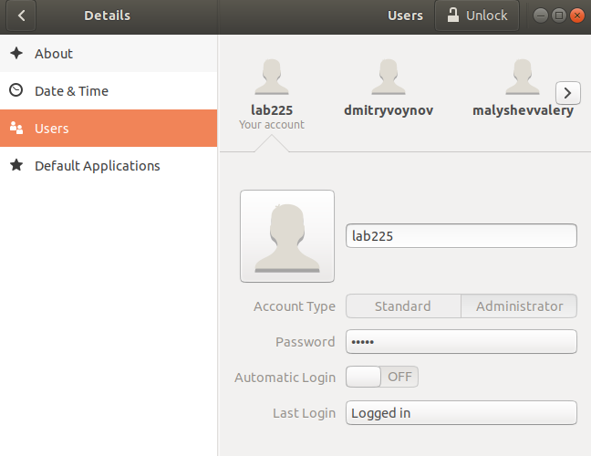
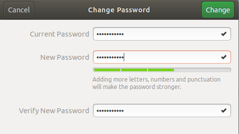
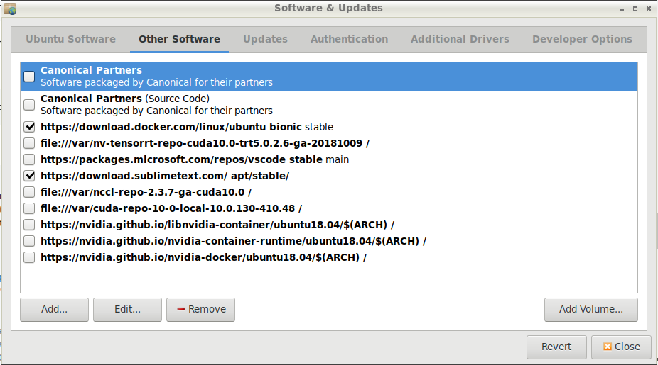
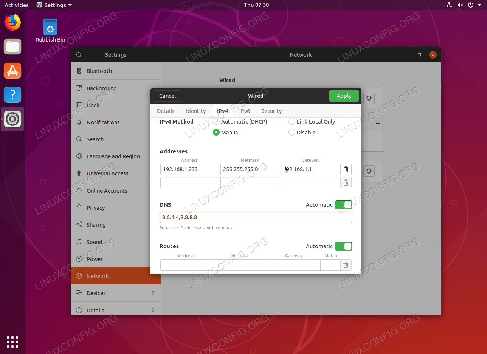
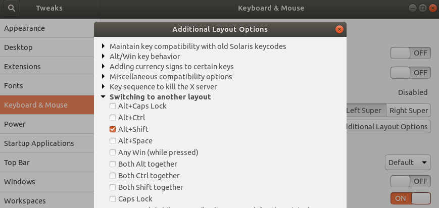
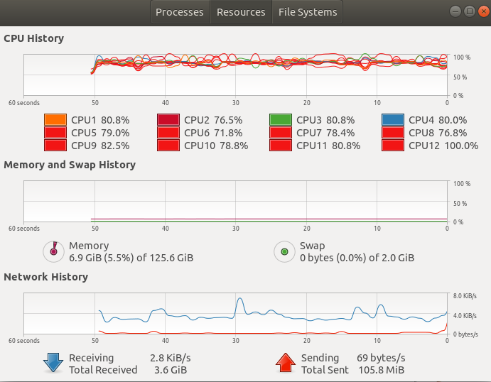

How-to:
   - [`nvidia-smi` error after system update](#nvidia-smi-error)
   - [Add directory to the $PATH](#add_to_path)
   - [Allow IP-address](#ip-address)
   - [Allow `sudo` commands and write permissions](#permissions)
   - [Calculator](#calculator)
   - [Clear out Git history](#clear-git)
   - [Create user](#user)
   - [Change password](#passwd)
   - [Change SSH Port](#change_ssh_port)
   - [Check Linux version](#check-linux)
   - [Coral USB Accelerator](#coral)
   - [Delete package](#delete)
   - [Delete user account](#del-account)
   - [Exclude packages from `sudo apt upgrade`](#exclude-packages)
   - [Find file by name](#find)
   - [Find files owned by the user](#find-user)
   - [Install deb file](#deb)
   - [Kill the tty](#tty-kill)
   - [List all environment variables](#printenv)
   - [List installed packages](#list-installed)
   - [Lock screen](#lock)
   - [Lock screen time](#lock_time)
   - [Manage software updates](#software-updates)
   - [Mount USB](#mount)
   - [Open console](#console)
   - [Open image in Midnight Commander](#open-image-in-mc)
   - [Restart system](#ubuntu-reboot)
   - [Run scripts on start up](#autorun)
   - [Set environment variable](#envvar)
   - [Show the model of the computer](#show_the_model)
   - [Static IP address](#static_ip)
   - [Switch language hotkey](#lang)
   - [System info and benchmarks](#sys_info)
   - [Take screenshot](#screenshot)
   - [Update system packages](#update-ubuntu)
   - [View computer resources](#resources)
   - [View disk usage](#disk-usage)
   - [View screen resolution](#resolution)
   - [View temperature sensors](#temperature)
   - [Who is logged in](#who)

---
### <a name="nvidia-smi-error" />`nvidia-smi` error after system update

Unfortunately, there is `nvidia-smi` error after system update for DL3 server.
I don't know how to turn off nVidia drivers from automatic updating yet.

So after update I have to [reinstall nVidia drivers again](08_Nvidia_driver_and_CUDA_install.md/#nvidia-smi-error).
It takes 5 minutes, but I would like to get rid of this problem in the future.

For DL4 server, please, review [Nvidia driver installation](16_DL4_config.md/#nvidia).

---
### <a name="add_to_path" />Add directory to the $PATH

```shell script
# For the local current user
nano ~/.profile
# export PATH="/path/to/dir:$PATH"
source ~/.profile

# For the local current user
nano ~/.bashrc
# Add the following line to the bashrc file:
# export PATH="/path/to/dir:$PATH"
# Run bashrc file to effect changes.
source ~/.bashrc

# Temporary addition
export PATH="/path/to/dir:$PATH"

# Permanently add to PATH for ALL users
sudo nano /etc/environment
# Edit the file. Make sure that the path is something like this:
# PATH="/usr/local/sbin:/usr/local/bin:/usr/sbin:/usr/bin:/sbin:/bin:/usr/games:/usr/local/games:/opt/ASAP/bin"
# Run environment file to effect changes.
. /etc/environment
```

---
### <a name="ip-address" />Allow IP-address

It is possible, that your IP-addres get into black list
of `/etc/hosts.deny` file.

Check log file for failed attempts and delete all logs with user attempts:
```shell script
cat /var/log/auth.log | grep -n username
cat /var/log/auth.log | grep -n ip-address
sudo nano -c /var/log/auth.log
```

Add IP-mask to the `/etc/hosts.allow` file.
Secondly delete you IP-address from `/etc/hosts.deny` file.
```shell script
# Edit /etc/hosts.allow file
sudo nano /etc/hosts.allow
```
Add the something like this:
```shell script
# Use this address to calculate the mask:
# http://jodies.de/ipcalc?host=80.94.164.1&mask1=24
ALL : 80.94.164.0/24
ALL : 80.94.162.0/24
ALL : 80.94.171.0/24
```
Make sure that your IP-addres is not in the blacklist of `/etc/hosts.deny` file.
Actually IP-address can re-appear after several minutes, but if it was excepted in
`/etc/hosts.allow` file, then SSH connection should work anyway.

To search in the `nano` editor. `Ctrl + W` is the shortcut for searching.
The same effect can be achieved by pressing the `F6` key.
After entering the search term, press `Enter`.
To repeat the search, issue `Alt + W`.
In this menu, you can select earlier searches using the arrow up/down keys.
To toggle backwards searching, you need to press `Alt + B` in the search dialog.
For more shortcuts, press `F1`.

```shell script
cat /etc/hosts.deny | grep -n "80.94."  # -n - show line numbers
# Delete IP-address if necessary
sudo nano -c /etc/hosts.deny  # -c - show line numbers
```

---
### <a name="permissions" />Allow `sudo` commands and write permissions

[How-to allow `sudo` commands and write permission into system directories](07_Website_software.md/#permissions)

---
### <a name="calculator" />Calculator

```shell script
gnome-calculator &> /dev/null
```

---
### <a name="clear-git" />Clear out Git history

Steps to [clear out the history](https://gist.github.com/stephenhardy/5470814)
of a git/github repository.

```shell script
# Remove history from Git directory
rm -rf .git

# Recreate the repos from the current content only
git init
git add .
git commit -m "Initial commit"

# Push to the github remote repos ensuring you overwrite history
git remote add origin https://github.com/foobar167/articles
# Or try this: git remote add origin git@github.com:<YOUR ACCOUNT>/<YOUR REPOS>.git
# Or try this: git remote add origin https://github.com/USERNAME/REPOSITORY.git
# But try it from the beginning (rm -rf .git, etc.)
git push -u --force origin master
```

---
### <a name="user" />Create user

   * Create user with GUI

Press `<Super>` (`<Win>`) key and type *Users*.
Users and groups window with *Users Settings* will open



Click *Add* button to add new user.

   * Create user via console

Press `<Ctrl>+<Alt>+<T>` and open console window.

```shell script
# Show list of all users
cat /etc/passwd
# or
cut -d: -f1 /etc/passwd

# Show list of all goups
cat /etc/group

# To create user with questions, directory and sceleton files
sudo adduser username
# Add existing user to the group
sudo adduser username groupname
# or without questions, dir and files (not recommended)
#sudo useradd username

# To delete user
sudo deluser username
# or (not recommended)
#sudo userdel username
# Delete directory
#sudo rm -r /home/username  # use with caution!

# To delete user from a group
sudo deluser username groupname

# Change user name
usermod -l new_username old_username

# Change user password
sudo passwd username

# Change shell for a user
sudo chsh username

# Change user detailes (name, phone, etc.)
sudo chfn username

# Create group
sudo addgroup groupname
# Add existing user to the group
sudo usermod -a -G groupname username
```

Enable or disable the user account:
```shell script
sudo adduser tempuser       # create temporal user
sudo usermod -L tempuser    # disable user account
sudo usermod -U tempuser    # enable user account
sudo deluser tempuser       # delete user
sudo rm -r /home/tempuser   # use with caution!
cat /etc/group | grep temp  # check
ls /home | grep temp        # check
# If error: "userdel: user tempuser is currently used by process 1864"
sudo kill -9 1864           # kill the process
sudo deluser -f tempuser    # try again
```

More info on how to [backup and delete deprecated user accounts](https://github.com/foobar167/articles/blob/master/Ubuntu/07_Website_software.md#backup-and-delete-deprecated-user-accounts).

---
### <a name="passwd" />Change password

*Change Password from GUI*

Click the system menu at the top right corner,
select your user name and click on *Account Settings* menu.



*Users* window will open.



On the *Users* window select *Password*. 



Enter current password. Enter new password, verify new password once again
and click on *Change* button.

*Change Password from Command Line*

[Open console](#console) and enter `passwd`.
Type current password, type new password and retype new password. 

```shell script
passwd
Changing password for lab225.
(current) UNIX password: 
Enter new UNIX password: 
Retype new UNIX password: 
passwd: password updated successfully
lab225@deeplab3:~$

# To change other users password
sudo passwd username
```

---
### <a name="change_ssh_port" />Change SSH Port
[How to Change SSH Port in Ubuntu 18.04](https://www.ubuntu18.com/ubuntu-change-ssh-port/)

```shell
# Check SSH port currently running on
sudo netstat -tulnp | grep ssh
# Check the current configuration
sudo grep -i port /etc/ssh/sshd_config
# Open the `/etc/ssh/sshd_config` file and locate the line:
  #Port 22
# Uncomment it (remove the leading # character) and change the value
# with an appropriate port number (for example, 22000):
  Port 22000
# Restart the SSH server
sudo systemctl restart sshd
# Make sure that the ssh daemon now listen on the new ssh port
netstat -tulpn | grep ssh

# Use `-p` flag to specify SSH port number
ssh username@ip.add.re.ss -p 22000
```

---
### <a name="check-linux" />Check Linux version

[How to check operating system version in Linux command line](https://www.cyberciti.biz/faq/how-to-check-os-version-in-linux-command-line)

```shell script
# Find OS name and version
cat /etc/os-release
lsb_release -a
hostnamectl

# Find kernel version
uname -r
# Find Linux distribution
lsb_release -cs

# Even more options
cat /proc/version
cat /etc/issue
```

---
### <a name="coral" />Coral USB Accelerator

[Get started with the USB Accelerator](https://coral.ai/docs/accelerator/get-started)

For Ubuntu 22.04 with system Python 3.10 use instruction below:
```shell script
# Add package repository to the Ubuntu 22.04:
echo "deb https://packages.cloud.google.com/apt coral-edgetpu-stable main" | sudo tee /etc/apt/sources.list.d/coral-edgetpu.list
curl https://packages.cloud.google.com/apt/doc/apt-key.gpg | sudo apt-key add -
sudo apt update

# Install the Edge TPU runtime (standard, not maximum package):
sudo apt install libedgetpu1-std

# Reconnect the USB Accelerator to your computer using the provided USB 3.0 cable.

# This command doesn't work for Ubuntu 22.04:
#     sudo apt-get install python3-pycoral

# Use Conda virtual environment with Python 3.9. Download and install wheel files:
wget https://github.com/google-coral/pycoral/releases/download/v2.0.0/pycoral-2.0.0-cp39-cp39-linux_aarch64.whl
wget https://github.com/google-coral/pycoral/releases/download/v2.0.0/tflite_runtime-2.5.0.post1-cp39-cp39-linux_aarch64.whl
pip install tflite_runtime-2.5.0.post1-cp39-cp39-linux_aarch64.whl
pip install pycoral-2.0.0-cp39-cp39-linux_aarch64.whl

# Download the example code from GitHub:
mkdir coral && cd coral
git clone https://github.com/google-coral/pycoral.git
cd pycoral

# Download the model, labels, and bird photo:
bash examples/install_requirements.sh classify_image.py

# Run the image classifier with the bird photo:
python examples/classify_image.py \
--model test_data/mobilenet_v2_1.0_224_inat_bird_quant_edgetpu.tflite \
--labels test_data/inat_bird_labels.txt \
--input test_data/parrot.jpg \
--top_k 3  \
--count 15

# In the file `classify_image.py` change `Image.ANTIALIAS` on `Image.LANCZOS`.

# Results should be like this:
#    ----INFERENCE TIME----
#    Note: The first inference on Edge TPU is slow because it includes loading the model into Edge TPU memory.
#    11.8ms
#    3.0ms
#    2.8ms
#    2.9ms
#    2.9ms
#    -------RESULTS--------
#    Ara macao (Scarlet Macaw): 0.75781
```

---
### <a name="delete" />Delete package

```shell script
# Remove package
sudo apt remove packagename
# Remove user data and configuration files
sudo apt purge packagename

# Remove unused dependences
sudo apt autoremove
# Clean
sudo apt clean

# Or do this
sudo apt purge --auto-remove packagename
```

---
### <a name="del-account" />Delete user account
See [Backup and delete deprecated user accounts](07_Website_software.md/#accounts) in the web-site section.

---
### <a name="exclude-packages" />Exclude packages from `sudo apt upgrade`

Read [how to exclude packages from apt-get upgrade](https://tecadmin.net/exclude-packages-from-apt-upgrade)

```shell script
# Using apt
sudo apt-mark hold package_name
sudo apt-mark unhold package_name
# Using dpkg
echo "package_name hold" | sudo dpkg --set-selections
echo "package_name install" | sudo dpkg --set-selections
# Using aptitude
sudo aptitude hold package_name
sudo aptitude unhold package_name

# List packages on hold
sudo dpkg --get-selections | grep "hold"
```

---
### <a name="find" />Find file by name

[How to search files from the terminal on Linux](https://www.howtoforge.com/tutorial/linux-search-files-from-the-terminal)
[14 Practical Examples of Linux Find Command for Beginners](https://www.howtoforge.com/tutorial/linux-find-command)

`locate` command

The reason for this unmatched speed is that the `locate` command isn't actually searching your local hard disks
for the files or directories that you need to find, but more like reads through the `mlocate.db`
database file which contains all file paths in your system.

```shell script
sudo apt install locate  # install locate tool
sudo updatedb  # update the mlocate.db database before first use
locate $HOME/*.py  # search for Python files in the $HOME dir
locate -c $HOME/*.py  # count Python files in the $HOME dir
locate -ic $HOME/*.py  # count Python files and ignore case

# Example
sudo updatedb
locate -ic Home
1491350
locate -c Home
3
locate Home
/etc/gufw/Home.profile
/usr/share/man/man3/FcConfigEnableHome.3.gz
/usr/share/man/man3/FcConfigHome.3.gz
```

`find` command

The “find” command is a much more powerful but also slower searching utility.
Contrary to the `locate` command, `find` actually searching your disks for the files
and directories that the user is after.
`find` can search for files that belong to a certain user or group of users,
files that were modified or accessed recently, files that of a specific size range,
hidden files, executables, read-only files, and files with certain permissions.

```shell script
find / -name "*name*" 2> /dev/null  # search in / root directory (everything)
find / -iname "*name*" 2> /dev/null  # ignore case
# Search in $HOME dir for Python files bigger than 1MB of size.
find ~/ -size +1M -iname "*.py" 2> /dev/null
# Search for Python files bigger than 700 kB of size.
find / -iname "*.py" -and -size +700k 2> /dev/null

# This does not work and I donot why: find / -iname "*.py" -and -size +700k -and -size -1M 2> /dev/null
# BUT this works for Ubuntu 18.04 :-) Note: 1M vs 1000k
find / -iname '*.py' -and -size +700k -and -size -1000k 2> /dev/null

find ~/ -cmin  -3 2> /dev/null  # changed  less than 3 minutes ago
find ~/ -ctime -3 -iname "*.png" 2> /dev/null  # changed less than 3 days ago
find ~/ -amin  -3 2> /dev/null  # accessed less than 3 minutes ago
find ~/ -atime -3 -iname "*.png" 2> /dev/null  # accessed less than 3 days ago

find . -iname "*.jpg" | wc -l    2>/dev/null  # count JPG files in the local dir
```

---
### <a name="find-user" />Find files owned by the user

[Find all the files owned by a particular user / group](https://www.cyberciti.biz/faq/how-do-i-find-all-the-files-owned-by-a-particular-user-or-group/)

How to find files by users `vivek` and `wendy`
```shell script
# Match files only
find / -type f -user vivek -o -user wendy
# Match dirs only
find / -type d -user vivek -o -user wendy
```

---
### <a name="deb" />Install deb file

```shell script
sudo dpkg -i my.deb
```
If there are broken dependences:
```shell script
sudo apt --fix-broken install
# and then
sudo dpkg -i my.deb
```

---
### <a name="tty-kill" />Kill the tty

```shell script
# Show who is logged in
who
username :1           2018-12-22 17:11 (:1)
username pts/7        2018-12-24 10:54 (178.120.33.235)
username pts/9        2018-12-24 12:17 (178.120.33.235)

# Get the PIDs
ps -ft pts/7
UID        PID  PPID  C STIME TTY          TIME CMD
username 25058 25057  0 10:54 pts/7    00:00:00 -bash
root     26850 25058  0 11:09 pts/7    00:00:00 su admin
admin    26859 26850  0 11:09 pts/7    00:00:00 bash
admin    26878 26859  0 11:09 pts/7    00:00:00 mc

# Use the PIDs to kill the processes
kill 25058 26850 26859 26878
-bash: kill: (26859) - Operation not permitted
-bash: kill: (26878) - Operation not permitted

# If the process doesn't gracefully terminate,
# forcefully kill it by sending a SIGKILL
kill -9 26859 26878
# or
kill -SIGKILL 26859 26878
```

---
### <a name="printenv" />List all environment variables

```shell script
printenv  # list all or part of environment
env  # list all or run a program in a modified environment
# or
printenv | less
# or
printenv | more
```

[A list of the commonly used variables in Linux](https://www.cyberciti.biz/faq/linux-list-all-environment-variables-env-command)

---
### <a name="list-installed" />List installed packages

[List installed packages](https://www.rosehosting.com/blog/list-all-installed-packages-with-apt-on-ubuntu)

```shell script
sudo apt list --installed
sudo apt list --installed | less
sudo apt list --installed | grep -i nvidia
sudo dpkg -l
sudo dpkg -l | grep -i nvidia
```

---
### <a name="lock" />Lock screen

To lock your screen press keys `<Ctrl>+<Alt>+<L>`.
If it does n't work then press keys `<Win>+<L>` or
(`<Super>+<L>`).

Also click on the *System* icon in the top right corner
of the screen and select *Lock Screen* icon/menu.

From console type:
```shell script
# Lock the screen
gnome-screensaver-command -l
```

When your screen is locked, and you want to unlock it,
press `<Esc>`, or swipe up from the bottom of the screen
with your mouse. Then enter your password, and press
`<Enter>` or click *Unlock*.
Alternatively, just start typing your password and the lock
curtain will be automatically raised as you type.

---
### <a name="lock_time" />Lock screen time

[Set screen lock time](https://askubuntu.com/questions/1042641/how-to-set-custom-lock-screen-time-in-ubuntu-18-04)

Open *Settings → Privacy → Screen Lock*:


---
### <a name="software-updates" />Manage software updates

- [How can PPAs be removed?](https://askubuntu.com/questions/307/how-can-ppas-be-removed)
- [How can I fix a 404 Error when using a PPA or updating my package lists?](https://askubuntu.com/questions/65911/how-can-i-fix-a-404-error-when-using-a-ppa-or-updating-my-package-lists)

Launch Menu --> Preferences --> Software & Updates



Use sheet "Other Software" to manage repositories for updates.
Use sheet "Updates" to manage updates check.

Also check file `/etc/apt/sources.list` and directory `/etc/apt/sources.list.d`
which containes list of sources to update Ubuntu 18.04.

Manage PPA via console. When update with command `sudo apt update`,
some PPA has been removed and no longer exist and ther is an error:
```text
Err:5 https://dl.yarnpkg.com/debian stable InRelease
  The following signatures were invalid: EXPKEYSIG 23E7166788B63E1E Yarn Packaging <yarn@dan.cx>
```
```shell
# Delete the expired key
sudo apt-key del 23E7166788B63E1E
# Delete the PPA for yarn
sudo rm yarn.list
# Clean the local repository and remove unnecessary packages
sudo apt clean
sudo apt autoclean
sudo apt autoremove
# Update the packages again
sudo apt update
```

---
### <a name="mount" />Mount USB

By default, storage devices that are plugged into the system
mount automatically in the `/media/<username>` directory.

---
### <a name="console" />Open console

Press `<CTRL>+<ALT>+<T>` keys or press `<Win>` key and enter `terminal`.

---
### <a name="open-image-in-mc" />Open image in Midnight Commander

Set ImageMagick as
[default Jpeg viewer for Midnight Commander](https://www.linuxquestions.org/questions/linux-software-2/howto-to-use-imagemagick-as-default-jpeg-viewer-for-midnight-commander-862415/).

Edit `~/.config/mc/mc.ext` file.

Note that editing `/etc/mc/mc.ext` sets the system-wide configuration.

In MC press `F9 -> Command -> Edit extension file`.

The `View` command is used when `F3` is pressed.

The `Open` command is used when `Enter` is pressed.

To use `geeqie` as Jpeg viewer for MC set `Open=geeqie %f`.
```shell script
type/^JPEG
        Open=geeqie %f
        #Open=display %f
        View=%view{ascii} /usr/lib/mc/ext.d/image.sh view jpeg
        Include=image
```

---
### <a name="ubuntu-reboot" />Restart system

```shell script
sudo reboot now

# force reboot
sudo reboot -f

sudo systemctl reboot
```

---
### <a name="autorun" />Run scripts on start up

There are several ways to run scripts on start up:
   1. systemd (`man systemd.service`)
   2. SysV (`man update-rc.d`). System V init (also known as classic init).
   3. Add script to `/etc/rc.local` file.
   4. cron (`man cron`)
   5. Use `~/.config/systemd/` or `/.config/autostart/` directories
      for user sessions. Only after user login.

For Ubuntu 14.04 **and older** one can use [Upstart](http://upstart.ubuntu.com/getting-started.html).

1\. Create `systemd` unit files. Links:
  - [How to run scripts on start up](https://askubuntu.com/a/719157/672237)
  - [Writing unit files](https://wiki.archlinux.org/index.php/systemd#Writing_unit_files)
  - [systemd.service - Service unit configuration](http://manpages.ubuntu.com/manpages/xenial/en/man5/systemd.service.5.html)
  - [systemd.service - Service unit configuration. Copy](https://www.freedesktop.org/software/systemd/man/systemd.service.html)

Create `/etc/systemd/system/slide_analysis_api.service` containing:

```text
[Unit]
Description=uWSGI instance to serve slide_analysis_api
After=network.target

[Service]
User=malyshevvalery
Group=www-data
WorkingDirectory=/home/malyshevvalery/Slide_Analysis
Environment="PATH=/home/malyshevvalery/Slide_Analysis"
ExecStart=/home/malyshevvalery/Slide_Analysis/venv/bin/uwsgi --ini /home/malyshevvalery/Slide_Analysis/slide_analysis_api.ini

[Install]
WantedBy=multi-user.target
```

Then run:

```shell script
# Add slide_analysis_api to autorun
sudo systemctl daemon-reload
sudo systemctl enable slide_analysis_api.service
```
You can run multiple commands from the same service file,
using multiple `ExecStart` lines:

```text
[Service]
ExecStart=/some/command
ExecStart=/another/command some args
ExecStart=-/a/third/command ignore failure
```

The command must always be given with the full path.
If any command fails, the rest aren't run.
A `-` before the path tells systemd to ignore a non-zero exit status
(instead of considering it a failure).

2\. Create script file `/etc/init.d/myscript.sh`. Run the commands:

```shell script
# To add use
sudo update-rc.d myscript.sh defaults  # default run levels are: 2,3,4 and 5
# To remove use
sudo update-rc.d -f myscript.sh remove
```

More info:
   - [Part 1: How to config service to autostart after crash or reboot](https://www.digitalocean.com/community/tutorials/how-to-configure-a-linux-service-to-start-automatically-after-a-crash-or-reboot-part-1-practical-examples)
   - [Part 2: How to config service to autostart after crash or reboot](https://www.digitalocean.com/community/tutorials/how-to-configure-a-linux-service-to-start-automatically-after-a-crash-or-reboot-part-2-reference)
   - [How to Enable or Disable Services in Ubuntu Systemd/Upstart](https://linoxide.com/linux-how-to/enable-disable-services-ubuntu-systemd-upstart)
   - [How can I configure a service to run at startup](https://askubuntu.com/a/9384/672237)

3\. Edit the file `/etc/rc.local`.
```shell script
sudo nano /etc/rc.local
```

Add commands, but make sure that the line `exit 0` is at the end.

If command runs continuously (in an infinite loop) or is likely not to exit,
you must be sure to fork the process by adding an ampersand `&` to the end
of the command, like so:

```shell script
python3 /home/pi/myscript.py &
```

:exclamation: **Add ampersand `&` otherwise, the script will not end
and the system will not boot.** :exclamation:

The ampersand allows the command to run in a separate process and continue
booting with the process running.

4\. One approach is to add an @reboot [cron](https://en.wikipedia.org/wiki/Cron) task:
   1. Running `crontab -e` will allow you to edit your cron.
   2. Adding a line like this to it: `@reboot /path/to/script`
      will execute that script once your computer boots up.

5\. For user sessions, you can create the systemd unit in
`~/.config/systemd` instead. This should work with 16.04 onwards,
but not earlier releases of Ubuntu with systemd
(since those still used Upstart for user sessions).
User session units can be controlled with the same commands
as with system services, but with the `--user` option added:

```shell script
systemctl --user daemon-reload
systemctl --user status foo.service
```

A shell script named `.gnomerc` in your home directory is automatically
sourced each time you log in to a GNOME session. You can put arbitrary
commands in there; environment variables that you set in this script
will be seen by any program that you run in your session.

Note that the session does not start until the `.gnomerc` script
is finished; therefore, if you want to autostart some long-running program,
you need to append `&` to the program invocation,
in order to detach it from the running shell.

The menu option **System -> Preferences -> Startup Applications** allows 
to define what applications should be started when your graphical session starts
(Ubuntu predefines quite some). This has almost the same purpose and scope
of the `.gnomerc` script, except you don't need to know `sh` syntax
(but neither can you use any `sh` programming construct).

---
### <a name="envvar" />Set environment variable

```shell script
PYTHONPATH=/usr/lib/python3/dist-packages/caffe
export PYTHONPATH
```

---
### <a name="show_the_model" />Show the model of the computer

```shell script
# The first line will be product name.
sudo lshw | grep product
# or
sudo dmidecode -t system

sudo dmidecode -s bios-release-date       # show release date
sudo dmidecode -s baseboard-product-name  # show product name
sudo dmidecode -s baseboard-manufacturer  # show manufacturer

# Install GUI application
sudo apt install xsysinfo
xsysinfo &
```

---
### <a name="static_ip" />Static IP address
[Ubuntu Static IP configuration](https://linuxconfig.org/how-to-configure-static-ip-address-on-ubuntu-18-10-cosmic-cuttlefish-linux)



The simplest approach on how to configure a static IP address on Ubuntu Desktop
is via GNOME graphical user interface.
   * Open network settings Ubuntu Desktop.
   * Click on the settings icon to start IP address configuration.
   * Select IPv4 tab.
   * Select manual and enter your desired IP address, netmask, gateway
     and DNS settings. Once ready click `Apply` button.
   * Turn OFF and ON switch to apply your new network static IP config settings.
   * Click on the network settings icon once again to confirm your new
     static IP address settings.

Configure static IP address on Ubuntu server via `networkd` daemon.
Open `/etc/netplan/` directory. There is a default netplan configuration file
called `50-cloud-init.yaml` or `01-network-manager-all.yaml`.
```text
# This file is generated from information provided by the datasource. Changes
# to it will not persist across an instance reboot. To disable cloud-init's
# network configuration capabilities, write a file
# /etc/cloud/cloud.cfg.d/99-disable-network-config.cfg with the following:
# network: {config: disabled}
network:
    ethernets:
        ens9f0:
            addresses:
                    - ××.××.×××.××/24
            gateway4: ××.××.×××.1
            nameservers:
                    addresses: [8.8.4.4,8.8.8.8,××.××.×××.2,××.××.×××.3]
```

```shell
# Once ready apply changes with
sudo netplan apply
# In case you run into some issues execute
sudo netplan --debug apply
```

---
### <a name="lang" />Switch language hotkey

On Ubuntu 18.04 the default shortcut is `<Win>+<Space>`.
`<Win>` key is also called `<Super>` key.

[Instructions](https://askubuntu.com/a/1029605/672237)
for Ubuntu 18.04 LTS with Gnome desktop from Gnome Tweaks.

```shell script
# Install Gnome Tweaks
sudo apt-get install gnome-tweaks
# Open Gnome Tweaks
sudo gnome-tweaks &
```
   - Open *Gnome Tweaks* (`gnome-tweaks &`).
   - Select *Keyboard & Mouse* tab
   - Click *Additional Layout Options* button
   - Expand *Switching to another layout* menu
   - Select checkbox *Alt+Shift* there



---
### <a name="sys_info" />System info and benchmarks

Links:
   * [Khadas Edge2 Pro review – A Rockchip RK3588S SBC tested with Ubuntu 22.04](https://www.cnx-software.com/2022/09/20/khadas-edge2-pro-review-rockchip-rk3588s-sbc-ubuntu-22-04/)
   * Thomas Kaiser [sbc-bench script](https://github.com/ThomasKaiser/sbc-bench).
The small set of different CPU performance tests focuses on 'headless'
operation only (no GPU/display stuff, no floating point number crunching).
   * Browser benchmark with [Speedometer 2.0](https://browserbench.org/Speedometer2.0/).
   * [How to benchmark your Ubuntu Linux servers with the Phoronix Test Suite](https://www.techrepublic.com/article/benchmark-ubuntu-linux-servers-phoronix-test-suite/)
   * [Phoronix Test Suite HowTo](https://wiki.ubuntu.com/PhoronixTestSuite)

Show system parameters:
```shell script
cat /etc/lsb-release 
uname -a
free -mh
df -mh

# Install and run inxi command line tool
# sudo apt install inxi
sudo inxi -Fc0

# Linux monitor
# sudo apt install htop
htop
ps -aux | grep X  # list processes with `X`
```
View [CPU load and temperature sensors](#temperature) here.

Run some Linux console benchmarks:
```shell script
# CPU default to the performance governor
cat /sys/devices/system/cpu/cpu*/cpufreq/scaling_governor

# sbc-bench.sh from Thomas kaiser
# wget https://raw.githubusercontent.com/ThomasKaiser/sbc-bench/master/sbc-bench.sh
sudo /bin/bash ./sbc-bench.sh -r  # or "-c" for shorter tests
```

Phoronix Test Suite:
```shell script
# Install Phoronix Test Suite
# sudo apt install phoronix-test-suite
# or
# wget https://phoronix-test-suite.com/releases/repo/pts.debian/files/phoronix-test-suite_10.8.4_all.deb
# sudo dpkg -i ~/Downloads/phoronix-test-suite_10.8.4_all.deb

# To fix broken dependencies
sudo apt --fix-broken install
# or
# sudo apt install -f

# Install OPTIONAL but recommended extensions
sudo apt install php-gd bzip2 sqlite3 curl

# Check installation
phoronix-test-suite version
phoronix-test-suite
# List tests compatible with your OS
phoronix-test-suite list-recommended-tests
# List all available tests
phoronix-test-suite list-available-tests
# List the tests by group
phoronix-test-suite list-available-suites

# Run the Numpy test suite (or pts/machine-learning)
phoronix-test-suite info numpy 2>&1 | less  # show info in the terminal 
sudo phoronix-test-suite install numpy  # install necessary software
phoronix-test-suite run numpy  # run benchmark suite
# Use `benchmark` to install and run
phoronix-test-suite benchmark numpy  # install and run in 1 command

# Show info about some other tests
phoronix-test-suite info tensorflow-lite stress-ng
```

Run some stress tests:
```shell script
sudo apt install stress
stress --help  # show options
stress --cpu 8 --io 4 --vm 4 --vm-bytes 256M --hdd 4 --hdd-bytes 1024M --timeout 10s
# Stress-ng is an updated implementation of Stress tool
sudo apt install stress-ng
```

---
### <a name="screenshot" />Take screenshot

[How to take a screenshot on Ubuntu 18.04](https://linuxconfig.org/how-to-take-a-screenshot-on-ubuntu-18-04-bionic-beaver-linux)

Press `<Win>` key on the keyboard and enter `screenshot`.
Or enter in console `gnome-screenshot&`, but this works only in Gnome.
Screen shot application will appear.

   * Flameshot GUI
```shell script
sudo apt install flameshot  # install Flameshot
flameshot gui  # start it
```
There is an icon on the panel menu after `flameshot gui` is started.

   * Kazam (Flameshot tool is better)
```shell script
sudo apt install kazam  # install Kazam
kazam &  # start it in background mode
```

---
### <a name="update-ubuntu" />Update system packages

```shell script
sudo apt update
# sudo apt dist-upgrade
sudo apt upgrade

# If message: `The following packages have been kept back`
sudo apt install <list of packages kept back>
```

---
### <a name="resources" />View computer resources

   * GPU

```shell script
# View NVIDIA resources
nvidia-smi
# or in non-stop mode (exit with Ctrl+C)
watch -n 0.5 nvidia-smi
```

   * CPU

```shell script
# Check memory and CPU usage per process
top
```

   * HTOP

HTOP is a lightweight text-mode process viewer packed with handy features
such as killing processes without entering their PID,
displaying full command lines, etc with a colour display.

```shell script
# Install HTOP interactive processes viewer
sudo apt install htop
# Run it
htop
# To quit press F10 or <Q> key.
```


   * System monitor GUI
   
Press `<Super>` or `<Win>` key, type "system monitor".

Run *Gnome System Monitory* from command line:

```shell script
# Run Gnome System Monitor in background
gnome-system-monitor &
```



   * Show system status

```shell script
systemctl status
```

Navigate with arrow keys and
`<Home>`, `<End>`, `<Page Up>`, `<Page Down>` keys.
Exit with `<Q>` key.


   * Memory usage

```shell script
# Display memory usage in MBs
free -m
# Read /proc/meminfo file
cat /proc/meminfo
# Memory usage statistics
vmstat -s
```

   * Hardware info

```shell script
# DMI table decoder
sudo dmidecode
# Show BIOS info
sudo dmidecode -t bios
```

---
### <a name="disk-usage" />View disk usage
[List Disks on Ubuntu](https://linuxhint.com/list_disks_ubuntu/)

Show disk usage or directory size
```shell script
gnome-disks&  # open disks utility in background mode

# Disk Usage Analyzer - view only bootable disk
sudo apt install baobab  # install it
baobab&  # launch it

df -h /home/
sudo du -sh /home 2> /dev/null

# Show directory size
du -sh /home/username 2> /dev/null

# View all account sizes
for ACCOUNT in $(ls /home); do
    du -sh /home/$ACCOUNT 2> /dev/null
done

# Show all partitions usage on disks
df -h $(ls /dev/sd[a-z][1-9])
```

You can list all the attached disks on your computer from Ubuntu
using the `lsblk` command.
```shell
sudo lsblk
# Hide loop (-e7) and CD/DVD (-e11) devices
sudo lsblk -e7 -e11
# List attached disks with their vendor and model information
sudo lsblk --scsi
```

---
### <a name="resolution" />View screen resolution

`xrandr`

or open *System Settings* → *Display*.
There you'll see a *Resolution* drop-down menu.

---
### <a name="temperature" />View temperature sensors

Links: [01](https://askubuntu.com/questions/15832/how-do-i-get-the-cpu-temperature),
       [02](https://itsfoss.com/check-laptop-cpu-temperature-ubuntu/),
       [03](https://www.cyberciti.biz/faq/how-to-check-cpu-temperature-on-ubuntu-linux/),
       [04](https://linoxide.com/linux-how-to/get-cpu-temperature-on-ubuntu-linux/)
```shell script
#Install lm-sensors
sudo apt install lm-sensors 
# After installation type the following in terminal
sudo sensors-detect
# You may also need to run
sudo service kmod start
# It will ask you few questions. Answer Yes for all of them.
watch -n 2 sensors  # press <Ctrl>+<C> to exit

# To see HDD temperature Install hddtemp
sudo apt install hddtemp
sudo hddtemp /dev/sda /dev/sdb /dev/sdc

# Use psensor tool
sudo apt install psensor
psensor

# Use conky tool
sudo apt install conky
conky &

# Use hardinfo
sudo apt install hardinfo
hardinfo &
```

---
### <a name="who" />Who is logged in

```shell script
who
```
