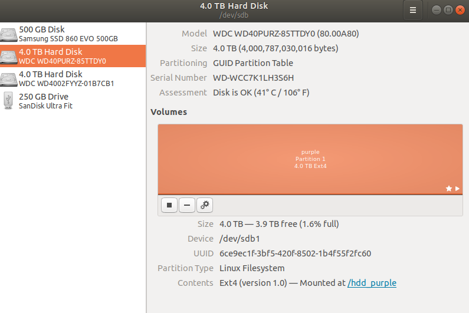

   - [Task](#task)
   - [Related links](#links)
   - [Format disks](#format)
   - [Permanently mount disks](#mount)
   - [Moving HOME from command line](#home)

---
### <a name="task" />Task

   - Drive check and format two HDDs: *WD Purple* and *WD Gold*.
   - Mount two HDDs to Ubuntu file system.
   - Move HOME folder to *WD Gold* HDD.

My answer on AskUbuntu.com: https://askubuntu.com/a/1097160/672237

---
### <a name="links" />Related links

   - [Terminal method of formatting storage drive](https://askubuntu.com/a/517365/672237)
   - [Add additional HDD in Ubuntu](https://askubuntu.com/a/956516/672237)
   - [Move home folder to second drive](https://askubuntu.com/a/50539/672237)

---
### <a name="format" />Format disks

Plug in all necessary SATA and power cables to your HDDs. Load Ubuntu.
Press `<Win>` keyboard and type "*Disks*" or type in terminal:
```shell script
gnome-disks&  # open disks utility
```

*Disks* utility will be opened:



In this utility you could format your HDDs into `Ext4` file system.
Otherwise to format disks use commands:
   1. `fdisk`, `man fdisk`
   2. `parted`, `man parted`
   3. `mkfs`, `man mkfs`

```shell script
# Better use GUI "gnome-disks" utility
# Make file system
sudo mkfs.ext4 -L purple /dev/sdb
sudo mkfs.ext4 -L gold   /dev/sdc
```
[Check disks for errors](https://smallbusiness.chron.com/run-chkdsk-ubuntu-54071.html)
The command may take some time to complete,
depending on the size of your drive.
When the process is finished, a number will be displayed.
`0` indicates that no errors were found;
`1` means that errors were found and corrected;
`2` means that the system should be rebooted;
`4` indicates that file system errors were found,
but could not be corrected.
Any other number indicates that the utility did not run
correctly. Run the `fsck` command a second time
if any number other than zero appears.
This ensures that all errors were corrected.
```shell script
# Check drive
sudo fsck -y /dev/sdb
sudo fsck -y /dev/sdc
```

:exclamation: **Formatting will delete everything on your hard disk.** :exclamation:

You can skip this step if there are any data on the hard disk
and you want to not lose it.

Slow formatting should take a lot of time. From 16 upto 20 hours for 4 TB disk.

---
### <a name="mount" />Permanently mount disks

Press `<CTRL>+<ALT>+<T>` keys and open a console.

```shell script
# Check your /dev/sdb and /dev/sdc discs are visible
lsblk

# Create two directories for HDDs: "WD Purple" and "WD Gold"
sudo mkdir /hdd_purple
sudo mkdir /hdd_gold  # temporary directory

# Temporary mount to the new mount point
sudo mount /dev/sdb1 /hdd_purple
sudo mount /dev/sdc1 /hdd_gold

# Check they are mounted.
df -h /hdd_purple
df -h /hdd_gold

# Unmount drives
sudo umount /dev/sdb1
sudo umount /dev/sdc1
# If "umount: /hdd_purple: target is busy" then:
sudo umount -lf /dev/sdb1
sudo umount -lf /dev/sdc1

# Check they are unmounted.
df -h /hdd_purple
df -h /hdd_gold
```

Configuration file `/etc/fstab` has list of all partitions
that will be mounted at boot (permanently).

   1. Get UUID of HDD and backup `/etc/fstab` file.

```shell script
# 1. Show and copy UUID of the HDD with this command:
sudo blkid
```

My data is:

```shell script
/dev/sdb1: LABEL="purple" UUID="6ce9ec1f-3bf5-420f-8502-1b4f55f2fc60" TYPE="ext4" PARTUUID="a14c8357-a8ce-42e4-9772-64ccfad3e226"
/dev/sdc1: LABEL="gold" UUID="1d049c7c-4565-480b-a181-2459e8ff8c1b" TYPE="ext4" PARTUUID="4c691b21-b4e3-4dab-ab91-d7bf7272b2b5"
```

Make a backup of `/etc/fstab` file to be able to revert changes.

```shell script
# Make backup
sudo cp /etc/fstab /etc/fstab.2020.07.08.bak
```

   2. Add a new partitions by editing `/etc/fstab` file as root.

```shell script
# Edit /etc/fstab
sudo nano /etc/fstab

# At the bottom of fstab file add 2 lines similar to this:
UUID=6ce9ec1f-3bf5-420f-8502-1b4f55f2fc60   /hdd_purple   ext4   defaults           0  2
UUID=1d049c7c-4565-480b-a181-2459e8ff8c1b   /hdd_gold     ext4   defaults           0  2
```

**Your UUID is different.**

Save `/etc/fstab` file with keys `<Ctrl>+<S>`.
Quit the editor with `<Ctrl>+<X>`.

**Note**. If you have *Midnight Commander* running,
then `<Ctrl>+<O>` will switch from `nano` editor to your *MC*.
Use `<Ctrl>+<S>` (save) or `<Ctrl>+<X>` (exit) instead.

   3. Check and reboot

To see if the drive is mounted correctly we can simulate the mount process
at boot.

```shell script
# Simulate the mount process
sudo mount -a
df -h
# Change the owner
sudo chown -R root:root /hdd_purple
sudo chown -R root:root /hdd_gold
# Set write permissions to disks
sudo chmod ugo+rwx /hdd_purple  # use -R for recursion
sudo chmod ugo+rwx /hdd_gold    # use -R for recursion
# Check it
ls -hal /
# Reboot
sudo reboot
```

---
### <a name="home" />Moving HOME from command line

To avoid side effects while working in a graphical environment,
perform all actions to move `$HOME` directory from a terminal with
`<Ctrl>+<Alt>+<F3>` hotkeys pressing.

Press `<Ctrl>+<Alt>+<F3>` hotkeys and switch to console mode.
Login in the console mode.

```shell script
# Copy /home directory to the new location.
# NOTE: Copying will take A LOT of time!
sudo rsync -avzhXH --progress /home/ /hdd_gold

# Check if everything is copied correctly
ls -hal /hdd_gold

# Delete everything in the /home directory
# Be careful with this command, make sure you have a backup.
sudo rm -rf /home/*

# Make $HOME permanent — edit /etc/fstab configuration file
sudo nano /etc/fstab

# Change string
UUID=1d049c7c-4565-480b-a181-2459e8ff8c1b  /hdd_gold  ext4  defaults  0  2
# to string
UUID=1d049c7c-4565-480b-a181-2459e8ff8c1b  /home      ext4  defaults  0  2
# I.e. change /hdd_golds to /home

# After a reboot, your /home resides on the new drive having plenty of space.
sudo reboot
```
