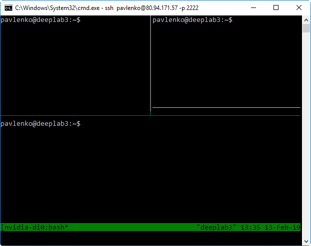

   - [Task](#task)
   - [Installations](#install)
      - [All other different software](#other-software)
      - [Anydesk](#anydesk)
      - [ASAP](#asap)
      - [Chrome](#chrome-browser)
      - [Chromium](#chromium)
      - [Elastix](#elastix)
      - [Emacs](#emacs)
      - [FileZilla](#filezilla)
      - [Geeqie](#geeqie)
      - [JebBrains IntelliJ](#intellij)
      - [LibreOffice or OpenOffice](#libreoffice)
      - [Mango viewer](#mango-viewer)
      - [Notepad++](#notepad-plus-plus)
      - [OpenSSH server](#openssh)
      - [PyCharm Community](#pycharm)
      - [TeamViewer Host](#teamviewer)
      - [Tmux](#tmux)
      - [Ubuntu Software Center](#ubuntu-software-center)
      - [uTorrent](#utorrent)
   - [Starting any process in background mode](#background-mode)
   - [Snap commands](#snap)
   - [X2Go server/client](#x2go)

---
### <a name="task" />Task

Install different software on Ubuntu 18.04.

---
### <a name="install" />Installations

----
#### <a name="other-software" />All other different software
```shell script
sudo apt install htop      # CPU monitoring
sudo apt install git       # Git
sudo apt install mc        # Midnight Commander
sudo apt install autoconf  # automatic configure script builder
sudo apt install make      # utility for directing compilation
sudo apt install curl      # tool for transferring data with URL syntax
sudo apt install gcc g++   # GCC and C++ compilers
sudo apt install net-tools   # ifconfig command
sudo apt install traceroute  # traceroute command
sudo apt install python-is-python3  # for Ubuntu 20.04 default Python

# Or in one command
sudo apt install htop git mc autoconf make curl gcc g++ \
                 net-tools traceroute python-is-python3
```

---
#### <a name="anydesk" />Anydesk
Remote desktop sharing with
[AnyDesk on Ubuntu 20.04](https://linuxconfig.org/remote-desktop-sharing-with-anydesk-on-ubuntu-20-04-focal-fossa)
Focal Fossa.
```shell script
wget -qO - https://keys.anydesk.com/repos/DEB-GPG-KEY | sudo apt-key add -
sudo sh -c 'echo "deb http://deb.anydesk.com/ all main" > /etc/apt/sources.list.d/anydesk-stable.list'
sudo apt update
sudo apt install anydesk

#sudo apt remove anydesk
```

----
#### <a name="asap" />ASAP
[ASAP](https://github.com/computationalpathologygroup/ASAP),
**A**utomated **S**lide **A**nalysis **P**latform is an open source platform for visualizing,
annotating and automatically analyzing whole-slide histopathology images.

Download DEB file from [here](https://github.com/computationalpathologygroup/ASAP/releases).

*NOTE*: there is no `deb` package
for Ubuntu version 20.04 yet (2020.07.06)
```shell script
# Fix broken dependences
sudo apt --fix-broken install
# Install
sudo dpkg -i ASAP-1.9-Linux-Ubuntu1804.deb

# Permanently add /opt/ASAP/bin to PATH for ALL users
sudo nano /etc/environment
# Edit the file. Make sure that the path is something like this:
# PATH="/usr/local/sbin:/usr/local/bin:/usr/sbin:/usr/bin:/sbin:/bin:/usr/games:/usr/local/games:/opt/ASAP/bin"
# Run environment file to effect changes.
. /etc/environment

# Check it
ASAP &  # run ASAP
```

----
#### <a name="chrome-browser" />Chrome

```shell script
# Download Google Chrome browser
wget https://dl.google.com/linux/direct/google-chrome-stable_current_amd64.deb
# Install the package
sudo dpkg -i google-chrome-stable_current_amd64.deb
# If some dependency errors occured
sudo apt --fix-broken install
```

----
#### <a name="chromium" />Chromium

```shell script
# Install Chromium web browser
sudo apt install chromium-browser
# Start Chromium in terminal background
chromium-browser &> /dev/null
```

----
#### <a name="elastix" />Elastix

*NOTE*: there is no installation for Ubuntu 20.04 yet (2020.06.07)
```shell script
# Toolbox for rigid and nonrigid registration of images
sudo apt install elastix
# Documents for Elastix toolbox
sudo apt install elastix-doc
# Check installation
elastix --version
```

----
#### <a name="emacs" />Emacs

```shell script
# Emacs editor
sudo apt install emacs
```

----
#### <a name="filezilla" />FileZilla

```shell script
sudo apt install filezilla
filezilla &> /dev/null
```

----
#### <a name="geeqie" />Geeqie

[Geeqie](https://www.linuxhelp.com/how-to-install-geeqie-in-ubuntu)
is an open source image viewer and organizer that allows the users to view graphics files.

It is useful to process images with it.

```shell script
# Install image viewer using GTK+ and data files for Geeqie.
sudo apt install geeqie geeqie-common
geeqie &> /dev/null  # run Geeqie

# Uninstall Geeqie if you like
sudo apt remove geeqie
```

----
#### <a name="intellij" />JebBrains IntelliJ

```shell script
# Install JetBrains IntelliJ IDEA Community edition
# https://blog.jetbrains.com/idea/2017/11/install-intellij-idea-with-snaps
sudo snap install intellij-idea-community --classic

# Run JetBrains IntelliJ IDEA Community edition
intellij-idea-community &> /dev/null
```

----
#### <a name="libreoffice" />LibreOffice or OpenOffice

```shell
sudo apt install libreoffice
#sudo apt install libreoffice-common
#sudo snap install libreoffice
libreoffice --version  # show version
```

Note: [LibreOffice](https://gcore.com/learning/how-to-install-libri-office-on-ubuntu/)
terminates the X2Go session for our DL4 server. Installed
[OpenOffice](https://www.openoffice.org/download/common/instructions.html) instead
([ru](https://losst.pro/ustanovka-openoffice-ubuntu) instructions).

```shell
sudo apt remove --purge libreoffice\*  # remove all libreoffice tools
sudo apt install -f  # find unused dependencies
sudo apt-get autoremove  # delete unused dependencies
sudo apt install openjdk-17-jre-headless  # install Java version >= 6
# Download the last version for Ubuntu - Linux 64-bit (x86-64) (DEB)
wget https://sourceforge.net/projects/openofficeorg.mirror/files/4.1.15/binaries/en-US/Apache_OpenOffice_4.1.15_Linux_x86-64_install-deb_en-US.tar.gz
tar xzf Apache_OpenOffice_4.1.15_Linux_x86-64_install-deb_en-US.tar.gz  # unpack installer
cd en-US//DEBS/  # go to directory with packages
sudo dpkg -i *.deb  # install all packages in the directory
cd desktop-integration/  # go to subdirectory
sudo dpkg -i *.deb  # install all packages in the directory
soffice -help 2>&1 | head -n1  # show OpenOffice version via command line
```

----
#### <a name="mango-viewer" />Mango viewer
[Mango](https://mangoviewer.com/index.html) – short for
Multi-image Analysis GUI – is a viewer for medical research images.
It provides analysis tools and a user interface to navigate image volumes.
There are three versions of Mango:
**Mango** for Desktop, **Papaya** for Browser and **iMango** for Apple iPad.

[Download for Linux](https://mangoviewer.com/downloads/mango_unix.zip).

In the Midnight Commander create extension associations:
Open Midnight Commander (`mc`) → press <F9> →
choose menu "Command" → menu "Edit extension file" → copy-paste this text:
```text
[nii.gz]
Shell=.nii.gz
Open=~/install/mango/mango %f
View=~/install/mango/mango %f

[nii]
Shell=.nii
Open=~/install/mango/mango %f
View=~/install/mango/mango %f

[dcm]
Shell=.dcm
Open=~/install/mango/mango %f
View=~/install/mango/mango %f
```

----
#### <a name="notepad-plus-plus" />Notepad++
**Warning**: Wine Tool is large!

[Notepad++](https://www.tecrobust.com/install-notepad-plus-plus-linux-ubuntu)
is a Best Programming Text Editor and as well as a Source Code Editor which was developed
for Windows Platform and is more famous among the Windows users.
It provides a simplified speed typing interface with a lot of features such as Syntax Highlighting,
Brace Matching, AutoComplete, Color Codes, and a lot more features.
Source Code Editor also makes it very easy to run Compliers, debuggers, and more.
Though Notepad++ is not available for Linux, there is a way to use Notepadd++
on Linux Ubuntu Distributions.

```shell script
sudo apt install snapd               # install Snap tool
sudo apt install wine-stable         # install Wine tool
sudo snap install notepad-plus-plus  # install Notepad++
notepad-plus-plus &> /dev/null       # run Notepad++
```

----
#### <a name="openssh" />OpenSSH server
[Install OpenSSH server](https://www.cyberciti.biz/faq/ubuntu-linux-install-openssh-server/)
for Ubuntu Linux.
```shell script
sudo apt install -y openssh-server
sudo systemctl status ssh  # verify

#sudo systemctl enable ssh
#sudo systemctl start ssh
#sudo ufw allow ssh
#sudo ufw enable
#sudo ufw status
```

----
#### <a name="pycharm" />PyCharm Community

Install free of charge PyCharm Community edition.

[How-to install needed version](https://snapcraft.io/pycharm-community)
[How to Install PyCharm on Ubuntu](https://www.liquidweb.com/kb/how-to-install-pycharm-on-ubuntu)

```shell script
# Install PyCharm Community last stable release
sudo snap install pycharm-community --classic

pycharm-community &> /dev/null  # run it in background mode

# Remove possible error with Canberra Gtk.
# canberra-gtk-module translates GTK+ widgets signals to event sounds
# This module is needed for PyCharm successful start
sudo apt install libcanberra-gtk-module
```

----
#### <a name="teamviewer" />TeamViewer Host
[Download](https://www.teamviewer.com/en/download/linux)
deb package for TeamViewer **Host**.
```shell script
sudo apt install -y ./teamviewer-host_15.7.6_amd64.deb
teamviewer  # launch and configure TeamViewer
```

----
#### <a name="tmux" />Tmux

Tmux (the **T**erminal **MU**ltiple**X**er) allows multiple terminal sessions
to be accessed simultaneously in a single window. It is useful for running
more than one command-line program at the same time. It can also be used
to detach processes from their controlling terminals,
allowing SSH sessions to remain active without being visible.
```shell script
# Tmux terminal multiplexer
sudo apt install tmux

# Tmux session manager
sudo apt install tmuxp

# Tmux plugin manager based on git
sudo apt install tmux-plugin-manager

# Create and manage tmux sessions easily
sudo apt install tmuxinator

# Python 3.x scripting library and ORM for tmux
sudo apt install python3-libtmux

# Tmux session manager
sudo apt install python3-tmuxp

# Terminal multiplexer with instant terminal sharing
sudo apt install tmate
```

[Getting started with Tmux](https://linuxize.com/post/getting-started-with-tmux)



```shell script
# Start a session
tmux new -s nvidia-digits
# Attach a session
tmux attach-session -t [name of session]
# Check active sessions
tmux ls

# To split a pane horizontally press <ctrl>+<b> and then press <">:
ctrl+b "
# To split pane vertically:
ctrl+b %
# To move from pane to pane press <ctrl>+<b> and then press arrow key:
ctrl+b [arrow key]
# Cycle through panes:
ctrl+b o
# Resize pane:
ctrl+b :
resize-pane -D 2
# Kill current pane:
ctrl+b x

# Detach from session:
ctrl+b d
# Kill named session:
tmux kill-session -t [name of session]
# Kill tmux server, along with all sessions:
tmux kill-server
```

----
#### <a name="ubuntu-software-center" />Ubuntu Software Center

[Ubuntu Software Center](https://www.ubuntupit.com/how-to-install-software-in-ubuntu-linux-a-complete-guide-for-newbie/)
is a GUI to install software for newbie.

```shell script
sudo apt install ubuntu-software  # install Ubuntu Software Center
gnome-software  # run ubuntu software center
```

----
#### <a name="utorrent" />uTorrent

```shell script
snap find torrent
snap install utorrent
utorrent &> /dev/null
```

---
### <a name="background-mode" />Starting any process in background mode

```shell script
tmux a -t nvidia-digits  # attach an existing session
# Start any process in background mode
ctrl+b d  # detach from session
# Exit from SSH or log out from the system, but process will run.
```

---
### <a name="snap" />Snap commands

`snap` tool to interact with *snaps*.
*Snaps* are packages that are mainly designed to be sandboxed and isolated
from other system software, secure, and easily installable, upgradeable,
degradable, and removable irrespective of its underlying system.

[Video turorials](https://utappia.org/2016/04/22/how-to-search-install-remove-snap-packages-in-ubuntu)

To craft needed snap visit the [SnapCraft web-site](https://snapcraft.io/pycharm-community).

[How to Install and Use Snap on Ubuntu 18.04](https://codeburst.io/how-to-install-and-use-snap-on-ubuntu-18-04-9fcb6e3b34f9)

```shell script
# Install Snap tool
sudo apt install snapd
snap --version
snap search pycharm  # search for PyCharm packages

# Use Snap tool
sudo snap find               # to list the available packages
sudo snap install <package>  # to install a package
sudo snap list               # to view all the installed snap packages
sudo snap changes            # to view a list of logged actions
sudo snap refresh <package>  # to upgrade a package to its latest available version
sudo snap refresh --list     # to see which packages have updates to be installed
sudo snap revert <package>   # to revert it to the previously installed version
sudo snap remove <package>   # to uninstall a package

# To update all snap packages
sudo snap refresh

# To remove broken snap installation
snap changes
# The output is:
#   ID   Status  Spawn               Ready  Summary
#   11   Doing   today at 16:15 +03  -      Install "intellij-idea-community" snap
sudo snap abort 11
# or
sudo snap remove intellij-idea-community

# Temporary enable-disable package.
sudo snap disable <package>
sudo snap enable <package>

# Add /snap/bin/ directory to the $PATH
sudo nano /etc/environment
# Run environment file to effect changes.
. /etc/environment
```

----
#### <a name="x2go" />X2Go server/client
[How to Set Up a Remote Desktop with X2Go on Ubuntu 18.04](https://draculaservers.com/tutorials/install-x2go-ubuntu-remote-desktop/)

Install X2Go [server](https://wiki.x2go.org/doku.php/doc:installation:x2goserver)
and [client](https://wiki.x2go.org/doku.php/doc:installation:x2goclient) software.
```shell script
# Install X2Go server
sudo apt install -y software-properties-common
sudo apt install -y python-software-properties
sudo add-apt-repository ppa:x2go/stable
sudo apt update
sudo apt install -y x2goserver x2goserver-xsession
sudo apt install -y x2gomatebindings  # if you use MATE/mubuntu
sudo apt install -y x2golxdebindings  # if you use LXDE/lubuntu

# Install X2Go client
sudo apt-add-repository ppa:x2go/stable
sudo apt update
sudo apt install -y x2goclient

# Install LXDE, Lightweight X11 Desktop Environment
# for X2Go remote sessions.
# Set lightdm display manager in the appeared config window.
sudo apt install -y lxde

# Installing MATE Desktop
sudo apt-get install mate-core mate-desktop-environment mate-notification-daemon
```
