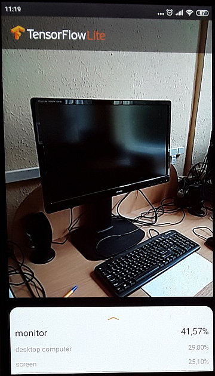
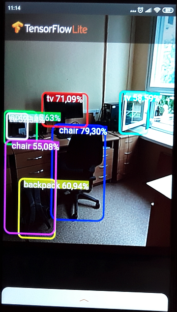

   - [Exercises and tutorials (for beginners)](#exercises)
   - [All video courses and tutorials](#video-courses)
   - [Code examples](#code-examples)
   - [Additional useful tools](#tools)
   - [Web sites to visit from time to time](#websites)
   - [TensorFlow for Android](#tensorflow-for-android)
   - [TensorFlow CPUs and GPUs Configuration](#cpu-gpu-configuration)
      - [Limit TensorFlow to one GPU](#limit-gpu)
      - [Limit TensorFlow to lower memory](#limit-memory)
         - [1. Reserve dynamically](#reserve-dynamically)
         - [2. Reserve fixed fraction](#reserve-fraction)
      - [Turn off debug messages](#debug-messages)
      - [Clean up resources and exit](#clean-up)
         - [Forcibly clean up resources](#force-clean)

---
### <a name="exercises" />Exercises and tutorials (for beginners)

Helpful for me and I hope will be helpful for you:

   * [Neural Networks by 3Blue1Brown](https://www.youtube.com/playlist?list=PLZHQObOWTQDNU6R1_67000Dx_ZCJB-3pi)
     — watch 4 videos
   * [fastai](https://course.fast.ai/videos/?lesson=1) course, part1.
   * [TensorFlow free course](https://classroom.udacity.com/courses/ud187) —
     <b>Highly recommend</b> this course to ML newcomers, beginners, novices, rookies, etc.
   * [Neural Networks Demystified](https://www.youtube.com/playlist?list=PLiaHhY2iBX9hdHaRr6b7XevZtgZRa1PoU)
     — intro into neural networks
   * [Top 10 Deep Learning tools](https://medium.com/@chengweizhang2012/top-10-deep-learning-experiences-run-on-your-browser-458a64c9625f)
     for your inspiration. For more tools go to the section [additional useful tools](#tools)
   * [Neural Networks from Scratch](https://youtu.be/G7RDn8Xtf_Y). Literally from stratch,
     using Python and NumPy only. The course **is not ready for now**, but will be in 6-8 month. 
   * [Machine Learning for Everyone](https://vas3k.com/blog/machine_learning/)
     ([Машинное обучение для людей](https://vas3k.ru/blog/machine_learning/))
     and [my brochure in Russian](https://foobar167.github.io/page/vvedeniye-v-mashinnoye-obucheniye-i-iskusstvennyye-neyronnyye-seti.html)
   * [TensorFlow learn ML](https://www.tensorflow.org/resources/learn-ml) web-page with many useful learning resources
     (books, videos, examples, etc.).
   * [Get Started with TensorFlow](https://www.tensorflow.org/tutorials) —
     Webpage with many tutorials. Everyone should make at least 5 exercises for beginners
     and then continue with more advanced tutorials.
     with the [source code](https://github.com/stephencwelch/Neural-Networks-Demystified).
   * [A Neural Network in 11 lines of Python (Part 1)](http://iamtrask.github.io/2015/07/12/basic-python-network) —
     Simple neural network in 11 lines of Python code with detailed explanation
     and [Russian translation is here](https://habr.com/ru/post/271563).
   * [A Neural Network in 13 lines of Python (Part 2 - Gradient Descent)](https://iamtrask.github.io/2015/07/27/python-network-part2) —
     Explanation of gradient descent with 13 lines of Python code.
   * [Create A Neural Network That Classifies Diabetes Risk In 15 Lines of Python](https://youtu.be/T91fsaG2L0s) —
     Neural network in 15 lines of Python code to diagnose diabetes.
     Russian translation [here](file:///D:/Pavlenko/%23_%D0%9F%D1%80%D0%BE%D0%B5%D0%BA%D1%82%D1%8B/Python/2019.02.25_ML_study/2019.02.27%20Diabetes/%D0%9D%D0%B5%D0%B9%D1%80%D0%BE%D0%BD%D0%BD%D0%B0%D1%8F%20%D1%81%D0%B5%D1%82%D1%8C%20%D0%BD%D0%B0%20Python%20%D0%B2%2015%20%D1%81%D1%82%D1%80%D0%BE%D0%BA%20%D0%BA%D0%BE%D0%B4%D0%B0%20%D0%B4%D0%BB%D1%8F%20%D0%B4%D0%B8%D0%B0%D0%B3%D0%BD%D0%BE%D1%81%D1%82%D0%B8%D0%BA%D0%B8%20%D0%B4%D0%B8%D0%B0%D0%B1%D0%B5%D1%82%D0%B0.html).
     Text explanations are [here](https://www.andreagrandi.it/2018/04/14/machine-learning-pima-indians-diabetes/).
     CSV database file is [here](https://www.kaggle.com/uciml/pima-indians-diabetes-database).
   * [Unsupervised Learning by Siraj Raval](https://youtu.be/8dqdDEyzkFA) —
     Using signal processing and K-means clustering to extract and sort neural events in Python plus
     [source code](https://github.com/llSourcell/spike_sorting)
     and [dataset](http://www.vis.caltech.edu/~rodri/Wave_clus/UCLA_data.zip).
   * [Unet Segmentation in Keras](https://youtu.be/M3EZS__Z_XE) —
     Easy explanation of the U-net in Keras
     with the [source code](https://github.com/nikhilroxtomar/UNet-Segmentation-in-Keras-TensorFlow/blob/master/unet-segmentation.ipynb).
   * [Deep Residual Unet Segmentation in Keras](https://youtu.be/BOoBWRTpaKk) —
     Easy explanation of the ResUNet in Keras
     with the [source code](https://github.com/nikhilroxtomar/Deep-Residual-Unet/blob/master/Deep%20Residual%20UNet.ipynb).
   * Course [Introduction to TensorFlow for AI, ML, and DL](https://www.coursera.org/learn/introduction-tensorflow/home/welcome) —
     Good introduction course into TensorFlow.
   * Course [Coding TensorFlow](https://www.youtube.com/playlist?list=PLQY2H8rRoyvwLbzbnKJ59NkZvQAW9wLbx) —
     You will look at various parts of TensorFlow from a coding perspective.
   * Courses. Machine Learning Tokyo: [CNN Workshop](https://www.youtube.com/channel/UC88RC_4egFjV9jfjBHwDuvg/playlists) video blog and GitHub [resource](https://github.com/Machine-Learning-Tokyo) and [CNN Architectures - implementations](https://www.youtube.com/playlist?list=PLaPdEEY26UXyE3UchW0C742xh542yh0yI)

---
### <a name="video-courses" />All video courses and tutorials

All video courses and tutorials about Machine Learning I'm working on
[are placed here](../Machine_Learning/courses_on_machine_learning.md).

---
### <a name="code-examples" />Code examples

All code examples are placed [here](../Machine_Learning/code_examples).

---
### <a name="tools" />Additional useful tools

Additional useful tools everybody should know about:

   * Jupyter Notebook:

       * [Six easy ways](https://www.dataschool.io/cloud-services-for-jupyter-notebook)
         to run your Jupyter Notebook in the cloud:
             [Binder](https://mybinder.org),
             [Kaggle Kernels](https://www.kaggle.com),
             [Google Colaboratory (Colab)](https://colab.research.google.com),
             [Microsoft Azure Notebooks](https://notebooks.azure.com),
             [CoCalc](https://cocalc.com),
             [Datalore](https://datalore.io)
       * [Google Colab](https://colab.research.google.com) —
         Colaboratory is a free Jupyter notebook environment that requires no setup and runs entirely
         in the cloud. With Colaboratory you can write and execute code, save and share your analyses,
         and access powerful computing resources, all for free from your browser.
       * [Kaggle Kernels](https://www.kaggle.com/kernels) —
         Free Jupyter notebook environment. If you tired to [read documentation](https://www.kaggle.com/docs/kernels),
         just try to find and see some [videos](https://youtu.be/sLAthlX816c).
       * [K3D Jupyter](https://github.com/K3D-tools/K3D-jupyter) —
         Jupyter notebook extension for *3D visualization*
         with [examples](https://github.com/K3D-tools/K3D-jupyter/tree/master/examples).
         Just start to view the examples and you'll like it :-)
       * [nbviewer](https://nbviewer.jupyter.org/) — A simple way to share Jupyter Notebooks.
         It is useful if your Jupyter Notebook `*.ipynb` won't load on Github.
         Enter the location of a Jupyter Notebook to have it rendered.
       * [10 Simple hacks to speed up your Data Analysis in Python](https://github.com/parulnith/10-Simple-hacks-to-speed-up-your-Data-Analysis-in-Python)
       * Use Jupyter Notebook with [RISE](https://rise.readthedocs.io/en/stable/) plug-in to make presentations right in the notebook.
       * [Juxtapose](https://juxtapose.knightlab.com/) —
         Easy-to-make frame comparisons. Useful for presentations.
         Generate an embedable code snippet that you can use on any website or Jupyter notebook.
         There must be an Internet connection to obtain URL.
         Copy-paste code below into your Jupyter notebook and replace the `url`:


```python
# Display the associated webpage in a new window
import IPython
url = 'https://cdn.knightlab.com/libs/juxtapose/latest/embed/index.html?uid=7e8015a0-4be7-11e9-8106-0edaf8f81e27'
iframe = '<iframe frameborder="0" class="juxtapose" width="100%" height="600" src="' + url + '"></iframe>'
IPython.display.HTML(iframe)
```


   * Downloading tools:

       * [Fatkun Batch Download Image add-on for Chrome browser](https://chrome.google.com/webstore/detail/fatkun-batch-download-ima/nnjjahlikiabnchcpehcpkdeckfgnohf) —
         Fast and easy download of many images from Google Images. Menu
         _"Ask where to save each file before downloading"_ must be turned off before downloading images.
       * [google_images_download](https://pypi.org/project/google_images_download) is a Python
         [Script](https://github.com/hardikvasa/google-images-download)
         for "searching" and "downloading" hundreds of Google images to the local hard disk
       * For older versions of Firefox [Google Images Downloader](https://addons.mozilla.org/en-US/firefox/addon/google-images-downloader/?src=recommended) Firefox add-on by Rushikesh Tade
       * [How to scrape the web for images](https://forums.fast.ai/t/how-to-scrape-the-web-for-images) forum


   * Datasets Search:

       * [Google Dataset Search](https://toolbox.google.com/datasetsearch) is a search engine for datasets.
       * [Kaggle datasets](https://www.kaggle.com/datasets) — search engine for 25 000 datasets on Kaggle.
       * [Academic Torrents](https://academictorrents.com/) distributed system for sharing datasets.
       * [Awesome Public Datasets](https://github.com/awesomedata/awesome-public-datasets) list of a topic-centric public data sources.
       * [Awesome Open Source](https://awesomeopensource.com) find open source by browsing 7,000 topics across 59 categories.

       * [Quantitative Imaging Data Warehouse (QIDW)](https://qidw.rsna.org/)
       * [NCBI Datasets](https://www.ncbi.nlm.nih.gov/datasets/). Find and download gene, transcript, protein and genome sequences, annotation and metadata.


   * [Deep Learning add-on for Adaptive Vision Studio Lite](https://www.adaptive-vision.com/en/software/deep-learning) —
     If you need out-of-the-box solutions, you could try Adaptive Vision tool with Deep Learning add-on.
     Unfortunately, Deep Learning add-on has only trial version for 30 days for educational purposes.
     [Lite version](https://www.adaptive-vision.com/en/software/editions)
     is a limited-functionality freeware available for trial and non-commercial use.
     Recommended especially for students who want to learn how to develop
     complex algorithms with images loaded from files.


   * Annotation tools:

       * Annotation tool [labelImg](https://tzutalin.github.io/labelImg).
         This annotation tool supports both Windows and Linux, it will generate `xml` files inside
         image directories. Tip: use shortcuts (`w`: draw box, `d`: next file, `a`: previous file, etc.)
         to accelerate the annotation.
       * My own annotation tools: [Manual image annotation with polygons](https://github.com/foobar167/junkyard/tree/master/manual_image_annotation1)
         and [Manual image annotation with rectangles](https://github.com/foobar167/junkyard/tree/master/manual_image_annotation2)
         can annotate and cut rectangular images.
       * [VGG Image Annotator](http://www.robots.ox.ac.uk/~vgg/software/via/)
         is a simple and standalone manual annotation software for image, audio and video.
         VIA [runs in a web browser](http://www.robots.ox.ac.uk/~vgg/software/via/via.html)
         and does not require any installation or setup.
         The complete VIA software fits in a single self-contained HTML page of size less than 400 Kilobyte
         that runs as an offline application in most modern web browsers.
       * [Computer Vision Annotation Tool](https://github.com/opencv/cvat) (CVAT). CVAT is free, online, interactive video and image annotation tool for computer vision.
       * [https://supervise.ly](https://supervise.ly) The leading platform for entire computer vision lifecycle.


   * Model Zoo:

       * [TensorFlow Hub](https://tfhub.dev) is a library for the publication, discovery, and consumption
         of reusable parts of machine learning models. A *module* is a self-contained piece of a TensorFlow graph,
         along with its weights and assets, that can be reused across different tasks in a process known as
         [transfer learning](https://en.wikipedia.org/wiki/Transfer_learning).
         If you think of a model like a binary, think of a module like a library
         ([video](https://youtu.be/rirzJ-e68cw?t=207)).
       * [mmdetection](https://github.com/open-mmlab/mmdetection) is an open source object detection toolbox based on
         [PyTorch](https://pytorch.org). Plus [model zoo](https://github.com/open-mmlab/mmdetection/blob/master/docs/MODEL_ZOO.md).
       * [Detectron](https://github.com/facebookresearch/Detectron) is Facebook AI Research's software system
         that implements state-of-the-art object detection algorithms.
         It is written in Python and powered by the [Caffe2](https://github.com/facebookarchive/caffe2)
         deep learning framework.
       * [Model Zoo](https://modelzoo.co/) website curates and provides a platform
         for deep learning researchers to easily find pre-trained models for a variety of platforms and uses.


   * Data visualization:

       * [Tools to Design or Visualize Architecture of Neural Network](https://github.com/ashishpatel26/Tools-to-Design-or-Visualize-Architecture-of-Neural-Network)
       * [diagrams.net](https://www.diagrams.net/) is open source, online, desktop and container deployable diagramming software ([link](https://app.diagrams.net/)).
       * [Facets](https://ai.googleblog.com/2017/07/facets-open-source-visualization-tool.html)
         is an open source visualization tool for Machine Learning training data.
         It helps to understand the various features of data and explore them without having to
         explicitly code. Facets is released by Google under the
         [PAIR (People + AI Research)](https://ai.google/research/teams/brain/pair) initiative.
         Open [example **only in Chrome**](https://colab.research.google.com/drive/15XYYCo2D4sMYl0ZC3Tm8wVrp0UlzHljR#scrollTo=c-crf6ht1_mn).
       * [GeoGebra](https://www.geogebra.org/) is dynamic mathematics software for all levels of education
         that brings together geometry, algebra, spreadsheets, graphing, statistics and calculus
         in one easy-to-use package. [Mandelbrot example](https://www.geogebra.org/m/BUVhcRSv#material/Npd3kBKn).
       * [Hands-on TensorBoard (TensorFlow Dev Summit 2017)](https://youtu.be/eBbEDRsCmv4) —
         Demonstration of TensorBoard tool with the
         [source code](https://github.com/martinwicke/tf-dev-summit-tensorboard-tutorial).
       * [Streamlit](https://streamlit.io/docs/) is an open-source Python library
         that makes it easy to build beautiful apps for machine learning. I didn't use it yet.


   * [OpenAI](https://openai.com/resources/#platforms) builds free software for training, benchmarking,
     and experimenting with AI. Reinforcement Learning (RL).


   * Resize multiple images with ratio [`resize_with_ratio.py`](https://github.com/skliff13/MilitaryDemo/blob/master/CreateDataset/resize_with_ratio.py)
     script.


   * [Kite](https://kite.com) autocomplete plugin for Python IDE (PyCharm, Spyder, etc.).


---
### <a name="websites" />Web sites to visit from time to time

Web sites for ML/DL:
   * https://medium.com — Many articles in ML/DL. Very alike [Хабр in Russian]().
   * https://distill.pub — Distillation of scientific publications.
   * https://stackoverflow.com — and — [all](https://cs.stackexchange.com) — [its](https://cstheory.stackexchange.com) — [siblings](https://scicomp.stackexchange.com) — [are](https://stats.stackexchange.com) — vital for [ML/DL search](https://meta.stackexchange.com/questions/130524/which-stack-exchange-website-for-machine-learning-and-computational-algorithms).
   * https://realpython.com — web site with high-quality articles about Python.
   * https://www.dlology.com — blog of Chengwei Zhang aka [Tony607](https://github.com/Tony607)
   * https://pythonprogramming.net — a bunch of tutorials about Machine Learning and more + [video blog](https://www.youtube.com/channel/UCfzlCWGWYyIQ0aLC5w48gBQ)
   * https://paperswithcode.com — Machine Learning papers, code and evaluation tables all in one web-site.
   * https://sotabench.com — benchmarking every open source model
   * https://madewithml.com — deliver value with applied ML
   * https://ods.ai — Open Data Science community
   * https://www.deeplearningweekly.com — Bringing you everything new and exciting in the world
     of deep learning from academia to the grubby depth of industry every week right to your inbox.
   * https://www.pyimagesearch.com — Adrian Rosebrock's blog about Computer Vision, Deep Learning and OpenCV.

Video channels to explain scientific publications in ML/DL:
   * [ML Tokyo](https://www.youtube.com/channel/UC88RC_4egFjV9jfjBHwDuvg/playlists)
   * [sentdex](https://www.youtube.com/channel/UCfzlCWGWYyIQ0aLC5w48gBQ)
   * [Two Minute Papers](https://www.youtube.com/user/keeroyz)
   * [Henry AI Labs](https://www.youtube.com/channel/UCHB9VepY6kYvZjj0Bgxnpbw)
   * [Yannic Kilcher](https://www.youtube.com/channel/UCZHmQk67mSJgfCCTn7xBfew/featured)
   * [CodeEmporium](https://www.youtube.com/channel/UC5_6ZD6s8klmMu9TXEB_1IA/featured)

Newsletters:
   * https://www.deeplearningweekly.com
   * https://www.deeplearning.ai/thebatch

---
### <a name="tensorflow-for-android" />TensorFlow for Android

For iOS review [this blog](https://machinethink.net/blog/) of Matthijs Hollemans.

[TensorFlow Lite guide](https://www.tensorflow.org/lite/guide) — this is your starting point.

Video course [Introduction to TensorFlow Lite](https://www.udacity.com/course/intro-to-tensorflow-lite--ud190).

TensorFlow Lite **vs** TensorFlow Mobile ([link](https://towardsdatascience.com/the-essential-guide-to-learn-tensorflow-mobile-and-tensorflow-lite-a70591687800)):
   * Lite is the next version of Mobile. Generally, applications developed on Lite
   will have better performance and less binary file size than Mobile.
   * Lite is still in early stages so not all the cases cover which is not the case for Mobile.
   * Lite supports selective sets of operators, therefore not all the models will work on Lite by default.
   Whereas, Mobile has fully covered functionality.

I'm not familiar with Android development. So start with [Android quickstart](https://www.tensorflow.org/lite/guide/android)
and Android **image classification** [example](https://github.com/tensorflow/examples/tree/master/lite/examples/image_classification/android):
   * Download and install [Android Studio](https://developer.android.com/studio).
   * Set device in [developer mode](https://developer.android.com/studio/debug/dev-options) with USB debugging enabled.
Enable developer mode and USB debugging on [Xiaomi Redmi](https://www.syncios.com/android/how-to-debug-xiaomi-redmi-phone.html)
or [Samsung Galaxy Tab](https://www.getdroidtips.com/enable-options-usb-debugging-galaxy-tab-s3-9-7).
Google it to set developer and debugging on other phone models.
   * Take USB cable (to connect Android device to your computer).

[Configuration steps](https://stackoverflow.com/a/48524656/7550928) for **MIUI 9 and above**:
*Settings → Additional Settings → Developer options →*
   01. Turn off `Turn on MIUI optimization` at the very bottom of `Developer options`
       and **Restart** the phone.
   02. Turn On `USB Debugging`.
   03. Turn On `Install via USB`.
   04. Set USB Configuration to Charging.
       MTP(Media Transfer Protocol) is the default mode. Works even in MTP in some cases.

After finishing previous example run **object detection** [example](https://github.com/tensorflow/examples/tree/master/lite/examples/object_detection/android)
using a quantized [MobileNet SSD](https://github.com/tensorflow/models/tree/master/research/object_detection)
model trained on the [COCO dataset](http://cocodataset.org/#explore).

Result for image classification demo is **decent** (2019.09.13). I don't know which dataset they used,
but the quality of classification is decent.



Result for object detection is **poor** (2019.09.13, COCO dataset). It is not for production.



For further Android development examples and TensorFlow Lite,
visit [this repository](https://github.com/foobar167/android).

---
### <a name="cpu-gpu-configuration" />TensorFlow CPUs and GPUs Configuration

Links to read:
   * [TensorFlow CPUs and GPUs Configuration](https://medium.com/@lisulimowicz/tensorflow-cpus-and-gpus-configuration-9c223436d4ef)
   * [Using GPUs](https://www.tensorflow.org/guide/using_gpu)
   * [How to prevent tensorflow from allocating the totality of a GPU memory](https://stackoverflow.com/questions/34199233/how-to-prevent-tensorflow-from-allocating-the-totality-of-a-gpu-memory)
   * [How can I flush GPU memory using CUDA (physical reset is unavailable)](https://stackoverflow.com/questions/15197286/how-can-i-flush-gpu-memory-using-cuda-physical-reset-is-unavailable)

---
#### <a name="limit-gpu" />Limit TensorFlow to one GPU

By default TensorFlow occupies all GPUs on the platform.
Also you should exit Python (ipython, jupyter) console to free GPU resources. 

```python
# Calculate on the 2nd GPU
import os
os.environ["CUDA_DEVICE_ORDER"] = "PCI_BUS_ID"  # so the IDs match nvidia-smi
os.environ["CUDA_VISIBLE_DEVICES"] = "1"        # "0,1" for multiple GPU or "-1" for CPU

# Note: it seems option "0,1" does not work for different GPU models.
```

```shell script
# For Jupyter Notebook one has to restart the kernel
# after changing of environment variables.

# Monitor GPU permanently. To exit, press <Ctrl>+<C> keys.
watch -n 0.5 nvidia-smi
# Monitor CPU permanently. To exit, press <Q> key.
htop
```

---
#### <a name="limit-memory" />Limit TensorFlow to lower memory

By default TensorFlow occupies all memory on GPU.
[Limiting GPU memory growth.](https://www.tensorflow.org/guide/gpu#limiting_gpu_memory_growth)

##### <a name="reserve-dynamically" />1. Reserve dynamically

You can dynamically reserve only necessary, but not all available memory:

```python
# Reserve necessary GPU memory
import tensorflow as tf

# For TensorFlow 2.x
gpus = tf.config.list_physical_devices('GPU')
if gpus:
  try:
    # Currently, memory growth needs to be the same across GPUs
    for gpu in gpus:
      tf.config.experimental.set_memory_growth(gpu, True)
    logical_gpus = tf.config.list_logical_devices('GPU')
    print(len(gpus), "Physical GPUs,", len(logical_gpus), "Logical GPUs")
  except RuntimeError as e:
    # Memory growth must be set before GPUs have been initialized
    print(e)
```

##### <a name="reserve-fraction" />2. Reserve fixed fraction

You can set the fraction of GPU memory to be allocated when you construct a `tf.Session`
by passing a `tf.GPUOptions` as part of the optional config argument:

```python
# Reserve GPU memory fraction
import tensorflow as tf

# For TensorFlow 2.x
gpus = tf.config.list_physical_devices('GPU')
if gpus:
  # Restrict TensorFlow to only allocate 1GB of memory on the first GPU
  try:
    tf.config.set_logical_device_configuration(
        gpus[0],
        [tf.config.LogicalDeviceConfiguration(memory_limit=1024)])
    logical_gpus = tf.config.list_logical_devices('GPU')
    print(len(gpus), "Physical GPUs,", len(logical_gpus), "Logical GPUs")
  except RuntimeError as e:
    # Virtual devices must be set before GPUs have been initialized
    print(e)
```
The `per_process_gpu_memory_fraction` acts as a hard upper bound on the amount of GPU memory
that will be used by the process on each GPU on the same machine.
Currently, this fraction is applied uniformly to all of the GPUs on the same machine

---
#### <a name="debug-messages" />Turn off debug messages

```python
import os
import tensorflow as tf

# 0 - all messages are logged (default behavior)
# 1 - INFO messages are not printed
# 2 - INFO and WARNING messages are not printed
# 3 - INFO, WARNING, and ERROR messages are not printed
os.environ['TF_CPP_MIN_LOG_LEVEL'] = '2'  # show errors
```

---
#### <a name="clean-up" />Clean up resources and exit

After calculations **everyone should clean up resources** and exit from Python, iPython and Jupyter.
Place this code at the end of your program:
```python
# Clean up resources. Place this code at the end of the program.
import os, signal
os.kill(os.getpid(), signal.SIGTERM)  # you can use signal.SIGKILL for Linux, but not for Windows
```

##### <a name="force-clean" />Forcibly clean up resources

Root can forcibly clean up resources:
```shell script
# Shows PIDs of processes
# using the specified files or file systems
sudo fuser -v /dev/nvidia*

                     USER         PID ACCESS COMMAND
/dev/nvidia0:        root        4051 F...m Xorg
                     username1   8138 F...m python
                     username2  11791 F.... python3
                     username3  14282 F...m python3
                     username3  14295 F...m python3
/dev/nvidia1:        root        4051 F...m Xorg
                     username1   8138 F...m python
                     username2  11791 F...m python3
/dev/nvidiactl:      root        4051 F...m Xorg
                     username1   8138 F...m python
                     username2  11791 F...m python3
                     username3  14282 F...m python3
                     username3  14295 F...m python3
/dev/nvidia-modeset: root        4051 F.... Xorg
/dev/nvidia-uvm:     username1   8138 F...m python
                     username2  11791 F.... python3
                     username3  14282 F...m python3
                     username3  14295 F...m python3

# Finish 2 processes for nvidia0
sudo kill -9 14282
sudo kill -9 14295

sudo fuser -v /dev/nvidia*
nvidia-smi  # show nvidia system management interface
```
