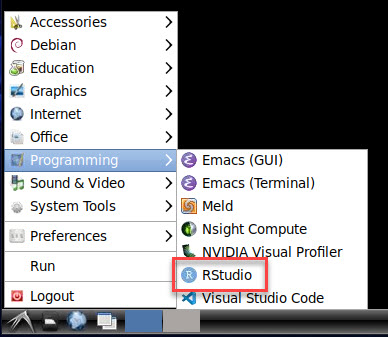

Configurations I've made on DL4 server for **Ubuntu 20.04**.

   - [Disable sleep/suspend](#disable-sleep)
   - [Docker installing and configuring](#docker)
   - [How-to configure TensorFlow](#tf-how-to)
   - [Install useful software](#software)
        - [OpenSlide](#open-slide)
        - [Snap](#snap)
        - [Visual Studio](#visual-studio)
        - [R and RStudio](#rstudio)
   - [Nvidia and CUDA installation](#nvidia)
   - [`pyenv` virtual environment](#pyenv)
   - [Shows PIDs of NVIDIA processes](#permissions)

---
## <a name="disable-sleep" />Disable sleep/suspend

[Lightlocker and Xscreensaver conflicting](https://askubuntu.com/questions/1063481/lightlocker-and-xscreensaver-conflicting)
[How to Disable Suspend and Hibernation Modes In Linux](https://www.tecmint.com/disable-suspend-and-hibernation-in-linux)
[How to permanently disable sleep/suspend?](https://askubuntu.com/questions/473037/how-to-permanently-disable-sleep-suspend)

Some Ubuntu 20.04 distributions have sleep/suspend mode after 20 minutes.

**NOTE**: not all these commands were tested.

```shell script
# delete light-locker service
sudo apt purge light-locker
# disable light-locker file
sudo mv /etc/xdg/autostart/light-locker.desktop /etc/xdg/autostart/light-locker.desktop.bak
# disable services
sudo systemctl mask sleep.target suspend.target hibernate.target hybrid-sleep.target
```

Edit `/etc/systemd/logind.conf` file:
```text
#NAutoVTs=6
#ReserveVT=6
#KillUserProcesses=no
#KillOnlyUsers=
#KillExcludeUsers=root
#InhibitDelayMaxSec=5
HandlePowerKey=ignore
HandleSuspendKey=ignore
HandleHibernateKey=ignore
HandleLidSwitch=ignore
HandleLidSwitchExternalPower=ignore
HandleLidSwitchDocked=ignore
#PowerKeyIgnoreInhibited=no
#SuspendKeyIgnoreInhibited=no
#HibernateKeyIgnoreInhibited=no
LidSwitchIgnoreInhibited=no
#HoldoffTimeoutSec=30s
IdleAction=ignore
IdleActionSec=130min
#RuntimeDirectorySize=10%
#RemoveIPC=yes
#InhibitorsMax=8192
#SessionsMax=8192
```

Run the following command to open the file to edit:

`sudo -H gedit /var/lib/polkit-1/localauthority/10-vendor.d/com.ubuntu.desktop.pkla`

Scroll to the bottom. Check to see if the following information exists, and if not add them:
```text
[Disable suspend]
Identity=unix-user:*
Action=org.freedesktop.upower.suspend
ResultActive=no
```
Doing this makes suspend do nothing when you click it;
it will disappear from the menu after you restart your computer.

You can run this command also to prevent computer from sleeping:

`gsettings set org.gnome.desktop.session idle-delay 0`

With dconf Editor, navigate to:

`org.gnome.settings-daemon.plugins.power`

You will find lots of options relating to sleep and suspend.


---
## <a name="docker" />Docker installing and configuring

Links:
   * [How To Install and Use Docker on Ubuntu 20.04](https://www.digitalocean.com/community/tutorials/how-to-install-and-use-docker-on-ubuntu-20-04)
   * [Install Docker Compose](https://docs.docker.com/compose/install/)
   * [NVIDIA Container Toolkit installation guide](https://docs.nvidia.com/datacenter/cloud-native/container-toolkit/install-guide.html#installing-on-ubuntu-and-debian)

Install Docker from the official Docker repository.
```shell script
sudo apt update
sudo apt install apt-transport-https ca-certificates curl software-properties-common
curl -fsSL https://download.docker.com/linux/ubuntu/gpg | sudo apt-key add -
sudo add-apt-repository "deb [arch=amd64] https://download.docker.com/linux/ubuntu focal stable"
sudo apt update
apt-cache policy docker-ce
sudo apt install docker-ce

# Configure Docker to start on boot
sudo systemctl enable docker
# Check the service is running
sudo systemctl status docker

# Add username to the "docker" group
sudo usermod -aG docker ${USER}
sudo usermod -aG docker skliff13
# Log out of the server and back in, or type the following:
su - ${USER}
# Confirm that the user is now added to the docker group
id -nG ${USER}
# or
cat /etc/group | grep docker

# Check installation
docker run hello-world
docker images
```

Install [Docker Compose](https://docs.docker.com/compose/) tool
for defining and running multi-container Docker applications.
```shell script
sudo curl -L "https://github.com/docker/compose/releases/download/1.27.4/docker-compose-$(uname -s)-$(uname -m)" -o /usr/local/bin/docker-compose
sudo chmod +x /usr/local/bin/docker-compose
# Check installation
docker-compose --version
```

Install [NVIDIA Container Toolkit](https://github.com/NVIDIA/nvidia-docker) for
[Clara Train Application Framework](https://docs.nvidia.com/clara/tlt-mi/clara-train-sdk-v3.0/index.html)
```shell script
distribution=$(. /etc/os-release;echo $ID$VERSION_ID) \
   && curl -s -L https://nvidia.github.io/nvidia-docker/gpgkey | sudo apt-key add - \
   && curl -s -L https://nvidia.github.io/nvidia-docker/$distribution/nvidia-docker.list | sudo tee /etc/apt/sources.list.d/nvidia-docker.list
sudo apt-get update
sudo apt-get install -y nvidia-docker2
sudo systemctl restart docker

# Check installation
sudo docker run --rm --gpus all nvidia/cuda:11.0-base nvidia-smi
```

---
## <a name="tf-how-to" />How-to configure TensorFlow

See [virtual environment](05_Virtual_environments.md).

---
## <a name="software" />Install useful software

See [software install](06_Various_software_install.md/#a-nameother-software-all-other-different-software).

---
### <a name="open-slide" />OpenSlide

Install [OpenSlide](https://openslide.org/download/):
```shell script
sudo apt install openslide-tools
# Install Python interface into virtual environment
pip install openslide-python
```

---
### <a name="snap" />Snap

Unfortunately, installations via `snap` do not work for now.
The error is:

```text
2020/07/19 14:53:45.767662 cmd_run.go:563: WARNING: XAUTHORITY environment value is not a clean path: "/share/home/<username>/.Xauthority"
cannot perform operation: mount --rbind /home /tmp/snap.rootfs_UCBqUu//home: Permission denied
```

```shell script
# Install Notepad++ editor
sudo apt install -y snapd            # install Snap tool
sudo apt install -y wine-stable      # install Wine tool
sudo snap install notepad-plus-plus  # install Notepad++

sudo snap install chromium  # Chromium web browser

sudo snap install pycharm-community --classic  # PyCharm IDE

# Remove possible error with Canberra Gtk.
# canberra-gtk-module translates GTK+ widgets signals to event sounds
# This module is needed for PyCharm successful start
sudo apt install -y libcanberra-gtk-module
```

---
### <a name="visual-studio" />Visual Studio

Install [Visual Studio Code](https://linuxize.com/post/how-to-install-visual-studio-code-on-ubuntu-20-04/)
```shell script
sudo apt update
sudo apt install software-properties-common apt-transport-https wget
# Import the Microsoft GPG key
wget -q https://packages.microsoft.com/keys/microsoft.asc -O- | sudo apt-key add -
# Enable the Visual Studio Code repository
sudo add-apt-repository "deb [arch=amd64] https://packages.microsoft.com/repos/vscode stable main"
sudo apt install code
# Check installation
code
```

---
### <a name="rstudio" />R and RStudio

Install latest version of [R via CRAN](https://cran.rstudio.com)
for [Ubuntu](https://cran.rstudio.com/bin/linux/ubuntu/).
And then install [RStudio IDE](https://computingforgeeks.com/how-to-install-r-and-rstudio-on-ubuntu-debian-mint/).
```shell
# update indices
sudo apt update -qq
# install two helper packages we need
sudo apt install --no-install-recommends software-properties-common dirmngr
# add the signing key (by Michael Rutter) for these repos
# To verify key, run gpg --show-keys /etc/apt/trusted.gpg.d/cran_ubuntu_key.asc 
# Fingerprint: E298A3A825C0D65DFD57CBB651716619E084DAB9
wget -qO- https://cloud.r-project.org/bin/linux/ubuntu/marutter_pubkey.asc | sudo tee -a /etc/apt/trusted.gpg.d/cran_ubuntu_key.asc
# add the R 4.0 repo from CRAN -- adjust 'focal' to 'groovy' or 'bionic' as needed
sudo add-apt-repository "deb https://cloud.r-project.org/bin/linux/ubuntu $(lsb_release -cs)-cran40/"

# Install R
sudo apt install --no-install-recommends r-base

# Get 5000+ CRAN Packages. Add the current R 4.0 or later ‘c2d4u’ repository
sudo add-apt-repository ppa:c2d4u.team/c2d4u4.0+

#sudo apt install --no-install-recommends r-cran-rstan
#sudo apt install --no-install-recommends r-cran-tidyverse

# Check installation of r-base
R --version  # `R` command to start console and q() to exit

# After installing latest version of r-base, install RStudio IDE
wget https://download1.rstudio.org/desktop/bionic/amd64/rstudio-2022.02.2-485-amd64.deb
sudo apt install -f ./rstudio-2022.02.2-485-amd64.deb
#sudo apt remove rstudio  # Uninstall RStudio IDE

# If there is an error "Could not initialize GLX", fix it with this:
export QT_XCB_GL_INTEGRATION=none
# Add this string to the end of files: ~/.bashrc and ~/.profile
# nano ~/.bashrc
# nano ~/.profile

# Check installation
rstudio
```

Check it through the menu: Programming --> RStudio



---
## <a name="nvidia" />Nvidia and CUDA installation
Install [Nvidia](https://www.nvidia.com/Download/index.aspx)
drivers and
[CUDA Toolkit](https://developer.nvidia.com/cuda-downloads)
from binary files:
```shell
# Get NVidia driver
wget https://download.nvidia.com/XFree86/Linux-x86_64/470.57.02/NVIDIA-Linux-x86_64-470.57.02.run
sudo sh NVIDIA-Linux-x86_64-470.57.02.run

# Get CUDA toolkit 11
wget https://developer.download.nvidia.com/compute/cuda/11.7.0/local_installers/cuda_11.7.0_515.43.04_linux.run
sudo sh cuda_11.7.0_515.43.04_linux.run

nvidia-smi      # verity Nvidia driver
nvcc --version  # verify CUDA version
```

**CUDA 10** should be installed for bioinformatics department.
Set `no` for the question:
`Do you want to install a symbolic link at /usr/local/cuda?`
```shell script
# Get CUDA toolkit 10
wget -O cuda_10.0.130_410.48_linux.run https://developer.nvidia.com/compute/cuda/10.0/Prod/local_installers/cuda_10.0.130_410.48_linux
sudo sh cuda_10.0.130_410.48_linux.run
```

---
## <a name="pyenv" />`pyenv` virtual environment

Links:
  - [Common build problems](https://github.com/pyenv/pyenv/wiki/common-build-problems)
  - [`pyenv` github](https://github.com/pyenv/pyenv)
  - [`pyenv` automatic installer](https://github.com/pyenv/pyenv-installer)
  - [Managing Multiple Python Versions With `pyenv`](https://realpython.com/intro-to-pyenv/)

System administrator must install required libraries for `pyenv`.

```shell script
# Install required libraries
sudo apt install -y build-essential libssl-dev zlib1g-dev libbz2-dev \
libreadline-dev libsqlite3-dev wget curl llvm libncurses5-dev libncursesw5-dev \
xz-utils tk-dev libffi-dev liblzma-dev python-openssl git

sudo apt install -y libedit-dev
```

Install `pyenv` into your account.

```shell script
# The automatic installer
curl https://pyenv.run | bash

nano ~/.bashrc  # edit .bashrc file

# Load pyenv automatically by adding
# the following to the end of ~/.bashrc file:
export PATH="~/.pyenv/bin:$PATH"
eval "$(pyenv init -)"
eval "$(pyenv virtualenv-init -)"

exec $SHELL  # restart shell
pyenv update  # update
```

[Configure](https://realpython.com/intro-to-pyenv/)
Python virtual environment using `pyenv`.

```shell script
pyenv install --list  # show all available versions

# Choose Python version and install it.
# This will take a while because `pyenv`
# is building Python from source.
pyenv install -v 3.8.4

# Uninstall Python version if necessary
#rm -rf ~/.pyenv/versions/3.8.4
# or
#pyenv uninstall 3.8.4

# Set Python version
pyenv versions  # show installed versions
pyenv local 3.8.4  # set an application-specific version
#pyenv global 3.8.4  # use Python 3.8.4 globally
python --version  # get current Python version
#python -m test  # run the built-in test suite
#pyenv commands  # list of pyenv commands

# Create virtual environment
# pyenv virtualenv <python_version> <environment_name>
pyenv virtualenv 3.8.4 myproject
pyenv local myproject  # activate environment

# Deactivation doesn't work without default system Python.
# Just create another virtual environment and activate it.
pyenv deactivate  # deactivate environment
#pyenv virtualenv-delete myproject  # delete venv
```

For example, install Anaconda:

```shell script
pyenv install anaconda3-2020.02
pyenv local anaconda3-2020.02
pyenv virtualenv anaconda3-2020.02 myproject2
pyenv local myproject2  # activate environment
conda --version  # check it
```

---
## <a name="permissions" />Shows PIDs of NVIDIA processes

<details>
  <summary>Use `nvtop` command instead</summary>

Create `nvidia-show` command for non-root users to view NVidia processes.

Create and edit file with `visudo` editor
in the directory `/etc/sudoers.d/`.

```shell script
# Create and edit file
sudo visudo -f /etc/sudoers.d/show_nvidia_pid

# Write these lines into the file /etc/sudoers.d/show_nvidia_pid

# Members of the bioimage and genomics groups
# can view NVIDIA processes
User_Alias USERS = %bioimage, %genomics

# $USER $HOST = (root) NOPASSWD: /the/absolute/path/to/your/command
USERS ALL=NOPASSWD: /bin/fuser -v /dev/nvidia*
```

For more information about `sudoers.d` see
[allow user permissions](07_Website_software.md#permissions).

```shell script
# Create alias for the command
alias nvidia-pids='sudo fuser -v /dev/nvidia*'

# Or create nvidia-show executable file
echo 'sudo fuser -v /dev/nvidia*' | sudo tee -a /usr/bin/nvidia-show
sudo chmod u=rwx,g=rx,o=rx /usr/bin/nvidia-show
ls -hal /usr/bin/nvidia-show /usr/bin/nvidia-smi  # check it

# Run it
nvidia-show
```
</details>


