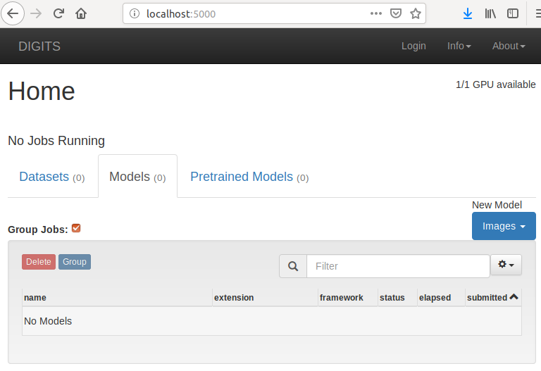

   - [Task](#task)
   - [Previous installations](#previous)
   - [Caffe](#caffe)
   - [PyTorch and Caffe2](#pytorch)
   - [NVIDIA DIGITS](#digits)
     - [Install Docker CE](#docker-ce)
     - [Install NVIDIA Container Runtime for Docker](#container)
     - [Install DIGITS with Docker](#digits-docker)
     - [Running DIGITS on Nvidia Docker](#run-digits)

---
### <a name="task" />Task
   - Install additional software for neural networks.

There are many packages and modules to work with neural networks.
This manual will install and verify additional software.

---
### <a name="previous" />Previous installations

   1. [Prepare Python](../04_Python_installation.md)
   2. [Install software for virtual environments](../05_Virtual_environments.md)
   3. [Prepare GPU driver and CUDA](../08_Nvidia_driver_and_CUDA_install.md)
   4. [Install TensorFlow using `pip` or build it from source](09_TensorFlow_installation.md)
   
---
### <a name="caffe" />Caffe

[Caffe](http://caffe.berkeleyvision.org/) is a deep learning framework
made with expression, speed, and modularity in mind. It is developed by
Berkeley AI Research (BAIR) and by community contributors.

[Ubuntu Installation](http://caffe.berkeleyvision.org/install_apt.html)
of pre-compiled Caffe

**Note**: the cuda version may break if your NVIDIA driver and CUDA toolkit
are not installed by APT.

```shell
# Caffe is a fast, open framework for Deep Learning
sudo apt install caffe-cuda
# Development files for Caffe (CUDA)
sudo apt install libcaffe-cuda-dev
# Library of Caffe, deep leanring framework (CUDA)
sudo apt install libcaffe-cuda1
# Python3 interface of Caffe (CUDA)
sudo apt install python3-caffe-cuda

# Verify. There is no Caffe interface for Python 2.7, only 3.x
python3 -c "import caffe; print(caffe.__version__);"
```

---
### <a name="pytorch" />PyTorch and Caffe2

[PyTorch](https://pytorch.org/) is an open-source machine learning library for Python,
based on Torch, used for applications such as natural language processing.
It is primarily developed by Facebook's artificial-intelligence research group,
and Uber's "Pyro" software for probabilistic programming is built on it.

[Torch](https://en.wikipedia.org/wiki/Torch_(machine_learning)) is an open-source
machine learning library, a scientific computing framework, and a script language
based on the Lua programming language. It provides a wide range of algorithms
for deep learning, and uses the scripting language LuaJIT, and an underlying
C implementation. As of 2018, Torch is no longer in active development.

[Caffe2](https://caffe2.ai/) is a new lightweight, modular, and scalable deep
learning framework. Built on the original [Caffe](http://caffe.berkeleyvision.org),
Caffe2 is designed with expression, speed, and modularity in mind,
allowing for a more flexible way to organize computation. 

Install stable PyTorch on Linux using `pip` for Python 2.7 and CUDA 10.0:


Install stable PyTorch on Linux using `pip` for Python 3.6 and CUDA 10.0:


```shell
sudo su
cd ~
umask 022

sudo pip install https://download.pytorch.org/whl/cu100/torch-1.0.0-cp27-cp27mu-linux_x86_64.whl
sudo pip install -U torchvision

# if the above command does not work, then you have python 2.7 UCS2, use this command
##pip install https://download.pytorch.org/whl/cu100/torch-1.0.0-cp27-cp27m-linux_x86_64.whl

sudo pip3 install https://download.pytorch.org/whl/cu100/torch-1.0.0-cp36-cp36m-linux_x86_64.whl
sudo pip3 install -U torchvision

# PyTorch Caffe (Caffe2 from Facebook) and plugins
sudo pip  install -U ptcaffe
sudo pip  install -U ptcaffe-plugins
sudo pip3 install -U ptcaffe
sudo pip3 install -U ptcaffe-plugins

# Prevent this error - ModuleNotFoundError: No module named 'past'
sudo pip  install -U future
sudo pip3 install -U future

exit  # exit from root

# Verify
python -c "import torch;                   \
    print(torch.cuda.is_available());      \
    print(torch.cuda.get_device_name(0));  \
    print(torch.cuda.device_count());"

python3 -c "import torch;                  \
    print(torch.cuda.is_available());      \
    print(torch.cuda.get_device_name(0));  \
    print(torch.cuda.device_count());"

# Verify Caffe2
python  -c "from caffe2.python import core" 2>/dev/null && echo "Success" || echo "Failure"
python3 -c "from caffe2.python import core" 2>/dev/null && echo "Success" || echo "Failure"
# Verify GPU. Should be >= 1.
python  -c "from caffe2.python import workspace; print(workspace.NumCudaDevices())"
python3 -c "from caffe2.python import workspace; print(workspace.NumCudaDevices())"
```

---
### <a name="digits" />NVIDIA DIGITS

[NVIDIA DIGITS](https://developer.nvidia.com/digits) or
Interactive Deep Learning GPU Training System is **not a framework**.
DIGITS is a wrapper for NVCaffe, Torch, and TensorFlow;
which provides a graphical web interface to those frameworks
rather than dealing with them directly on the command-line.

Useful links:
   * [Ubuntu Installation](https://github.com/NVIDIA/DIGITS/blob/digits-6.0/docs/UbuntuInstall.md)
   * [DIGITS Docker Installation](https://github.com/NVIDIA/DIGITS/blob/digits-6.0/docs/DockerInstall.md)
   * [NVIDIA Container Runtime for Docker](https://github.com/NVIDIA/nvidia-docker#quick-start)
   * [Get Docker CE for Ubuntu](https://docs.docker.com/install/linux/docker-ce/ubuntu/)
   * [Docker post-installation steps for Linux](https://docs.docker.com/install/linux/linux-postinstall/)

Even more links:
   * [DIGITS Installation Guide](https://docs.nvidia.com/deeplearning/digits/digits-installation/index.html)
   * [DIGITS User Guide](https://docs.nvidia.com/deeplearning/digits/digits-user-guide/index.html)
   * [DIGITS GitHub project](https://github.com/NVIDIA/DIGITS)
   * [NVIDIA repository](http://developer.download.nvidia.com/compute/machine-learning/repos/)
     Go to `ubuntu1804/x86_64` for NVIDIA drivers.
   * [Failure: DIGITS Building](https://github.com/NVIDIA/DIGITS/blob/digits-6.0/docs/BuildDigits.md)

It is assumed, that NVIDIA drivers, Caffe, Torch and TensorFlow are
already installed on your system. 

<details close>
    <summary><b>There are errors when building DIGITS
        and its dependencies from source</b></summary>
      <blockquote>

:exclamation: **Cannot build it from source. For your review only** :exclamation:

It is assumed, that NumPy was installed.
More over, in my case I have one NumPy installed using `apt` for Python 3.x
and one NumPy installed using `pip` for Python 2.7.
Otherwise TensorFlow wouldn't work for Python 2.7.

By default, Ubuntu installs recommended but not suggested packages.
With `--no-install-recommends`, only the main dependencies
(packages in the `Depends` field) are installed.
*The same is for SciPy.*

```shell
# Install some dependencies
sudo apt install --no-install-recommends \
    git \
    graphviz \
    python-flask \
    python3-flask \
    python-flaskext.wtf \
    python3-flaskext.wtf \
    python-gevent \
    python3-gevent \
    python-h5py \
    python3-h5py \
    python-pil \
    python3-pil \
    python-pip \
    python3-pip \
    python-tk \
    python3-tk

# Set location and download source
DIGITS_ROOT=~/digits
git clone https://github.com/NVIDIA/DIGITS.git $DIGITS_ROOT

# Make backup and delete requirements for NumPy, SciPy and Pillow
# And hope that it'll work...
cd ~/digits
cp requirements.txt requirements.txt.2018.12.21.backup
nano requirements.txt
# Delete NumPy, SciPy and Pillow requirements and save.

# Set PYTHONPATH for Caffe
PYTHONPATH=/usr/lib/python3/dist-packages/caffe
export PYTHONPATH

# Install DIGITS to enable loading data and visualization plug-ins
sudo pip install -e $DIGITS_ROOT

Error — AttributeError: 'module' object has no attribute 'open'
```

Errors — AttributeError: 'module' object has no attribute 'open'

It's seems NVIDIA DIGITS works for Python 2.7,
but Caffe `apt` installation is for Python 3.x only. Ridiculous.

---
  </blockquote>
</details>
<br/>

Starting from DIGITS 6, the preferred method of installation
is using Docker and installing DIGITS inside a Docker container.
To run DIGITS smoothly, Nvidia Docker must be installed.

---
#### <a name="docker-ce" />Install Docker CE

```shell
# Uninstall old Docker versions
sudo apt remove docker docker-engine docker.io

# Install using the repository

# Install packages to allow apt to use a repository over HTTPS
# apt-transport-https - transitional package for HTTPS support
# ca-certificates - common CA certificates
# curl - command line tool for transferring data with URL syntax
# software-properties-common - manage the repositories that you install software from
sudo apt update
sudo apt install \
    apt-transport-https \
    ca-certificates \
    curl \
    software-properties-common

# Add Docker’s official GPG key
curl -fsSL https://download.docker.com/linux/ubuntu/gpg | \
    sudo apt-key add -

# Verify that you now have the key with the fingerprint
# 9DC8 5822 9FC7 DD38 854A E2D8 8D81 803C 0EBF CD88,
# by searching for the last 8 characters of the fingerprint.
sudo apt-key fingerprint 0EBFCD88

# Set up the stable repository
sudo add-apt-repository \
   "deb [arch=amd64] https://download.docker.com/linux/ubuntu \
   $(lsb_release -cs) \
   stable"

# Install the latest version of Docker CE
sudo apt update
sudo apt install docker-ce

# Verify that Docker CE is installed correctly
sudo docker run hello-world
```

---
#### <a name="container" />Install NVIDIA Container Runtime for Docker

Install [nVidia-Docker](https://github.com/NVIDIA/nvidia-docker).


```shell
# If you have nvidia-docker 1.0 installed: we need to remove it
# and all existing GPU containers
sudo docker volume ls -q -f driver=nvidia-docker | \
    sudo xargs -r -I{} -n1 docker ps -q -a -f volume={} | \
    sudo xargs -r docker rm -f
sudo apt purge -y nvidia-docker

# Add the package repositories
curl -s -L https://nvidia.github.io/nvidia-docker/gpgkey | \
    sudo apt-key add -
distribution=$(. /etc/os-release;echo $ID$VERSION_ID)
curl -s -L https://nvidia.github.io/nvidia-docker/$distribution/nvidia-docker.list | \
    sudo tee /etc/apt/sources.list.d/nvidia-docker.list
sudo apt update

# Install nvidia-docker2 and reload the Docker daemon configuration
sudo apt install -y nvidia-docker2
sudo pkill -SIGHUP dockerd

# Test nvidia-smi with the latest official CUDA image
sudo docker run --runtime=nvidia --rm nvidia/cuda:10.0-base nvidia-smi
```

---
#### <a name="digits-docker" />Install DIGITS with Docker

```shell
# Install the latest version of DIGITS's docker image
sudo docker pull nvidia/digits:latest
# Install 6 RC
##sudo docker pull nvidia/digits:6.0-rc
```

---
#### <a name="run-digits" />Running DIGITS on Nvidia Docker

```shell
# To run DIGITS with Nvidia Docker, use the following command:
# nvidia-docker run -v <path to data>:/data/ -p 5000:5000 nvidia/digits:latest
# where <path to data> is where you have stored data sets or other files
# necessary for DIGITS to use on your system.
sudo nvidia-docker run -v ~:/data/ -p 5000:5000 nvidia/digits:latest
# or
sudo nvidia-docker run -v /hdd_purple:/data/ -p 5000:5000 nvidia/digits:latest

libdc1394 error: Failed to initialize libdc1394
/usr/local/lib/python2.7/dist-packages/matplotlib/font_manager.py:273: UserWarning: Matplotlib is building the font cache using fc-list. This may take a moment.
  warnings.warn('Matplotlib is building the font cache using fc-list. This may take a moment.')
  ___ ___ ___ ___ _____ ___
 |   \_ _/ __|_ _|_   _/ __|
 | |) | | (_ || |  | | \__ \
 |___/___\___|___| |_| |___/ 6.0.0

2018-12-22 12:08:27 [INFO ] Loaded 0 jobs.

# In your browser enter:
http://localhost:5000
```



There is an error after run:
```libdc1394 error: Failed to initialize libdc1394```.
People on the forums write that you should ignore it.
