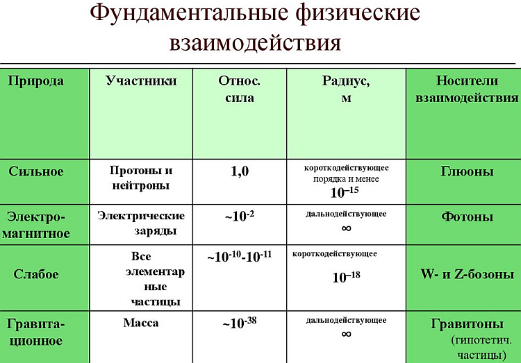
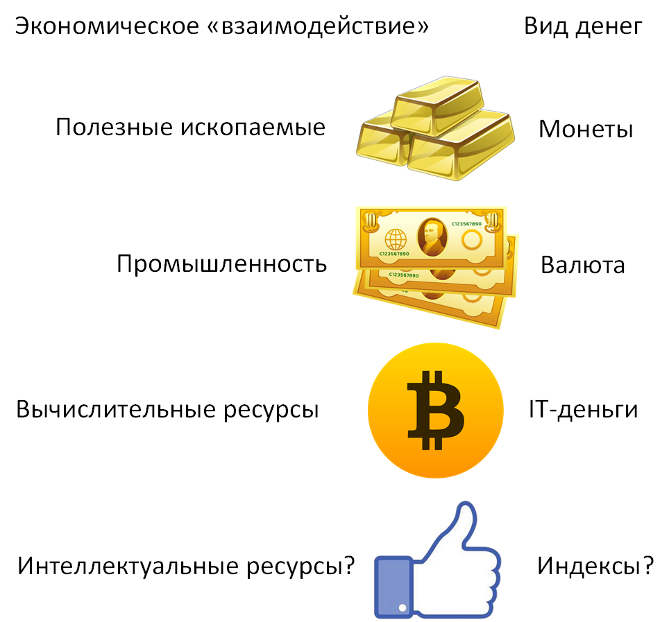

# Экономика будущего для физиков
*научно-фантастический рассказ*

Дата публикации: 31.12.2019

[Статья опубликована на Хабре](https://habr.com/ru/post/482832)

**Аннотация.** В работе приводится аналогия между силами природы и различными видами денег. Делается *обоснование* существования «законов сохранения денег». Дается физическое объяснение феномена IT-денег, а также золотовалютных денег. Рассматривается переход от золотовалютной к золото-валютно-вычислительной экономике. Делается обоснованное *предположение*, что четвертым видом денег после золота, ценных бумаг и IT-денег будут так называемые «индексы цитирования» или «рейтинги», которые похожи по своим свойствам на фондовые индексы.

Данная работа является попыткой понять, что такое деньги с точки зрения физики и эконофизики. [Эконофизика](https://ru.wikipedia.org/wiki/%D0%AD%D0%BA%D0%BE%D0%BD%D0%BE%D1%84%D0%B8%D0%B7%D0%B8%D0%BA%D0%B0)&nbsp;[1] (экономика и физика) – это наука, которая применяет методологию физики к анализу экономических данных. В эконофизике применяются такие модели физики, как броуновское движение, функциональные интегралы и эволюционные игры.

Читателю предлагается взглянуть на понятие денег с весьма необычной точки зрения. Эта работа настолько необычна, что похожа на фантастический рассказ. Автор надеется, что его рассуждения помогут читателю лучше понять, что такое деньги и как с помощью них [развивается цивилизация](https://ru.wikipedia.org/wiki/%D0%A1%D1%83%D0%BC%D0%BC%D0%B0_%D1%82%D0%B5%D1%85%D0%BD%D0%BE%D0%BB%D0%BE%D0%B3%D0%B8%D0%B8)&nbsp;[2]. Автор не претендует на глубокое понимание предмета и может даже ошибаться в очевидных для других вещах.

«Закона сохранения денег не существует», – с некоторой иронией отметил замдиректора ИПМ РАН Георгий Малинецкий. Однако еще Бенуа Мандельброт в 1965 году обнаружил, что динамика финансовых рядов (колебаний цен на бирже) совершенно одинакова на малых и больших масштабах времени. По графику финансового ряда практически невозможно определить, изображает он колебания цен в течение часа, суток или месяца. Это свойство Мандельброт назвал самоподобием, а обладающие им объекты – [фракталами](https://github.com/foobar167/fractals). Фрактальная структура финансовых рядов показывает некоторую непрерывную симметрию физической системы. [Теорема Нетер](https://ru.wikipedia.org/wiki/%D0%A2%D0%B5%D0%BE%D1%80%D0%B5%D0%BC%D0%B0_%D0%9D%D1%91%D1%82%D0%B5%D1%80) гласит: «Каждой непрерывной симметрии физической системы соответствует некоторый закон сохранения». Значит, в соответствии с теоремой Нетер, какие-то «законы сохранения денег» должны существовать. Скорее всего, эти законы сохранения не похожи на законы сохранения энергии, импульса и момента импульса. Мы их пока не знаем.

Проведем [аналогию](https://ru.wikipedia.org/wiki/%D0%90%D0%BD%D0%B0%D0%BB%D0%BE%D0%B3%D0%B8%D1%8F) между деньгами и силами природы. В физике [каждому виду взаимодействия соответствует частица-переносчик](https://ru.wikipedia.org/w/index.php?title=%D0%A4%D1%83%D0%BD%D0%B4%D0%B0%D0%BC%D0%B5%D0%BD%D1%82%D0%B0%D0%BB%D1%8C%D0%BD%D1%8B%D0%B5_%D0%B2%D0%B7%D0%B0%D0%B8%D0%BC%D0%BE%D0%B4%D0%B5%D0%B9%D1%81%D1%82%D0%B2%D0%B8%D1%8F#%D0%A1%D0%B2%D0%BE%D0%B4%D0%BD%D0%B0%D1%8F_%D1%82%D0%B0%D0%B1%D0%BB%D0%B8%D1%86%D0%B0) этого взаимодействия (таблица 1):

Таблица 1 – Каждому виду взаимодействия соответствует частица-переносчик

| Взаимодействие | Частица-переносчик |
| --- | --- |
| Гравитация | Гравитон |
| Электромагнитное | Фотон |
| Сильное | Глюоны |
| Слабое | W- и Z-бозоны, а также бозон Хиггса |

По аналогии с таблицей 1 автор предлагает аналогичную таблицу для «переносчика» рыночных сил (таблица 2):

Таблица 2 – Каждому экономическому ресурсу соответствует определенный вид денег

| Экономическое «взаимодействие» | Вид денег или «частица-переносчик» |
| --- | --- |
| Полезные ископаемые, и все, что растет на Земле | Золотые и серебряные монеты |
| Промышленность (заводы, газеты, пароходы и т.д.) | Ценные бумаги и валюта |
| Вычислительные ресурсы | IT-деньги (биткоины и другие «коины») |
| Еще? Интеллектуальные ресурсы? | Рейтинги цитирования? Индексы? |

Автор предлагает по-новому взглянуть на труд и капитал. Возможно, труд и капитал не являются экономическими ресурсами.

Труд – это потенциал и, по аналогии с потенциальной энергией в физике, не может являться «переносчиком» экономических взаимодействий. Трудовой потенциал может быть выражен через любую из экономических сил: крестьянский труд на земле, рабочий труд на заводе, труд в офисе, интеллектуальный труд и художественное творчество – это совершенно разные виды труда, которые некорректно объединять в единый так называемый «трудовой ресурс». Труд – это потенциал, а не ресурс. Вполне возможно, что в этом моменте кроется самая большая ошибка Карла Маркса&nbsp;[3], который приравнивал труд (то есть потенциальную энергию) к капиталу (то есть к силе). Труд – это не капитал. [Рабочая сила](https://ru.wikipedia.org/wiki/%D0%A0%D0%B0%D0%B1%D0%BE%D1%87%D0%B0%D1%8F_%D1%81%D0%B8%D0%BB%D0%B0), способность человека к труду, не является самостоятельным товаром, но является **неотъемлемой частью и придатком** средств производства. Смотрите пояснения ниже.

Карл Маркс не был физиком, а поэтому не понимал разницы между силой и энергией. Возможно, это непонимание физического устройства природы вылилось в большие убытки для цивилизации. Но продолжим дальше.

Капитал (деньги) является переносчиком экономических «взаимодействий», но не может быть выделен в отдельный экономический ресурс, потому что состоит из множества разных видов денег. По аналогии с частицами-переносчиками в физике, капитал может быть различных типов и выражать совершенно различные экономические силы. Другими словами, **существуют различные виды денег**, а также различные законы сохранения, которые регулируются различными по своему качеству экономическими силами.

Автор предполагает, что альтернативой и дополнением золотовалютных резервов будут информационно-вычислительные резервы. То есть, чем больше у страны, компании или физлица банки данных и вычислительная мощность, тем лучшее положение на рынках мира он будет занимать, обладать большей [ликвидностью](https://ru.wikipedia.org/wiki/%D0%9B%D0%B8%D0%BA%D0%B2%D0%B8%D0%B4%D0%BD%D0%BE%D1%81%D1%82%D1%8C).

Действительно, все эти многочисленные «bit-коины» ценны тем, что у кого-то есть вычислительные ресурсы. Если развить эту идею дальше, то переходим от золотовалютной к информационно-вычислительной экономике. Вернее, к **золото-валютно-вычислительной**. Где золото – это полезные ископаемые, первоначальный уровень. Затем валюта – это ценные бумаги, второй уровень. IT-деньги – это вычислительная мощность, третий уровень.

IT-деньги – это единица вычислительной мощности, которая ценна уже тем, что она есть. Неважно, как вычислительная мощность применяется в данный момент: обучают ли на ней нейросети, анализируют ли геном человека или просто гоняют по кругу бесконечный цикл деления на ноль. По аналогии ИТ-деньги можно сравнить с частицей-переносчиком «вычислительных сил» (таблица 2). В будущем IT-деньги будут основаны на общественно полезных алгоритмах [федеративного машинного обучения](https://habr.com/ru/post/402987/) ([Federated Learning](https://ai.googleblog.com/2017/04/federated-learning-collaborative.html))&nbsp;[4] и других видов машинного обучения.

По мнению автора, в настоящий момент внедрению IT-денег мешает [закон Мура](https://ru.wikipedia.org/wiki/%D0%97%D0%B0%D0%BA%D0%BE%D0%BD_%D0%9C%D1%83%D1%80%D0%B0). Вычислительные ресурсы обесцениваются в два раза каждые два года. Получается большая гиперинфляция вычислительных мощностей, которая не позволяет накапливать вычислительные мощности и за счет этого богатеть. Произойдет либо «насыщение» и закон Мура нарушится, либо будет ликвидна не сама вычислительная мощность, а ее логарифмический рост. Таким образом, логарифм по экспоненте превратит этот показатель в константу.

Каким будет следующий, четвертый уровень ликвидности? Возможно это будет [индекс цитирования научных статей](https://ru.wikipedia.org/wiki/%D0%98%D0%BD%D0%B4%D0%B5%D0%BA%D1%81_%D1%86%D0%B8%D1%82%D0%B8%D1%80%D0%BE%D0%B2%D0%B0%D0%BD%D0%B8%D1%8F_%D0%BD%D0%B0%D1%83%D1%87%D0%BD%D1%8B%D1%85_%D1%81%D1%82%D0%B0%D1%82%D0%B5%D0%B9), художественных произведений и любой интеллектуальной продукции **вплоть до комментария в социальной сети**. Деньгами станут **индексы цитирования** , похожие на [индекс Хирша](https://ru.wikipedia.org/wiki/%D0%98%D0%BD%D0%B4%D0%B5%D0%BA%D1%81_%D0%A5%D0%B8%D1%80%D1%88%D0%B0). Некий [импакт-фактор](https://ru.wikipedia.org/wiki/%D0%98%D0%BC%D0%BF%D0%B0%D0%BA%D1%82-%D1%84%D0%B0%D0%BA%D1%82%D0%BE%D1%80), численный показатель важности научной или художественной работы. Рейтинг сайта.

Сам интеллектуальный продукт (собственность на него) будет принадлежать кому угодно: государству, частной компании, физлицу и т.д. Индексы цитирования интеллектуальной продукции являются альтернативой и дополнением к [фондовым индексам](https://ru.wikipedia.org/wiki/%D0%A4%D0%BE%D0%BD%D0%B4%D0%BE%D0%B2%D1%8B%D0%B9_%D0%B8%D0%BD%D0%B4%D0%B5%D0%BA%D1%81), которые, как известно, основаны на ценных бумагах.

При этом абсолютные значения индексов будут не важны. Имеют значение только изменения индексов с течением времени (градиент или даже логарифм изменения индекса). Торговля индексами цитирования будет осуществляться по аналогии с торговлей фондовыми индексами ([индексный фьючерс](https://ru.wikipedia.org/wiki/%D0%98%D0%BD%D0%B4%D0%B5%D0%BA%D1%81%D0%BD%D1%8B%D0%B9_%D1%84%D1%8C%D1%8E%D1%87%D0%B5%D1%80%D1%81)). А измеряться все это будет в [пунктах](https://ru.wikipedia.org/wiki/%D0%9F%D1%83%D0%BD%D0%BA%D1%82_(%D1%8D%D0%BA%D0%BE%D0%BD%D0%BE%D0%BC%D0%B8%D0%BA%D0%B0)).

С течением времени ликвидность, измеряемая в абсолютных величинах, будет уступать «динамической» ликвидности, которая будет первой производной (градиентом) по графику изменения индексов или логарифмом. Абсолютные величины не уйдут полностью с рынков, но будут делить сферу влияния с динамическими индексами.

Индекс – это не абсолютная величина, а смесь абсолютной величины с динамикой ее изменения (первая производная). В общем случае формула рейтинга может быть определена через производную первого порядка:

|   | _рейтинг = α׃(t) + β×∂ƒ(t)/∂t_ | (1) |
| --- | --- | --- |

где _ƒ(t)_ – индекс цитирования, который зависит от текущего времени _t_; _∂ƒ(t)/∂t_ – динамика изменения индекса в настоящий момент времени _t_; _α_ – малая константа, которая учитывает некие «былые заслуги» интеллектуального продукта; _β_ – усилитель динамики роста или падения индекса цитирования, который, возможно, зависит от второй производной индекса цитирования по текущему времени и производных высших порядков.

Поясню вопрос, почему интеллектуальные способности могут стать экономической «силой», а труд в современном понимании такой «силой» не является? Дело в том, что трудиться могут не только люди, но и животные, машины и даже деньги. Однако создавать качественный интеллектуальный продукт могут только люди. Вскоре смогут и роботы. Но в ближайшем будущем самих роботов будет создавать только человек с помощью своих интеллектуальных способностей.

Если выразить эту мысль через понятийный аппарат Карла Маркса, то труд в его классическом понимании по-прежнему остается и всегда будет зависеть от частной собственности на средства производства. **Труд – это придаток к средствам производства** , а не ценность сама по себе. Но интеллектуальные способности не зависят от частной собственности на средства производства. Основная доля информации будет в открытом доступе бесплатно. Поэтому человек в своем профессиональном и личностном росте будет ограничен только своими собственными интеллектуальными способностями, природными склонностями, данными ему от рождения либо приобретенными благодаря воспитанию, настойчивости характера и живости ума.

Выразить силу своих интеллектуальных способностей будет возможно без средств производства через Интернет. По этой причине понятие «труд» и понятие «интеллектуальная сила» (в данный момент «интеллектуальный труд») будут разделены по смыслу. Сейчас они пока синонимы и труд программиста мало чем отличается от труда рабочего на производстве. Постепенно интеллектуальные [орудия труда](https://ru.wikipedia.org/wiki/%D0%9E%D1%80%D1%83%D0%B4%D0%B8%D0%B5_%D1%82%D1%80%D1%83%D0%B4%D0%B0): компьютер, подключение к Интернету, доступ к информации – будут дешеветь и станут либо полностью бесплатными, либо их стоимость будет незначительна по сравнению с ценностью продукта.

Уже сейчас можно заметить тенденцию к «обогащению» за счет публикаций. Это понятие кратко выражено во фразе «Опубликуйся или умри» ([Publish or perish](https://en.wikipedia.org/wiki/Publish_or_perish)) по аналогии с «Разбогатей или умри». Интеллектуально способные люди будут такой же ценностью, как сейчас полезные ископаемые, цениться буквально «на вес золота». На их выращивание, воспитание и сохранение будут направлены основные усилия государств-лидеров. Сейчас актуальна «утечка мозгов», но в дальнейшем она будет приравнена и являться аналогом потери денег в буквальном смысле этого слова по аналогии с уменьшением золотовалютных резервов страны.

**Вывод.** IT-деньги не являются конечной фазой эволюции денег. В дальнейшем появятся другие экономические «силы» и, как следствие, новые виды денег. Появится новое понятие «интеллектуальная сила». Стоимость «интеллектуальной силы» будет выражаться в «индексе цитирования» и «рейтинге» по аналогии с фондовым индексом. Поговорка «Время – деньги» уступит место другой поговорке «Знание – сила».

Литература:

1. Ивар Федоуз «[Эконофизика? Есть! Новая наука о человеке](http://www.chaskor.ru/article/ekonofizika_ekonomicheskaya_fizika_8072)», интернет-издание «Частный Корреспондент»
2. Станислав Лем «Сумма технологий» (пока не осилил, кратко в [Википедии](https://ru.wikipedia.org/wiki/%D0%A1%D1%83%D0%BC%D0%BC%D0%B0_%D1%82%D0%B5%D1%85%D0%BD%D0%BE%D0%BB%D0%BE%D0%B3%D0%B8%D0%B8))
3. Карл Маркс «Капитал» (много букв, не осилил, кратко в [Википедии](https://ru.wikipedia.org/wiki/%D0%9A%D0%B0%D0%BF%D0%B8%D1%82%D0%B0%D0%BB_(%D0%9C%D0%B0%D1%80%D0%BA%D1%81))
4. [Federated learning](https://youtu.be/m17IgaHaoTI) with TensorFlow Federated (TF World &#39;19)

**Теги:** эконофизика, IT-деньги, деньги, золото-валютно-вычислительная экономика, индекс цитирования, рейтинг, законы сохранения денег
