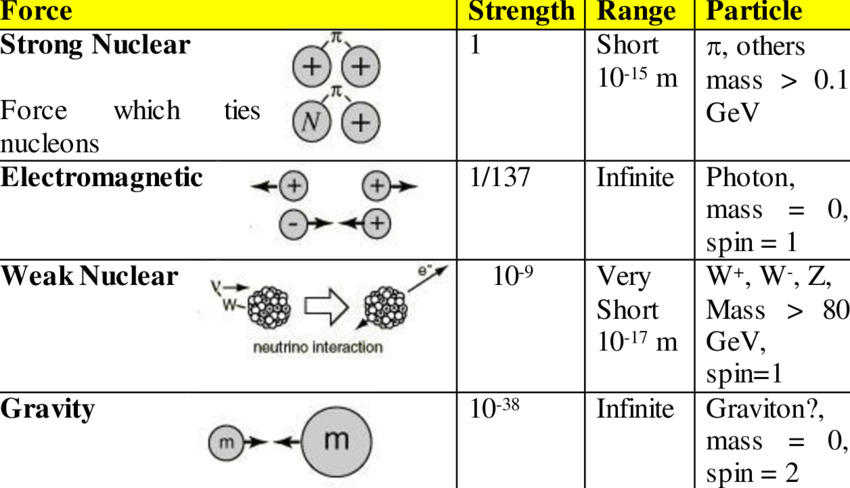
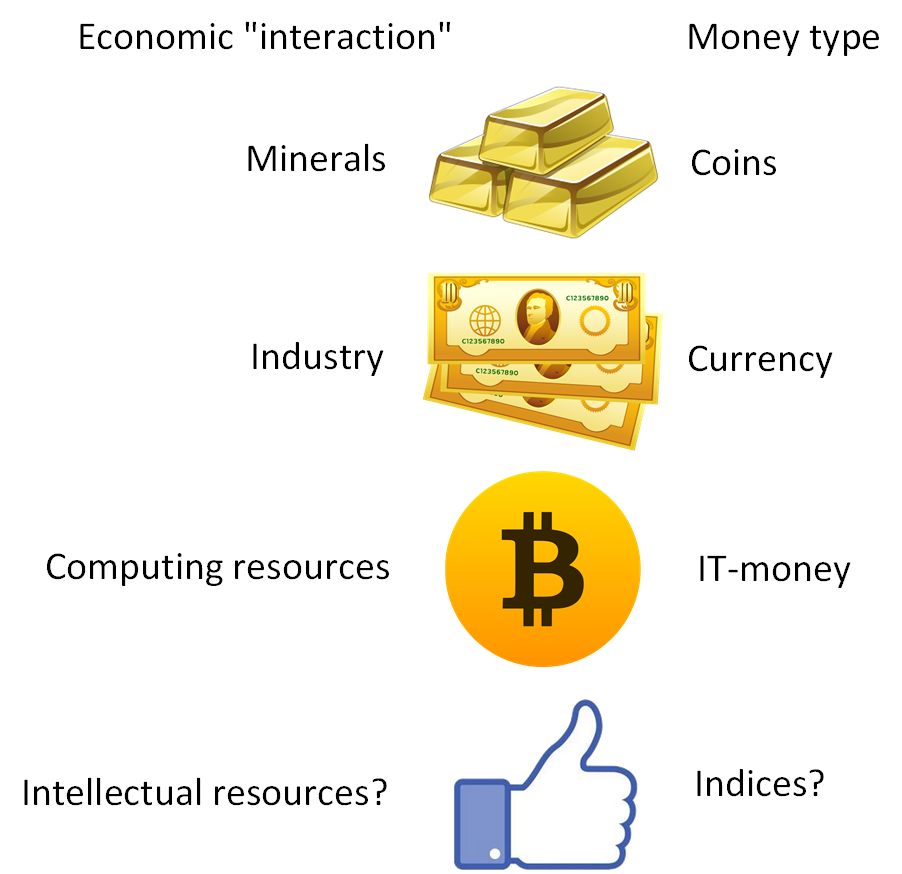
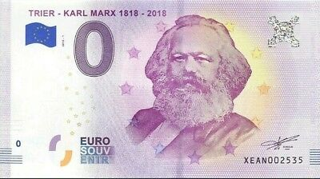
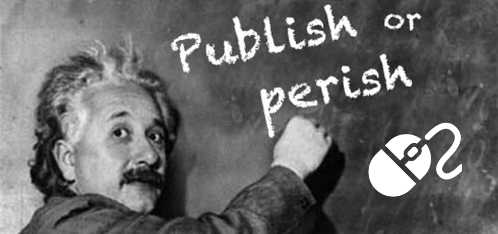

# Future economics for physicists
*science fiction story*

Published 12.01.2020 on [Habr.com](https://habr.com/ru/post/483594/) with Russian [version](https://habr.com/ru/post/482832/).

**Annotation.** This article gives an analogy between the forces of nature and various types of money. A *justification* for the "money conservation laws" is made. Explanation of the IT-money phenomenon by analogy to physics laws is given, as well as gold and currency money. The transition from the gold and currency to the gold-currency-computing economy is considered. A reasonable *assumption* is made that the fourth type of money after gold, securities and IT money will be so-called "citation indices" or "ratings", which are similar in their properties to stock indices.

This article is an attempt to understand what money is from the physics and econophysics points of view. [Econophysics](https://en.wikipedia.org/wiki/Econophysics) (economics and physics) is an interdisciplinary research field, applying theories and methods originally developed by physicists to solve problems in economics, usually those including uncertainty or stochastic processes, nonlinear dynamics and evolutionary games.

This is an unusual point of view at the concept of money. It looks like a fantastic story. However, it could help the reader better understand what money is and why they are necessary for [civilization development](https://en.wikipedia.org/wiki/Summa_Technologiae) [1]. The author does not have a deep understanding of the subject and maybe wrong in things that are obvious to others.

"There is no money conservation law," some speak with irony. However, in 1965 Benoit Mandelbrot discovered that the dynamics of financial series (price fluctuations on the exchange market) are the same on small and large time scales. According to the schedule of the financial series, it is almost impossible to determine whether it depicts price fluctuations during the hour, day or month. Mandelbrot called this property self-similarity, and the objects possessing it are called [fractals](https://github.com/foobar167/fractals). The fractal structure of the financial series shows some continuous symmetry of the physical system. According to the [Noether's theorem](https://en.wikipedia.org/wiki/Noether%27s_theorem) is: "If a system has a continuous symmetry property, then there are corresponding quantities whose values are conserved in time." For fractals, there is a *scale symmetry*. So, by Noether's theorem, some "money conservation laws" must exist. Most likely, these conservation laws are not similar to the laws of conservation of energy, momentum and angular momentum. We don’t know them yet.

Let's draw an [analogy](https://en.wikipedia.org/wiki/Analogy) between money and the forces in nature. In physics [each type of interaction corresponds to a carrier particle](https://en.wikipedia.org/wiki/Fundamental_interaction#Overview_of_the_fundamental_interactions) of this interaction. For example, photons mediate the interaction of electric charges, and gluons mediate the interaction of color charges (table 1):

Table 1 – Each type of interaction corresponds to a carrier particle

| Interaction | Mediators |
| --- | --- |
| Gravitation | Graviton (hypothetical) |
| Electromagnetic | Photon |
| Strong | Gluons |
| Weak | W and Z bosons, and also Higgs boson |

By analogy with the table 1, there is a proposal for the "mediators" of the market forces (table 2):

Table 2 - Each economic resource corresponds to a certain type of money

| Economic "interaction" | Money type or mediator of "economic force" |
| --- | --- |
| Minerals and everything that grows on Earth | Gold and silver coins |
| Industry (factories, newspapers, ships, etc.) | Securities and Currency |
| Computing resources | IT-money ([digital currency](https://en.wikipedia.org/wiki/Digital_currency), electronic money, [cryptocurrency](https://en.wikipedia.org/wiki/Cryptocurrency), [bitcoin](https://en.wikipedia.org/wiki/Bitcoin), etc.) |
| Intellectual resources? | Citation Ratings? Indices? |

The author suggests a fresh look at labor and capital. Perhaps labor and capital are not economic resources.

Labor is a potential and, by analogy with potential energy in physics, cannot be a "mediator" of economic interactions. Labor potential can be expressed through any of the economic forces: peasant labor on the ground, worker labor at the factory, office labor, intellectual labor, and artistic creativity — these are completely different types of labor that are incorrectly combined into a single so-called "labor resource". Labor is a potential, not a resource. It could be the biggest mistake of [Karl Marx](https://en.wikipedia.org/wiki/Karl_Marx) [3], who equated labor (that is, with potential energy) with capital (that is, with economics "mediator"). Labor is not a capital, not a "mediator". No one can "capitalize labor" and store it somewhere in the vault. [Workforce](https://en.wikipedia.org/wiki/Labour_power), a person’s ability to work is not an independent product, but it is **an integral part and appendage** of the [means of production](https://en.wikipedia.org/wiki/Means_of_production). See the explanation below.

Karl Marx was not a physicist and therefore did not understand the difference between power and energy. Perhaps this misunderstanding of the physical structure of nature resulted in great losses for civilization. But let's continue further.

Capital (i.e. money) is a mediator of economic "interactions", but cannot be allocated as a separate economic resource, because it consists of many different types of money. By analogy with mediator particles in physics, capital can be of various types and express completely different economic forces. In other words, **there are various types of money**, as well as various conservation laws, which are regulated by various economic forces.

The author assumes that the alternative and complement to the gold and foreign exchange reserves will be information and computing reserves. That is, the more a country, company or individual has data banks and computing power, the better position it will occupy in the world markets, possess more [market liquidity](https://en.wikipedia.org/wiki/Market_liquidity).

Indeed, all these numerous cryptocurrencies are valuable, because somebody has computing resources. It may be a shift from the gold and currency to the **gold-currency-computing** economics. Where gold is minerals, the initial level. Then the currency is securities, the second level. And IT-money is computing power, the third level.

IT money is a unit of computing power that is already valuable by itself. It doesn't matter how this computing power is used at the moment: whether it is training neural networks, or analyzing the human genome, or performing dummy infinite loop. By analogy, IT money can be compared with a particle-carrier of "computing forces" (see table 2). In the future, IT money will be based on socially useful algorithms of [federated machine learning](https://ai.googleblog.com/2017/04/federated-learning-collaborative.html) [4] and other machine learning tasks. However, there will be [frauds](https://www.businessinsider.com/the-biggest-cryptocurrency-scams-and-arrests-of-2019-so-far-2019-8) too.

According to the author, [Moore’s law](https://es.wikipedia.org/wiki/Ley_de_Moore) hinders the implementation of IT money. Computational resources are depreciated twice every two years. There is hyperinflation of computing power, which does not allow an accumulation of computing power for a long time and to grow rich. Either "saturation" will occur and Moore’s law will be violated, or logarithmic growth of computing power will be in use. Thus, the logarithm exponentially turns this indicator into a constant.

What will be the next level of liquidity? Perhaps it will be citation indices of [scientific articles](https://en.wikipedia.org/wiki/Citation_index), artworks and any intellectual products **including comments in the social network**. **Citation indices**, similar to [h-index](https://en.wikipedia.org/wiki/H-index) or [impact factor](https://en.wikipedia.org/wiki/Impact_factor), a numerical indicator of the importance of scientific or artistic work. Site rating. Citation indices of intellectual products are an alternative and addition to [stock market indices](https://en.wikipedia.org/wiki/Stock_market_index) which are known to be based on securities.

In this case, the absolute values of the indices will not be important. Only index changes over time will matter, the gradient or even the logarithm of the index change. Citation indices will be traded like [stock market index future](https://en.wikipedia.org/wiki/Stock_market_index_future) and will be measured in [price interest points](https://en.wikipedia.org/wiki/Percentage_in_point) (percentage in point).

Over time, liquidity, measured in absolute terms, will concede to "dynamic" liquidity measured like the first derivative (gradient) of the index change or even the logarithm. Absolute values will not completely leave the markets but will share the sphere of influence with dynamic indices. More likely that the logarithm of the growth of citation indices will be calculated, which is essentially an [entropy](https://en.wikipedia.org/wiki/Entropy).

Further will be an explanation *why intellectual abilities can become an economic "force"*, and labor nowadays is not such a "force"? The fact is that not only people can work, but also animals, machines, real estate, and money. However, only people can create high-quality intellectual products. Soon, robots will be able too. But in the near future, only humans themselves will create robots using their intellectual abilities.

If express this idea through the conceptual apparatus of Karl Marx, then the labor in its classical understanding remains and always will depend on means of production. **Labor is an appendage to the means of production** and not a value. Soon intellectual abilities will not dependent on ownership on means of production. The bulk of the information will be publicly available for free. Therefore, a person in his professional and personal growth will be limited only by his intellectual abilities, natural inclinations or acquired through education, character perseverance, and mind liveliness.

It'll be possible to express the power of one's intellectual abilities through free of charge or very cheap [means of production](https://en.wikipedia.org/wiki/Means_of_production) via the Internet. For this reason, the concept of "labor" and the concept of "intellectual power" (currently "intellectual labor") will be separated by meaning. Intellectuals will not work in a generally accepted way: it'll be like a computer game or lifestyle. Now the concept of "labor" and "intellectual labor" are still synonyms and the work of a software developer is not much different from the work of a production worker. Gradually the price for intellectual [means of production](https://en.wikipedia.org/wiki/Means_of_production): computer, Internet connection, access to information will become cheaper and will either be completely free, or their cost will be insignificant.

In academia, one can notice a tendency to "enrich" via scientific publications. To the author's point of view, this is the beginning of "intellectual money". This concept is briefly expressed in the aphorism "[Publish or perish](https://en.wikipedia.org/wiki/Publish_or_perish)", by analogy with "Get Rich or Die". Intellectually capable people will be of the same value as minerals now, literally valued "worth its weight in gold". The main efforts of the leading states will be directed at their cultivation, education, and preservation. The "brain drain" is relevant now, but in the future, it'll be equated and will be an analogue of the money loss, by analogy with a decrease in the country's foreign exchange reserves.

**Conclusion.** IT money is not the final phase of money evolution. Other economic "forces" will show up and, as a result, new money types. A new concept of "intellectual power" will appear. The cost of "intellectual power" will be expressed in the "citation index" and "rating" by analogy with the stock index. The proverb "Time is money" will give way to another proverb "Knowledge is power".

Literature:

1. Stanisław Lem "Summa Technologiae" (briefly [in Wikipedia](https://en.wikipedia.org/wiki/Summa_Technologiae))
2. Karl Marx "Capital. A Critique of Political Economy" (briefly [in Wikipedia](https://en.wikipedia.org/wiki/Das_Kapital))
4. [Federated learning](https://youtu.be/m17IgaHaoTI) with TensorFlow Federated (TF World &#39;19)

**Tags:** econophysics, IT-money, money, gold-currency-computing economy, citation index, rating, money conservation laws, digital currency, electronic money, cryptocurrency, bitcoin, 
